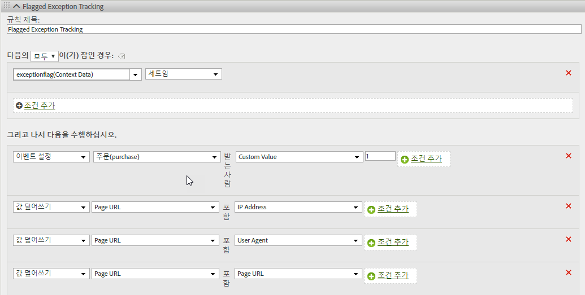

# hitGovernor

s.hitGovernor 플러그인은 사전 정의된 롤링 기간에 보낸 Analytics 이미지 요청의 총수를 추적하며, 총수가 특정 임계값을 초과하는 경우 필요에 따라 추가 논리를 수행할 수 있습니다.

## hitGovernor {#topic_56B636A42A624B38A0A446C607ACD700}

s.hitGovernor 플러그인은 사전 정의된 롤링 기간에 보낸 Analytics 이미지 요청의 총수를 추적하며, 총수가 특정 임계값을 초과하는 경우 필요에 따라 추가 논리를 수행할 수 있습니다.

보트, 스파이더, 특정 사용자 에이전트 또는 특정 IP 주소 목록의 트래픽을 보트 트래픽으로 식별할 수 있고, 그렇지 않은 경우에는 보고에서 제외할 수 있지만, 보고서 세트에 캡처되어 계산되지 않아야 하는 트래픽이 있을 수 있습니다. 예를 들어 너무 짧은 기간에 많은 클릭 수 또는 페이지 보기(초당 약 1개의 요청)는 잠재적으로 사기성 트래픽이 될 수 있습니다.

이 플러그인을 사용하면 해당 방문자의 나머지 라이프사이클 중에 트래픽을 자동으로 차단하고, 해당 트래픽도 보고서 내에서 동적으로 식별할 수 있습니다.

## Hit Governor 플러그인 작동 방식 {#section_541BC639E31442D09B1C85A2FFCDC02C}

이 플러그인은 이미지 요청이 추적 서버로 전송될 때마다 쿠키 값을 늘리고, 롤링 기간 동안 이 값을 추적합니다. 기본 기간은 1분이지만, 겹쳐 쓸 수 있습니다. 자세한 내용은 아래 [구현](../../../implement/js-implementation/plugins/hitgovernor.md#task_D4BDB524AA294C139AFCAE2B61FEA3F2)을 참조하십시오. If the total number of hits during that time frame exceeds the default hit threshold (60), a final custom link image request is sent to set the *`exceptionFlag`* context data variable. 기본 히트 임계값을 재정의할 수도 있습니다.

원하는 경우 해당 시점부터 기본 기간 60일 동안 특정 방문자에 대한 트래픽이 수집되지 않도록 할 수 있습니다. 트래픽을 차단하려면 아래에 설명된 대로 doPlugins 함수에 추가 코드 줄이 필요합니다. 기간을 조정할 수도 있습니다. The logic allows time to either include that visitor's IP address, User Agent, or [!DNL Experience Cloud] Visitor ID in the proper permanent exception logic, or to reset the timeout period after the sixty days have elapsed. 이 트래픽이 60일 이후에 플러그인에서 사기로 식별되는 경우, 트래픽이 예외로 플래그가 지정되며 추가 60일 동안은 수집되지 않습니다.

## 보고 {#section_E742F19B528041808454744DB2C7007C}

기본 변수 또는 이벤트를 설정하지 않아도 됩니다. 그러나 변수 및 이벤트를 적절하게 설정하도록 처리 규칙 논리를 설정하는 것이 좋습니다. 이러한 사용자 지정 변수 및 이벤트는 다음을 포함할 수 있습니다.

* [!DNL Experience Cloud] 방문자 ID
* IP 주소
* 사용자 에이전트
* 플래그가 지정된 예외 이벤트

그러한 변수에 대한 세그먼트를 작성하면 세그먼트 및 가상 보고서 세트를 작성하여 전체 사이트가 그러한 모호한 히트에 미치는 영향을 볼 수 있습니다.

보고에서 캡처된 값을 사용하여 보트 규칙, DB VISTA 규칙 또는 회사 IP 제외를 업데이트하는 것이 좋습니다.

## 구현 {#task_D4BDB524AA294C139AFCAE2B61FEA3F2}

hitGovernor 플러그인을 구현하려면 다음을 수행하십시오.

1. AppMeasurement 라이브러리를 수정합니다.

   플러그인을 초기화하려면 AppMeasurement 라이브러리 코드의 `registerPostTrackCallback` 함수 내에 이 코드 줄(굵은 글꼴)을 포함합니다.

   >[!NOTE]
   >
   >`registerPostTrackCallback` 이 기능은 Appmeasurement 라이브러리 1.8.0 +에 포함되어 있지만 기본적으로 사용자 지정 코드 구성에 포함되지 않습니다. doPlugins 함수 뒤와 *외부*&#x200B;에 포함되어 있습니다.

   ```
    s.registerPostTrackCallback(function(){ 
    s.governor();
   }); 
   ```

   AppMeasurement 파일의 doPlugins 섹션 아래에 [플러그인 소스 코드](../../../implement/js-implementation/plugins/hitgovernor.md#reference_76423C81A7A342B2AC4BE41490B27DE0)에 포함된 플러그인 코드를 포함합니다.

   히트 한계 임계값, 히트 타이밍 임계값 및 트래픽 제외 기간은 플러그인 자체 외부의 다음 변수를 다른 구성 변수와 함께 설정하여 모두 재정의할 수 있습니다.

<table id="table_9959A40F5F0B40B39DB86E21D03E25FD"> 
 <thead> 
  <tr> 
   <th colname="col1" class="entry"> 변수 </th> 
   <th colname="col2" class="entry"> 구문 </th> 
   <th colname="col3" class="entry"> 설명 </th> 
  </tr> 
 </thead>
 <tbody> 
  <tr> 
   <td colname="col1"> <p>히트 한계 임계값 </p> </td> 
   <td colname="col2"> <p> <code> s.hl = 60; </code> </p> </td> 
   <td colname="col3"> <p>제공된 시간 동안 초과하지 않아야 하는 총 히트 수입니다. </p> </td> 
  </tr> 
  <tr> 
   <td colname="col1"> <p>히트 시간 임계값 </p> </td> 
   <td colname="col2"> <p> <code> s.ht = 10; </code> </p> </td> 
   <td colname="col3"> <p>히트가 기록되는 창(초)입니다. 이 수를 6으로 나누어 롤링 시간 창을 결정합니다. </p> </td> 
  </tr> 
  <tr> 
   <td colname="col1"> <p>제외 임계값 </p> </td> 
   <td colname="col2"> <p> <code> s.he = 60; </code> </p> </td> 
   <td colname="col3"> <p>해당 방문자에 대해 제외 쿠키가 설정된 일 수입니다. </p> </td> 
  </tr> 
 </tbody> 
</table>

>[!NOTE]
>
>구현에서 기본 Analytics "s" 개체와 다른 개체 이름을 사용할 수 있습니다. 그런 경우 개체 이름을 적절하게 업데이트하십시오.

1. 처리 규칙을 구성합니다.

   이 플러그인은 플래그가 지정된 예외를 링크 추적 이미지 요청의 컨텍스트 데이터로 기록합니다. 따라서, 아래와 같은 해당 변수에 그러한 플래그가 지정된 예외를 추적하도록 처리 규칙을 구성해야 합니다.

   

1. (선택 사항) doPlugins에 트래픽 차단 코드를 포함합니다.

   트래픽이 예외로 식별되면 `doPlugins` 함수 내에 이 코드를 포함하여 해당 방문자의 모든 후속 히트를 완전히 차단할 수 있습니다.

   ```
   //Check for hit governor flag 
         if(s.Util.cookieRead('s_hg')==9)s.abort=true;
   ```

   이 코드가 포함되지 않은 경우 해당 방문자의 트래픽은 플래그가 지정되지만, 차단되지는 않습니다.

## 플러그인 소스 코드 {#reference_76423C81A7A342B2AC4BE41490B27DE0}

이 코드는 AppMeasurement 라이브러리의 doPlugins 섹션 아래에 추가해야 합니다.

```
//Hit Governor (Version 0.1 BETA, 11-13-17) 
s.governor=new Function("","" 
+"var s=this;if(typeof s.hl=='undefined'){s.hl=60;}if(typeof s.ht=='u" 
+"ndefined'){s.ht=60;}if(typeof s.he=='undefined'){s.he=60;}if(s.Util" 
+".cookieRead('s_hg')==8){var i=new Date(),y=i.getFullYear(),m=i.getM" 
+"onth(),d=i.getDate(),i=new Date(y,m,d+s.he);s.Util.cookieWrite('s_h" 
+"g',9,i);return;}var f=s.Util.cookieRead('s_hc'),g=Number(s.Util.coo" 
+"kieRead('s_ht')),h=Math.floor((new Date()).getTime()),ha=f!=''?f.sp" 
+"lit('|').map(Number):[0,0,0,0,0],i=ha.reduce(function(ha,b){return " 
+"ha+b;},0),j=g==0?0:Math.floor(((h-g)/(s.ht/6))/1000);if(g==0)s.Util" 
+".cookieWrite('s_ht',h);if(i<s.hl){if(j>=1){if(j>=6){ha=[0,0,0,0,0];" 
+"}else{for(var k=0;k<j;k++){ha.unshift(0);ha.pop();}}s.Util.cookieWr" 
+"ite('s_ht',h);}}else{s.Util.cookieWrite('s_hg',8);s.linkTrackVars+=" 
+"',contextData.exceptionFlag';s.contextData['exceptionFlag']='true';" 
+"s.tl(this,'o','exceptionFlag');}ha[0]++;s.Util.cookieWrite('s_hc',h" 
+"a.join('|'));"); 
```

