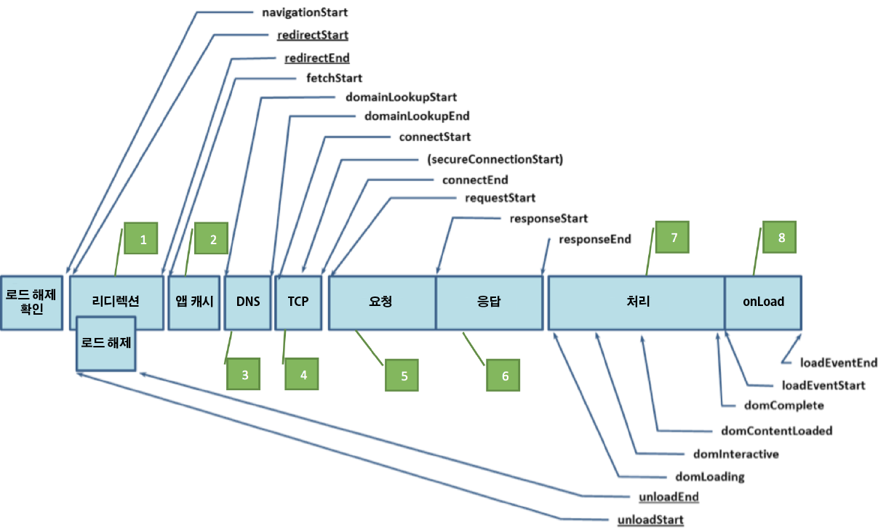

# performanceTiming

이 플러그인은 웹에서의 정확한 성능 측정을 위해 내비게이션 타이밍 JavaScript API를 사용하여 작동하며, 페이지 로드 이벤트 및 자산 로드 시간 동안 정확하고 상세한 타이밍 통계를 구하는 기본 방법을 제공합니다. 이전에는, 이러한 종류의 측정에서 타이밍 지표에 대한 JavaScript 날짜 개체나, 내비게이션 타이밍 지표의 가장 기초적인 외삽법을 이용했습니다. 이 방법들이 페이지 로드 시간에 대해 트렌드된 데이터를 제공하더라도 두 방법 모두 신뢰할 수는 없습니다.

## 이 플러그인이 수행하는 작업 {#section_4E0771B959FD4F86B4B91BD18CA01DF1}

>[!IMPORTANT]
>
>이 버전은 플러그인의 베타 버전이며 향후 업데이트될 예정입니다.

이 플러그인에서는 다음의 세부적인 이벤트를 활용하여 페이지 로드의 개별 타이밍 구성 요소를 추적합니다.

| 이벤트 | 이름 | 계산에 사용할 내용 |
|---|---|---|
| 1 | 리디렉션 타이밍 | fetchStart - navigationStart |
| 2 | 앱 캐시 타이밍 | domainLookupStart - fetchStart |
| 3 | DNS 타이밍 | domainLookupEnd - domainLookupStart |
| 4 | TCP 타이밍 | connectEnd - connectStart |
| 5 | 요청 타이밍 | responseStart - connectEnd |
| 6 | 응답 타이밍 | responseEnd - responseStart |
| 7 | 처리 타이밍 | loadEventStart - domLoading |
| 8 | onLoad 타이밍 | loadEventEnd - loadEventStart |
| 9 | 총 페이지 로드 시간 | loadEventEnd - navigationStart |
| 10 | 성능 인스턴스 | 카운터 |

다음 그래프는 각각 리디렉션이 있거나 없는 PerformanceTiming 인터페이스 및 PerformanceNavigation 인터페이스로 정의된 타이밍 특성을 보여줍니다.



내비게이션 타이밍 개체에 대한 상세한 내용은 다음 사이트에서 찾을 수 있습니다.

[https://www.w3.org/TR/navigation-timing/#sec-navigation-timing-interface](https://www.w3.org/TR/navigation-timing/#sec-navigation-timing-interface)

또한, 이 플러그인에서는 원할 경우 performanceEntries 개체를 사용하여 주어진 페이지에 로그인된 각각의 개별 자산에 대한 자산 이름, 자산 로드 시간 시작, 자산 로드 지속 시간을 자세히 기록할 수 있습니다. 이 플러그인에서는 많은 양의 정보가 기록되며, 따라서 페이지 보기 사이에 페이지 로드 정보를 저장하려면 DOM 저장소 개체를 활성화해야 합니다. 이 기능을 활성화하려면 반드시 먼저 회사 개인 정보 보호 정책에서 DOM 저장소 개체의 사용을 허용하는지 확인하십시오. 모든 자산을 추적하려면 listVar도 사용해야 합니다.

## 필요한 플러그인 지원 {#section_B6447EB6548942EFBC219AEFDC245639}

* appendList
* getPreviousValue

## 플러그인 코드 및 구현 {#section_564D77E1CF0E445586D95AD9769CE57D}

>[!NOTE]
>
>다음 지침을 따르면 사이트에서 데이터 수집 코드를 수정해야 합니다. 이 작업은 사이트의 데이터 수집에 영향을 줄 수 있으며 Adobe Analytics 사용 및 구현 경험이 풍부한 개발자만 수행해야 합니다. This plugin is compatible only with [!DNL AppMeasurement] tracking libraries.

**구성 섹션(doPlugins 전):**

`s.pte`: 사용하려는 10개의 이벤트가 특정 순서로 들어 있고 쉼표로 구분된 이벤트 목록(개별 타이밍 이벤트 구성 요소(이벤트 1 - 8), 총 페이지 로드 시간(이벤트 9), 그리고 총 성능 인스턴스(이벤트 10)). 

`s.ptc`: 설정하여 doPlugins 내에서 플러그인을 실행할지 여부를 결정합니다. 항상 false로 설정하십시오.

*샘플 호출*

```
s.pte = 'event10,event11,event12,event13,event14,event15,event16,event17,event18,event19' 
//[--------------------------- 1 to 8 ---------------------------][-- 9 --][- 10 -] 
s.ptc = false; 
```

**doPlugins Section:**

플러그인을 초기화하려면 가급적 `doPlugins` 변수를 지정한 후에 s_code의 `s.pageName` 섹션에 1개 라인의 코드가 필요합니다. 플러그인 내에서 자산 로드 시간 기능을 활용하려면 사용할 목록 변수 이름을 전달해야 합니다. 그렇지 않으면, 이전에 `s.pte` 변수에서 지정한 이벤트에서 성능 타이밍 항목만 추적됩니다.

>[!NOTE]
>
>In order to correlate performance timing entries with pages on your site, you must also initialize the `getPreviousValue` plug-in. 이러한 성능 항목을 이전 페이지 이름이나 이전 페이지 URL 값 중 하나와 비교하는 것이 좋습니다.

*샘플 호출*

```
/* Performance Timing */ 
s.eVar9 = s.getPreviousValue(s.pageName,'gpv_v9','');  //Record the previous page name in the designated eVar of your choice 
s.performanceTiming('list2')  
```

**플러그인 섹션:**

마지막으로, 플러그인 자체를 JavaScript 구현에 추가하십시오.

```
/* Plugin: Performance Timing Tracking - 0.11 BETA */ 
s.performanceTiming=new Function("v","" 
+"var s=this;if(v)s.ptv=v;if(typeof performance!='undefined'){if(perf" 
+"ormance.timing.loadEventEnd==0){s.pi=setInterval(function(){s.perfo" 
+"rmanceWrite()},250);}if(!s.ptc||s.linkType=='e'){s.performanceRead(" 
+");}else{s.rfe();s[s.ptv]='';}}"); 
s.performanceWrite=new Function("","" 
+"var s=this;if(performance.timing.loadEventEnd>0)clearInterval(s.pi)" 
+";try{if(s.c_r('s_ptc')==''&&performance.timing.loadEventEnd>0){try{" 
+"var pt=performance.timing;var pta='';pta=s.performanceCheck(pt.fetc" 
+"hStart,pt.navigationStart);pta+='^^'+s.performanceCheck(pt.domainLo" 
+"okupStart,pt.fetchStart);pta+='^^'+s.performanceCheck(pt.domainLook" 
+"upEnd,pt.domainLookupStart);pta+='^^'+s.performanceCheck(pt.connect" 
+"End,pt.connectStart);pta+='^^'+s.performanceCheck(pt.responseStart," 
+"pt.connectEnd);pta+='^^'+s.performanceCheck(pt.responseEnd,pt.respo" 
+"nseStart);pta+='^^'+s.performanceCheck(pt.loadEventStart,pt.domLoad" 
+"ing);pta+='^^'+s.performanceCheck(pt.loadEventEnd,pt.loadEventStart" 
+");pta+='^^'+s.performanceCheck(pt.loadEventEnd,pt.navigationStart);" 
+"s.c_w('s_ptc',pta);if(sessionStorage&&navigator.cookieEnabled&&s.pt" 
+"v!='undefined'){var pe=performance.getEntries();var tempPe='';for(v" 
+"ar i=0;i<pe.length;i++){tempPe+='!';tempPe+=pe[i].name.indexOf('?')" 
+">-1?pe[i].name.split('?')[0]:pe[i].name;tempPe+='|'+(Math.round(pe[" 
+"i].startTime)/1000).toFixed(1)+'|'+(Math.round(pe[i].duration)/1000" 
+").toFixed(1)+'|'+pe[i].initiatorType;}sessionStorage.setItem('s_pec" 
+"',tempPe);}}catch(err){return;}}}catch(err){return;}"); 
s.performanceCheck=new Function("a","b","" 
+"if(a>=0&&b>=0){if((a-b)<60000&&((a-b)>=0)){return((a-b)/1000).toFix" 
+"ed(2);}else{return 600;}}"); 
s.performanceRead=new Function("","" 
+"var s=this;if(performance.timing.loadEventEnd>0)clearInterval(s.pi)" 
+";var cv=s.c_r('s_ptc');if(s.pte){var ela=s.pte.split(',');}if(cv!='" 
+"'){var cva=s.split(cv,'^^');if(cva[1]!=''){for(var x=0;x<(ela.lengt" 
+"h-1);x++){s.events=s.apl(s.events,ela[x]+'='+cva[x],',',2);}}s.even" 
+"ts=s.apl(s.events,ela[ela.length-1],',',2);}s.linkTrackEvents=s.apl" 
+"(s.linkTrackEvents,s.pte,',',2);s.c_w('s_ptc','',0);if(sessionStora" 
+"ge&&navigator.cookieEnabled&&s.ptv!='undefined'){s[s.ptv]=sessionSt" 
+"orage.getItem('s_pec');sessionStorage.setItem('s_pec','',0);}else{s" 
+"[s.ptv]='sessionStorage Unavailable';}s.ptc=true;"); 
/* Remove from Events 0.1 - Performance Specific,  
removes all performance events from s.events once being tracked. */ 
s.rfe=new Function("","" 
+"var s=this;var ea=s.split(s.events,',');var pta=s.split(s.pte,',');" 
+"try{for(x in pta){s.events=s.rfl(s.events,pta[x]);s.contextData['ev" 
+"ents']=s.events;}}catch(e){return;}"); 
/* Plugin Utility - RFL (remove from list) 1.0*/ 
s.rfl=new Function("l","v","d1","d2","ku","" 
+"var s=this,R=new Array(),C='',d1=!d1?',':d1,d2=!d2?',':d2,ku=!ku?0:" 
+"1;if(!l)return'';L=l.split(d1);for(i=0;i<L.length;i++){if(L[i].inde" 
+"xOf(':')>-1){C=L[i].split(':');C[1]=C[0]+':'+C[1];L[i]=C[0];}if(L[i" 
+"].indexOf('=')>-1){C=L[i].split('=');C[1]=C[0]+'='+C[1];L[i]=C[0];}" 
+"if(L[i]!=v&&C)R.push(C[1]);else if(L[i]!=v)R.push(L[i]);else if(L[i" 
+"]==v&&ku){ku=0;if(C)R.push(C[1]);else R.push(L[i]);}C='';}return s." 
+"join(R,{delim:d2})"); 
```

## 참고 {#section_131C5D97A0094880AFC3A2BBE0BC9DE4}

* 프로덕션 환경에 배포하기 전에 항상 플러그인 설치를 테스트하여 데이터 수집이 예상대로 수행되는지 확인하십시오.
* 플러그인은 이전 페이지와 연결되어 성능 데이터를 전달하기 때문에 방문 마지막 페이지 보기에 대한 데이터를 수집하지 않습니다.
* 자산 타이밍을 추적하는 경우, 이 플러그인은 사용자의 웹 브라우저에서 DOM 저장소 값을 설정하는 기능을 이용합니다. 사용자가 쿠키를 승인하지 않고 활성화된 DOM 저장소를 가지고 있으면 플러그인은 Analytics에 데이터를 전달하지 않습니다.
* 매우 적은 비율의 사용자가 브라우저 제한 사항으로 인해 내비게이션 타이밍 데이터를 전달하지 않으며, 이 플러그인은 특히 모바일 브라우저의 작은 부분에서 데이터가 왜곡되지 않도록 하기 위해 플러그인 내에 포함됩니다. 하지만 이 플러그인은 IE, Firefox, Chrome 및 Safari에서 성공적으로 테스트되었습니다.
* [!UICONTROL 이러한 지표와 연관된 방문자 행동을 요약 및 이해하는 데 도움이 되도록 계산된 지표를] 만들어야 합니다.

   * 평균 리디렉션 타이밍(리디렉션 타이밍/성능 타이밍 인스턴스)
   * 평균 앱 캐시 타이밍(앱 캐시 타이밍/성능 타이밍 인스턴스)
   * 평균 DNS 타이밍(DNS 타이밍/성능 타이밍 인스턴스)
   * 평균 TCP 타이밍(TCP 타이밍/성능 타이밍 인스턴스)
   * 평균 요청 타이밍(요청 타이밍/성능 타이밍 인스턴스)
   * 평균 응답 타이밍(응답 타이밍/성능 타이밍 인스턴스)
   * 평균 처리 타이밍(처리 타이밍/성능 타이밍 인스턴스)
   * 평균 온로드 타이밍(온로드 타이밍/성능 타이밍 인스턴스)
   * 평균 페이지 로드 타이밍(총 페이지 로드 타이밍/성능 타이밍 인스턴스)

