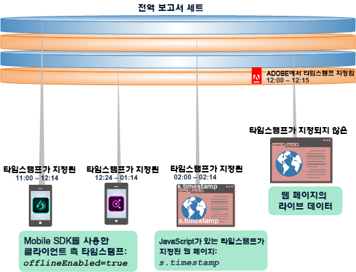
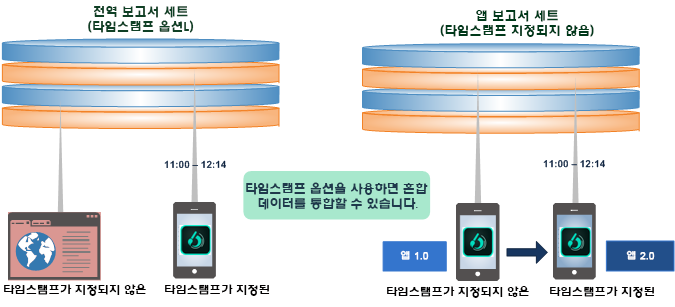
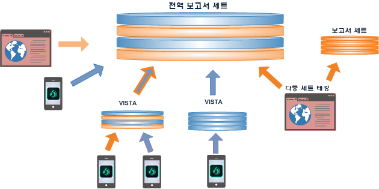
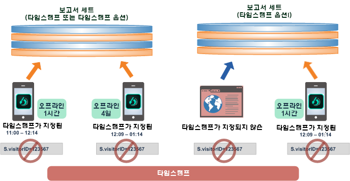
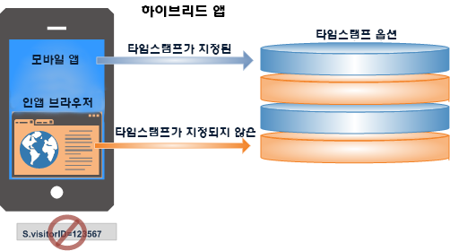

# 타임스탬프 옵션 사용

타임스탬프 옵션 설정 사용에 대한 이점 및 제한 사항에 대해 알아봅니다.

타임스탬프 옵션은 모든 새 보고서 세트에 대한 기본 설정입니다.

* 타임스탬프가 지정된 데이터와 지정되지 않은 데이터를 동일한 전역 보고서 세트에서 혼합할 수 있습니다.
* 타임스탬프가 지정된 데이터를 모바일 앱에서 전역 보고서 세트로 보낼 수 있습니다.
* 새 보고서 세트를 만들지 않고도 타임스탬프를 적용하도록 앱을 업그레이드하십시오.

>[!NOTE]
>
>타임스탬프 선택 사항은 템플릿에서 생성된 모든 새 보고서 세트에 대한 기본 설정입니다. 기존 보고서 세트에서 복사한 새 보고서 세트는 원래 보고서 세트의 설정을 상속받게 됩니다.

추가적인 설정에 대해서는 [타임스탬프 옵션](https://marketing.adobe.com/resources/help/en_US/reference/timestamp-optional.html)을 참조하십시오.

## 타임스탬프 옵션: 타임스탬프가 지정된 데이터와 지정되지 않은 데이터 통합 {#section_BF17CB593044462B993FD0D28EA56518}

타임스탬프 옵션 기능을 사용하면 데이터 손실을 발생시키지 않고도 타임스탬프가 지정되지 않은 데이터를 지정된 데이터와 결합할 수 있습니다. 모바일 장치에서 생성된 타임스탬프가 있는 오프라인 데이터는 웹 페이지에서 라이브의, 타임스탬프가 지정되지 않은 데이터와 결합하거나, 클라이언트측 타임스탬프 호출을 사용하여 모든 플랫폼의 데이터와 통합할 수 있습니다.

* **타임스탬프 데이터**. Client-side timestamp data is captured and sent directly with the device data using client-side timestamp variables: Javascript on a web page, or using a Mobile SDK call ( [!DNL offlineEnabled=true]) in a mobile app.
* **비타임스탬프 데이터**. Adobe에서는 데이터가 수집 서버를 히트하면 보고서 세트에서 타임스탬프가 지정되지 않은 데이터에 대해 타임스탬프를 설정합니다.

보고서 세트에는 다음 타임스탬프 설정 중 하나가 있을 수 있습니다.

* 타임스탬프가 허용되지 않음(visitorID 설정이 지원됨)
* 타임스탬프 필수(visitorID 설정이 지원되지 않음)
* 타임스탬프 옵션(visitorID 설정이 지원되지만 타임스탬프가 지정된 조회수에서는 지원되지 않음)

## 타임스탬프 옵션 기능에 대하여 {#section_63B2FA9A2AB24B3993E84D2C2B4BF2CE}

타임스탬프 옵션을 사용하면 클라이언트측 타임스탬프가 포함되어 있거나 포함되지 않은 여러 보고서 세트 간에 통합하고 보고할 수 있습니다. 이전 앱의 타임스탬프가 지정되지 않은 데이터를 여전히 사용하면서도 타임스탬프 옵션으로 앱을 업데이트하여 타임스탬프를 적용할 수 있습니다.

| 이전 출시 버전에서... | 또한... |
|--- |--- |
| 타임스탬프가 지정된 데이터는 타임스탬프가 지정되지 않은 전역 보고서 세트에 보낼 수 없습니다. 따라서, 오프라인 장치에서 보낸 조회수 데이터는 타임스탬프가 지정되지 않은 보고서 세트에 추가할 때 없어집니다.   따라서, 오프라인 데이터에서 보낸 조회수 데이터는 타임스탬프가 지정되지 않은 보고서 세트에 추가할 때 없어집니다. | 앱을 업데이트하여 타임스탬프를 수집 및 사용하려면 새 보고서 세트를 사용해야 합니다.  앱을 업데이트하여 타임스탬프를 사용할 때 기존 보고서 세트에 저장하거나 기존 데이터를 통합할 수 없습니다. |

**타임스탬프 옵션을 사용하면**, 모바일 장치에서 오프라인 데이터로 라이브 웹 사이트에서 타임스탬프가 지정되지 않은 데이터를 통합하거나 타임스탬프가 지정되지 않은 앱을 타임스탬프가 지정된 앱으로 업데이트할 수 있습니다. 

## 데이터를 전역 보고서 세트에 결합 {#section_5BE3BDF56007402BB1F5C3144D5FE1E0}

데이터를 전역 보고서 세트에 결합하는 일은 다중 세트 태깅, Vista 규칙, 그리고 오프라인 소스에서 가져온 배치 파일을 포함하여, 여러 가지 방식으로 수행할 수 있습니다.

>[!IMPORTANT]
>
>글로벌 보고서 세트에서 결합이 적절하도록 각 구성 요소 데이터 세트에 대한 디자인을 신중하게 계획합니다.

## 타임스탬프를 적용하는 우수 사례 {#section_9436394E5D7E4F8A8B369B6D11BB2B2B}

다음은 타임스탬프가 지정된 데이터를 타임스탬프가 지정되지 않은 데이터와 통합하는 시점을 알기 위한 우수 사례와 몇 가지 요구 사항 및 제한 사항입니다.

* 일반적으로 지정된 방문자나 방문에 대한 타임스탬프는 올바른 시간 순서로 Adobe에 도달해야 합니다.

   순서가 잘못된 데이터에는 오프라인 데이터 수집에서 늦게 도착하는 데이터와 늦게 도착하는 조회수, 또는 오프라인 모바일 장치에서 동기화가 되지 않은 시계가 포함될 수 있습니다. 데이터 순서가 잘못되면 시간 계산(체류 시간 값 등), 속성(eVar 지속성), 방문 번호/방문 카운트 및 경로 지정 보고서에 부정적인 영향을 줄 수 있습니다.

   

* [s.visitorID](https://marketing.adobe.com/resources/help/en_US/sc/implement/?f=visid_custom)를 설정할 때 타임스탬프를 사용하는 것은 권장되지 않습니다. 그렇게 하면 데이터 순서가 잘못될 수 있습니다.

* 웹 브라우저(타임스탬프가 지정되지 않은 라이브 데이터)를 여는 앱(타임스탬프가 지정된 오프라인 데이터)으로 구성된 하이브리드 앱에서는 타임스탬프를 사용하지 말아야 합니다. 그렇게 하면 세션에 대한 보고가 부정확해집니다.

   

   또한, 하이브리드 앱은 방문자 ID를 설정하지 말아야 합니다.
