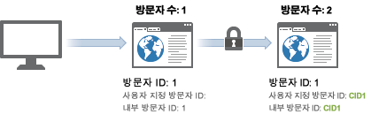
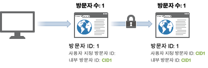

# 방문자 수

>[!IMPORTANT]
>
>장치 간에 방문자를 식별하는 이 방법은 더 이상 권장되지 않습니다. Please refer to the [Adobe Experience Cloud Device Co-op Documentation](https://marketing.adobe.com/resources/help/en_US/mcdc/).

Analytics에서는 각각의 유효한 고유 방문자 ID를 고유 방문자로 계산합니다.

[이전 표를](../../../implement/js-implementation/xdevice-visid/visit-example.md#concept_E3B32B8E539F4FDC8E3FA872328B87BA)보면 세 번 발생했습니다. 히트 1, 9 및 10 에서. 이것은 유효한 [!UICONTROL 방문자 ID]가 두 서버 호출 모두에 대해 같기 때문이며, 방문들이 서로 여러 시간 차이가 나고 다른 장치를 사용하는 것일 수 있음에도 불구하고 이렇게 되고 있습니다.

상호 장치 방문자 식별이 활성화되어 있으면 위 상황에서 표시되는 고유 방문자의 수가 증가할 수 있습니다. 이 방문자는 처음의 방문에 대해 1회, 사용자가 인증된 후에 다시 1회, 이렇게 같은 방문에 대해 두 번 계산될 수 있습니다.

새 방문자가 사이트를 보면, `s_vi` 쿠키가 채워지고 저장됩니다. 데이터 수집 서버에서, 이 방문자 ID에 대해 새 방문자 프로필이 만들어지고, 프로필에 대해 유효한 [!UICONTROL 방문자 ID]가 쿠키와 일치하도록 설정됩니다.

상호 장치 방문자 식별이 활성화되면, [!UICONTROL 방문자 ID] 변수가 후속 히트에서 제공될 경우(예: 인증 후), 유효한 [!UICONTROL 방문자 ID]가 사용자 지정 값과 일치하도록 업데이트됩니다. 이렇게 되면 인증 직후 유효한 [!UICONTROL 방문자 ID]가 변경되어 방문자 수가 여러 번 계산됩니다.

초기 연결이 이루어지면, 방문자는 [!UICONTROL 방문자 ID] 쿠키를 통해 연결되므로 방문 횟수는 정상으로 돌아옵니다. 이 방문자가 나중에 사이트를 보고, 그 다음 인증을 받는 경우, 유효한 [!UICONTROL 방문자 ID]가 인증 후에도 변경되지 않으므로 방문자 수가 부풀려지지 않습니다.

