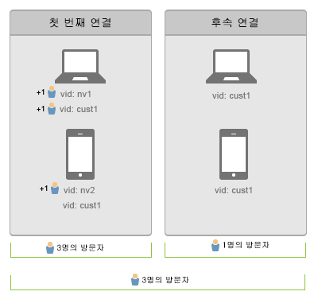

# 여러 장치에서 사용자 연결

>[!IMPORTANT]
>
>장치 간에 방문자를 식별하는 이 방법은 더 이상 권장되지 않습니다. Please refer to the [Adobe Experience Cloud Device Co-op Documentation](https://marketing.adobe.com/resources/help/en_US/mcdc/).

상호 장치 방문자 식별은 여러 장치의 방문자들을 연결하는 데 도움이 됩니다. 상호 장치 방문자 식별에서는 방문자 ID 변수 s.visitorID를 사용하여 여러 장치의 사용자를 연결합니다. 

[!UICONTROL 방문자 ID] 변수에 히트를 제공하면 시스템에서 [!UICONTROL 방문자 ID]가 일치하는 다른 방문자 프로필이 있는지 확인합니다. 일치하는 프로필이 있으면 그때부터 이미 시스템에 있는 방문자 프로필을 사용하고, 이전 방문자 프로필은 더 이상 사용하지 않습니다.

[!UICONTROL 방문자 ID]는 일반적으로 인증 후 또는 방문자가 사용 장치에 독립적으로 방문자를 식별할 수 있는 다른 작업을 수행한 후에 설정됩니다. 개인 식별 정보가 포함되지 않은 사용자 이름 해시 또는 내부 ID를 만드는 것이 좋습니다.

in the [이전에 소개한 예](../../../implement/js-implementation/xdevice-visid/xdevice-connecting.md)에서는, 고객이 각 장치에서 로그인하면 모두 같은 사용자 프로필에 연결됩니다. 방문자가 나중에 장치에서 로그아웃해도 각 장치에 저장된 [!UICONTROL 방문자 ID]가 이미 같은 방문자 프로필에 연결되어 있으므로 스티칭이 계속 작동합니다. [!UICONTROL 방문자 ID] 쿠키 삭제에 대비해 가능한 한 자주 [!UICONTROL s.visitorID]를 채우는 것이 좋습니다.

## 고유 방문자 및 방문 수 {#section_70330AB6724C4E419A4BD0BDD54641AC}

두 장치에 대해 다음 연결 시퀀스를 고려해 보십시오.

**첫 번째 데이터 연결 시**

* 방문자 중복 제거는 소급 적용되지 않습니다.

랩톱에서 인증되면, 한 방문자 ID(`nv1` 또는 `cust1`)의 히트는 Adobe Analytics에서 동일한 개인으로 간주됩니다. 하지만, 방문자 중복 제거는 소급 적용되지 않으므로, 2명의 고유 방문자로 간주됩니다.

모바일 장치의 첫 번째 데이터 연결에서는 고객이 인식되어 있지 않으므로 새 고유 방문자로 계산됩니다. 사용자가 모바일 장치에서 인증되면(`cust1`), Adobe Analytics에서는 `cust1`을 기본 사이트에서 제공된 방문자 ID로 다시 매핑하므로 고유 방문이 더 이상 증가하지 않습니다.

인증된 각각의 새로운 장치나 브라우저는 고유 방문자 1명을 추가하게 됩니다.

**후속 데이터 연결 시**

인증된 장치에 대한 후속 데이터 연결 시 고유 방문자가 증가하지 않습니다.
