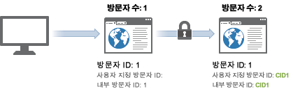
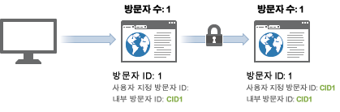

# 장치 간 방문자 식별 예

> [!IMPORTANT] 장치 간에 방문자를 식별하는 이 방법은 더 이상 권장되지 않습니다. 구성 [요소](/help/components/cda/cda-home.md) 사용 안내서의 장치 간 분석을 참조하십시오.

다음 예에서는 일반적인 고객 상호 작용에서 전송된 서버 호출 샘플을 사용하여 장치 간 방문자 식별이 작동하는 방식을 보여줍니다.

| 서버 호출 | 작업 | 방문자 ID 쿠키 | 방문자 ID 변수 | 유효 방문자 ID | 방문 페이지 번호 | 방문 횟수 |
|--- |--- |--- |--- |--- |--- |--- |
| 1 | 방문자가 마케팅 이메일에 있는 링크를 클릭하고 집 컴퓨터에서 사이트를 방문합니다. 이 방문자는 과거에 사이트를 7번 더 방문했습니다. | 1 | - | 1 | 1 | 8 |
| 2-8 | 사이트에서 7개의 페이지를 더 방문합니다. | 1 | - | 1 | 2-8 | 8 |
| 9 | 집 컴퓨터를 인증합니다. | 1 | CID1 | CID1 | 9  (This is CID1&#39;s first hit ever, so it takes over and continues on the visitor profile from Visitor ID 1.) | 8 |
| 10 | 한 페이지를 더 방문합니다. | 1 | CID1 | CID1 | 10 | 8 |
| 11 | 사무실 랩톱에서 사이트를 엽니다. 이 방문자는 이 장치를 사용하기 전에는 여러분의 사이트를 방문한 적이 없습니다. | 2 | - | 2 | 1 | 1 |
| 12 | 랩톱을 인증합니다. | 2 | CID1 | CID1 | 1 | 9 |
| 13 | 한 페이지를 더 봅니다. | 2 | CID1 | CID1 | 2 | 9 |

## 방문 카운트

Analytics는 방문 페이지 번호가 1인 히트가 표시될 때마다 방문을 카운트합니다.

위의 표를 사용하여 새 방문이 4배로 카운트되었습니다.히트 1, 9, 11 및 12에서.

## 방문자 카운트

Analytics에서는 각각의 유효한 고유 방문자 ID를 고유 방문자로 계산합니다.

위 표를 사용하여 새 방문자가 세 번 카운트되었습니다.히트 1, 9 및 10에서

상호 장치 방문자 식별을 사용하는 경우 표시되는 고유 방문자 수가 증가할 수 있습니다. 방문자는 동일한 방문에서 두 번 카운트될 수 있습니다.처음 방문과 사용자가 인증된 후에 다시 한 번.

초기 연결 후에는 방문자가 브라우저 쿠키를 통해 연결되므로 방문이 정상으로 돌아옵니다. 이 방문자가 나중에 사이트를 보고, 그 다음 인증을 받는 경우, 유효한 방문자 ID가 인증 후에도 변경되지 않으므로 방문자 수가 부풀려지지 않습니다.

고유 방문자를 식별할 때 가능한 한 일관되게 있는지 확인합니다. 예를 들어, 사용자가 인증될 때 항상 `visitorID` 변수를 사용합니다.
