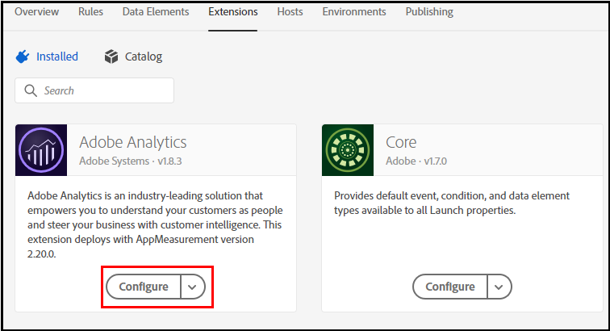

# 실행 데이터 요소를 Analytics 변수에 매핑

데이터 레이어 개체를 Launch 데이터 요소에 [매핑한 후 데이터 요소를 Analytics 변수에](https://docs.adobe.com/content/help/en/analytics/implementation/layer-to-elements.md)매핑할 수 있습니다.

Launch 데이터 요소를 Analytics 변수에 매핑하려면:

1. 해당하는 경우 데이터 요소를 전역 변수에 할당합니다. 페이지 이름과 같은 일부 데이터 *요소는* 속성의 모든 페이지에 적용됩니다. 이와 같은 경우 다음을 수행하여 변수를 전역적으로 설정할 수 있습니다.

2. 론치에서 아래로 스크롤하고 확장 카탈로그를 **클릭합니다**.

   

3. Analytics **아래에서** 구성을 클릭합니다.

   

4. 글로벌 **변수의** eVar에서 ****&#x200B;변수와 [연결되도록 설정한](https://docs.adobe.com/content/help/en/analytics/admin/admin-tools/conversion-variables/conversion-var-admin.html) eVar를 선택합니다. 다음으로 **설정을**&#x200B;선택하고 맨 오른쪽 필드에서 배럴 아이콘을 클릭하여 데이터 요소를 지정합니다.

   

5. 데이터 요소 **선택** 팝업 창에서 변수에 적용할 데이터 요소를 선택합니다.

6. **저장**&#x200B;을 클릭합니다.

또는 데이터 요소가 글로벌 변수와 연결되지 않은 경우 데이터 요소를 prop 또는 evar에 할당하는 규칙을 [간단히](https://docs.adobe.com/content/help/en/analytics/admin/admin-tools/processing-rules/processing-rules.html) 만들 수 있습니다.
