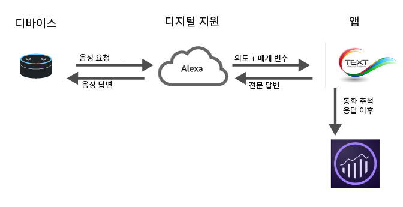

# Analytics for Digital Assistants 구현

<!-- 
https://wiki.corp.adobe.com/display/mobileanalytics/Analytics+for+Digital+Assistants+Whitepaper
https://marketing.adobe.com/resources/help/en_US/sc/implement/digital-assistants-white-paper.html
Ticket: https://jira.corp.adobe.com/browse/AN-157750
-->

클라우드 컴퓨팅, 기계 학습 및 자연어 처리 분야의 최근 발전을 통해 Digital Assistant는 일상 생활의 일부가 되고 있습니다. 소비자는 장치와 대화를 시작하고 장치가 인간과 같은 방식으로 이해하고 반응하기를 기대하고 있습니다. 디지털 도우미 플랫폼이 더욱 확실히 자리를 잡아가면서 관련 서비스 제공업체들은 사실적이며 실제와 같이 서비스를 소비자에게 제공할 수 있게 되었습니다. 예를 들면 소비자는 다음과 같은 작업을 요청할 수 있습니다.

* &quot;Alexa, 자동차 오일을 바꿔야 하는지 확인해 봐.&quot;
* &quot;Cortana, 내 결제 계좌의 잔액이 얼마야?&quot;
* &quot;Siri야, 내 뱅킹 앱에서 어제 저녁 값으로 존에게 20달러 보내 줘.&quot;

이 페이지에서는 Adobe Analytics를 사용하여 이러한 유형의 환경을 평가하고 최적화하는 방법을 개괄적으로 설명합니다.

## 디지털 환경 아키텍처 개요



오늘날 대부분의 Digital Assistant는 다음과 유사한 높은 수준의 아키텍처를 따릅니다.

1. **장치**: 사용자가 질문을 할 수 있는 마이크가 있는 장치(예: Amazon Echo 또는 전화기)가 있습니다.
1. **Digital Assistant**: 이 장치는 Digital Assistant를 구동하는 서비스와 상호 작용합니다. 여기서 음성은 시스템이 이해할 수 있는 의도로 변환되고 요청 세부 사항이 구문 분석됩니다. 사용자의 의도를 이해한 경우 Digital Assistant가 의도 및 요청 세부 사항을 요청을 처리하는 앱에 전달합니다.
1. **&quot;앱&quot;**: 앱은 전화기의 앱 또는 음성 앱일 수 있습니다. 앱이 요청에 응답합니다. 앱이 Digital Assistant에 응답하면 Digital Assistant가 사용자에게 응답합니다.

## Analytics 구현 위치

Analytics를 구현하는 가장 적합한 위치 중 하나가 앱입니다. 이 앱은 Digital Assistant로부터 의도와 세부 사항을 받은 다음, 응답하는 방법을 결정합니다.

요청 중에는 Adobe Analytics에 데이터를 전송하는 데 도움이 될 수 있는 두 번의 시기가 있습니다.

1. 요청이 앱에 전송될 때.
1. 앱에서 응답이 반환된 후.

향후 최적화를 위해 고객에게 발생한 사항을 기록하는 데 관심이 있다면 응답이 반환된 후 Adobe Analytics에 요청을 보내십시오. 요청 내용에 대한 전체 컨텍스트와 시스템이 응답한 방식이 제공됩니다.

## 새 설치

일부 Digital Assistant의 경우 누군가 이 기술을 설치하면(특히 인증이 포함되는 경우) 사용자는 알림을 받게 됩니다. 컨텍스트 데이터 변수 `a.InstallEvent=1`을 설정하여 설치 이벤트를 전송하는 것이 좋습니다. 이 기능은 모든 Digital Assistant에서 사용할 수 있는 것은 아니지만 보존 상태를 확인할 때 유용합니다. 다음 코드 샘플은 설치 이벤트, 설치 날짜 및 AppID 값을 컨텍스트 데이터 변수에 전송합니다.

```text
GET
/b/ss/examplersid/1?vid=[UserID]&c.a.InstallEvent=1&c.a.InstallDate=2017-04-24&c.a.AppID=Spoofify1.0&c.OSType=Alexa&pageName=install
HTTP/1.1
Host:
<xref href="https://sc.omtrdc.net">
  sc.omtrdc.net
 Cache-Control: no-cache
</xref href="https:>
```

## 여러 개의 Assistant 또는 여러 앱

조직에서는 여러 플랫폼용 앱을 원할 수 있습니다. 가장 좋은 방법은 각 요청에 앱 ID를 포함하는 것입니다. 이 변수는 `a.AppID` 컨텍스트 데이터 변수에서 설정할 수 있습니다. `[AppName] [BundleVersion]` 형식을 따르십시오. 예를 들어, BigMac for Alexa 1.2의 경우 다음과 같습니다.

```text
GET /b/ss/examplersid/1?vid=[UserID]&c.a.AppID=Spoofify1.0&c.a.Launches=1&c.Product=AmazonEcho&c.OSType=Alexa&pageName=install  HTTP/1.1
Host: example.sc.omtrdc.net
Cache-Control: no-cache
```

```text
GET /b/ss/examplersid/1?vid=[UserID]&c.a.AppID=Spoofify2.0&c.a.Launches=1&c.Product=GoogleHome&c.OSType=Android&pageName=install  HTTP/1.1
Host: example.sc.omtrdc.net
Cache-Control: no-cache
```

## 사용자/방문자 식별

Adobe Analytics는 [Adobe Experience Cloud Identity Service](https://docs.adobe.com/content/help/ko-KR/id-service/using/home.html)를 사용하여 시간 경과에 따른 상호 작용을 동일한 사람에게 연결합니다. 대부분의 Digital Assistant는 서로 다른 사용자에 대해 활동을 유지하는 데 사용할 수 있는 `userID`를 반환하며, 대부분의 경우 이 값은 고유 식별자로 전달할 수 있는 값입니다. 일부 플랫폼은 허용되는 100자보다 긴 식별자를 반환합니다. 이러한 경우 MD5 또는 Sha1과 같은 표준 해싱 알고리즘을 사용하여 고유 식별자를 고정 길이 값으로 해싱하는 것이 좋습니다.

ID 서비스를 사용하면 ECID를 다양한 장치에 매핑(예: 웹을 Digital Assistant에)할 때 가장 많은 가치를 제공합니다. 앱이 모바일 앱인 경우 Experience Platform SDK를 있는 그대로 사용하고 `setCustomerID` 메서드를 사용하여 사용자 ID를 전송하십시오. 하지만 앱이 서비스인 경우에는 이 서비스에서 제공한 ID를 ECID로 사용하고 이것을 `setCustomerID`에서도 설정하십시오.

```text
GET /b/ss/examplersid/1?vid=[UserID]&pageName=[intent]  HTTP/1.1
Host: example.sc.omtrdc.net
Cache-Control: no-cache
```

## 세션

Digital Assistant는 대화식이므로 세션의 개념이 있습니다. 예:

**소비자:** &quot;Ok Google, 택시를 불러 줘.&quot;

**Google:** &quot;예, 몇 시에 불러드릴까요?&quot;

**소비자:** &quot;오후 8시 30분&quot;

**Google:** &quot;좋습니다. 운전사가 오후 8시 30분에 도착할 것입니다.&quot;

세션은 컨텍스트를 유지하는 데 중요하며, 더 많은 세부 정보를 수집하여 보다 자연스러운 Digital Assistant를 만드는 데 도움이 됩니다. 대화에 대한 Analytics를 구현할 때 새 세션이 시작되면 수행할 작업이 두 가지가 있습니다.

1. **Audience Manager에 연결**: 응답을 사용자 지정할 수 있도록 사용자가 속해 있는 관련 세그먼트를 가져옵니다. (예를 들면 이 사람은 현재 다중 채널 할인에 적격입니다.)
2. **새 세션 또는 실행 이벤트에 보내기**: Analytics에 첫 번째 응답을 보낼 때 실행 이벤트를 포함합니다. 일반적으로 `a.LaunchEvent=1`의 컨텍스트 데이터를 설정하여 보낼 수 있습니다.

```text
GET /b/ss/examplersid/1?vid=[UserID]&c.a.LaunchEvent=1&c.Intent=[intent]&pageName=[intent]  HTTP/1.1
Host: sc.omtrdc.net
Cache-Control: no-cache
```

## 의도

각 Digital Assistant에는 의도를 감지한 다음 &quot;앱&quot;에 그 의도를 전달하는 알고리즘이 있으므로 앱이 수행할 작업을 알고 있습니다. 이러한 의도는 요청의 간결한 표현입니다.

예를 들어, 사용자가 &quot;Siri야, 내 뱅킹 앱에서 어제 저녁 값으로 존에게 20달러 보내 줘.&quot;라고 말하면 의도는 *sendMoney*.

이러한 각 요청을 eVar로 보냄으로써, 대화형 앱에 대해 각 의도에 대한 경로 지정 보고서를 실행할 수 있습니다. 앱에서 의도하지 않은 요청도 처리할 수 있는지 확인하십시오. 변수를 빠뜨리는 대신 &#39;지정된 의도 없음&#39;을 의도 컨텍스트 데이터 변수에 전달하는 것이 좋습니다.

```text
GET /b/ss/examplersid/1?vid=[UserID]&c.a.AppID=Penmo1.0&c.a.LaunchEvent=1&c.Intent=SendPayment&pageName=[intent]  HTTP/1.1
Host: example.sc.omtrdc.net
Cache-Control: no-cache
```

또는

```text
GET /b/ss/examplersid/1?vid=[UserID]&c.a.AppID=Penmo1.0&c.a.LaunchEvent=1&c.Intent=No_Intent_Specified&pageName=[intent]  HTTP/1.1
Host: sc.omtrdc.net
Cache-Control: no-cache
```

## 매개 변수/슬롯/엔티티

의도 외에, Digital Assistant에는 종종 의도의 세부 사항을 제공하는 키/값 쌍 세트가 있습니다. 이를 슬롯, 엔티티 또는 매개 변수라고 할 수 있습니다. 예를 들어, &quot;Siri야, 내 뱅킹 앱에서 어제 저녁 값으로 존에게 20달러 보내 줘.&quot;에는 다음과 같은 매개 변수가 있습니다.

* Who = John
* Amount = 20
* Why = Dinner

일반적으로 앱에는 유한한 수의 이러한 값이 있습니다. Analytics에서 이러한 값을 추적하려면 컨텍스트 데이터 변수로 보낸 다음, 각 매개 변수를 eVar에 매핑하십시오.

```text
GET /b/ss/examplersid/1?vid=[UserID]&c.a.AppID=Penmo1.0=1&c.a.LaunchEvent=1&c.Intent=SendPayment&c.Amount=20.00&c.Reason=Dinner&c.ReceivingPerson=John&c.Intent=SendPayment&pageName=[intent]  HTTP/1.1
Host: example.sc.omtrdc.net
Cache-Control: no-cache
```

## 오류 상태

Digital Assistant에서 처리 방법을 모르는 입력을 앱에 제공하는 경우가 있습니다. 예를 들어, &quot;Siri야, 내 뱅킹 앱에서 어제 저녁 값으로 존에게 석탄 20가방을 보내 줘.&quot;와 같은 경우입니다.

이러한 상황이 발생하면 앱이 명확한 설명을 요구하게 하십시오. 또한 발생한 오류 유형을 지정하는 eVar와 함께 앱에 오류 상태가 있음을 나타내는 데이터를 Adobe에 보내십시오. 입력이 올바르지 않은 오류와 앱에 문제가 있는 오류를 포함해야 합니다.

```text
GET /b/ss/examplersid/1?vid=[UserID]&c.a.AppID=Penmo1.0&c.Error=1&c.ErrorName=InvalidCurrency&pageName=[intent]  HTTP/1.1
Host: example.sc.omtrdc.net
Cache-Control: no-cache
```

## 장치 기능

대부분의 플랫폼은 사용자가 말한 장치를 노출하지 않지만 장치의 기능은 노출합니다. 예를 들어 오디오, 화면, 비디오 등과 같은 기능이 있을 수 있습니다. 이 정보는 사용자와 상호 작용할 때 사용할 수 있는 컨텐츠 유형을 정의하므로 유용합니다. 장치 기능을 평가할 때는 기능들을 알파벳순으로 연결하는 것이 가장 좋습니다.

예: `":Audio:Camera:Screen:Video:"`

선행 및 후행 콜론 기능은 세그먼트를 만들 때 도움이 됩니다. 예를 들어 `:Audio:` 기능이 있는 모든 히트를 표시합니다.

* Amazon Alexa를 사용한 [Amazon 기능](https://developer.amazon.com/public/solutions/alexa/alexa-skills-kit/docs/alexa-skills-kit-interface-reference)
* Google에서 작업을 사용하는 [Google 기능](https://developers.google.com/actions/assistant/surface-capabilities)

## 예

| 사람 | 장치 응답 | 작업/의도 | GET 요청 |
|---|---|---|---|
| Spoofify 설치 | 응답 없음 | 설치 | `GET /b/ss/examplersid/1?vid=[UserID]&c.a.InstallEvent=1&c.a.InstallDate=[currentDate]&c.a.AppID=Spoofify1.0&c.OSType=Alexa&c.Intent=Install&pageName=Install  HTTP/1.1`<br>`Host: example.sc.omtrdc.net`<br>`Cache-Control: no-cache` |
| Spoofify 재생 | &quot;네, Spoofify를 재생합니다&quot; | 재생 | `GET /b/ss/examplersid/1?vid=[UserID]&c.a.AppID=Spoofify1.0&c.a.LaunchEvent=1&c.Intent=Play&pageName=PlayApp  HTTP/1.1`<br>`Host: example.sc.omtrdc.net`<br>`Cache-Control: no-cache` |
| 노래 변경 | &quot;네, 어떤 노래를 원하시나요?&quot; | ChangeSong | `GET /b/ss/examplersid/1?vid=[UserID]&c.a.AppID=Spoofify1.0&c.Intent=ChangeSong&pageName= Ask%20For%20Song  HTTP/1.1`<br>`Host: example.sc.omtrdc.net`<br>`Cache-Control: no-cache` |
| 아기 상어 재생 | &quot;네, 핑크퐁의 &#39;아기 상어&#39;를 재생합니다&quot; | ChangeSong | `GET /b/ss/examplersid/1?vid=[UserID]&c.a.AppID=Spoofify1.0&c.Intent=ChangeSong&pageName=Action%20Play%20Song&c.SongID=[012345]  HTTP/1.1`<br>`Host: example.sc.omtrdc.net`<br>`Cache-Control: no-cache` |
| 재생 목록 변경 | &quot;네, 어떤 재생 목록을 원하세요?&quot; | ChangePlaylist | `GET /b/ss/examplersid/1?vid=[UserID]&c.a.AppID=Spoofify1.0&c.Intent=ChangePlaylist&pageName=Ask%20For%20Playlist  HTTP/1.1`<br>`Host: example.sc.omtrdc.net`<br>`Cache-Control: no-cache` |
| 내가 좋아하는 노래 재생 목록 재생 | &quot;네, 당신이 좋아하는 노래 재생 목록을 재생합니다&quot; | ChangePlaylist | `GET /b/ss/examplersid/1?vid=[UserID]&c.a.AppID=Spoofify1.0&c.Intent=ChangePlaylist&pageName=Action%20Play%20Playlist&c.Playlist=My%20Favorite%20Songs  HTTP/1.1`<br>`Host: example.sc.omtrdc.net`<br>`Cache-Control: no-cache` |
| 음악 끄기 | 응답 없음, 음악 끄기 | 꺼짐 | `GET /b/ss/examplersid/1?vid=[UserID]&c.a.AppID=Spoofify1.0&c.Intent=Off&pageName=Music%20Off  HTTP/1.1`<br>`Host: example.sc.omtrdc.net`<br>`Cache-Control: no-cache` |
