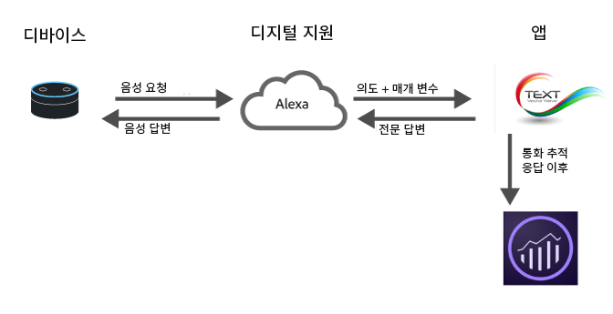

# Analytics for Digital Assistants 구현

클라우드 컴퓨팅, 머신 러닝 및 자연어 처리 분야의 발전으로 Digital Assistant는 일상 생활의 일부입니다. 소비자는 디바이스와 대화를 하면서 인간과 같은 반응을 기대하고, 브랜드는 이러한 경험을 통해 서비스를 제시할 수 있다. 예를 들어, 소비자는 다음과 같은 질문을 할 수 있습니다.

* &quot;알렉사, 내 차에 오일 교환이 필요할 때 물어보세요.&quot;
* &quot;Google, 내 당좌 예금 잔고가 얼마야?&quot;
* &quot;Siri야, 내 뱅킹 앱에서 어제 저녁 값으로 존에게 20달러 보내 줘.&quot;

이 페이지에서는 Adobe Analytics을 사용하여 이러한 유형의 경험을 측정하고 최적화하는 방법에 대한 개요를 제공합니다.

## 디지털 환경 아키텍처 개요



대부분의 Digital Assistant는 다음과 유사한 높은 수준의 아키텍처를 따릅니다.

1. **장치**: 사용자가 질문을 할 수 있는 마이크가 있는 장치(예: 스마트 스피커 또는 전화기)입니다.
1. **Digital Assistant**: 도우미를 지원하는 서비스입니다. 음성을 기계가 이해할 수 있는 의도로 전환하고 요청의 세부 사항을 구문 분석합니다. 의도가 이해되면 도우미가 의도와 세부 사항을 요청을 처리하는 앱에 전달합니다.
1. **&quot;앱&quot;**: 요청에 응답하는 휴대폰 앱 또는 음성 앱입니다. Digital Assistant에 응답하며, 이후 사용자에게 응답합니다.

## Adobe Analytics으로 데이터를 전송하는 방법

Digital Assistant 앱은 일반적으로 Adobe 클라이언트측 라이브러리(AppMeasurement 또는 웹 SDK)가 없는 서버나 플랫폼에서 실행됩니다. [데이터 삽입 API](https://developer.adobe.com/analytics-collection-apis/methods/data-insertion/)**를 사용하여**&#x200B;서버측에서 히트를 보냅니다. 측정하려는 각 상호 작용은 쿼리 문자열(또는 XML 본문)이 이 페이지에 설명된 변수([처리 규칙](/help/admin/tools/manage-rs/edit-settings/general/processing-rules/pr-overview.md)을 사용하여 eVar, prop 및 이벤트에 매핑하는 [컨텍스트 데이터 변수](/help/implement/vars/page-vars/contextdata.md))를 전달하는 데이터 삽입 API 요청이 됩니다.

이 페이지에서는 측정할 *내용*&#x200B;과(와) Analytics에서 모델링하는 방법에 중점을 둡니다. 끝점에 대한 쿼리 문자열 및 XML 인코딩, 필수 구성 요소 및 응답 형식은 [데이터 삽입 API 설명서](https://developer.adobe.com/analytics-collection-apis/methods/data-insertion/)를 참조하십시오. 아래의 각 변수는 [변수 참조](https://developer.adobe.com/analytics-collection-apis/methods/data-insertion/variable-reference)의 쿼리 문자열 매개 변수 및 XML 태그에 매핑됩니다.

## Analytics 구현 위치

Analytics를 구현하는 가장 좋은 위치 중 하나는 Digital Assistant로부터 의도와 세부 사항을 수신하고 응답하는 방법을 결정하는 앱에 있습니다. 요청 중에는 Adobe Analytics으로 데이터를 전송하는 데 도움이 되는 두 가지 순간이 있습니다.

1. 요청이 앱에 전송될 때.
1. 앱에서 응답이 반환된 후.

향후 최적화를 위해 발생한 사항을 기록하는 데 관심이 있는 경우 응답이 반환된 후 히트를 전송하십시오. 그러면 요청의 전체 컨텍스트와 시스템이 응답한 방법이 있습니다.

## 측정 방법

### 새 설치

누군가 기술을 설치할 때(특히 인증이 포함되는 경우) 알리는 도우미의 경우 `a.InstallDate` 및 앱 ID(`a.AppID`)와 함께 컨텍스트 데이터 변수 `a.InstallEvent=1`을(를) 설정하여 설치 이벤트를 보냅니다. 모든 플랫폼에서 사용할 수 있는 것은 아니지만 보존 분석 시 유용합니다.

### 여러 개의 Assistant 또는 앱

조직은 여러 플랫폼용 앱을 빌드하는 경우가 많습니다. `a.AppID` 컨텍스트 데이터 변수의 모든 요청에 대해 `[AppName] [BundleVersion]` 형식을 사용하여 앱 ID를 포함하십시오(예: `Spoofify 1.0`). Alexa, Google Assistant 및 보고의 다른 플랫폼을 구분할 수 있도록 플랫폼 또는 OS 컨텍스트 데이터 변수(예: `OSType`)를 추가합니다.

### 방문자 식별

Adobe Analytics은 [Adobe 방문자 ID 서비스](https://experienceleague.adobe.com/kr/docs/id-service/using/home)를 사용하여 시간에 따른 상호 작용을 동일한 사람에게 연결합니다. 대부분의 Digital Assistant는 고유 식별자로 사용할 수 있는 `userID`을(를) 반환하며, 이를 방문자 ID 재정의(`vid`)로 전달합니다. 일부 플랫폼은 허용되는 100자보다 긴 식별자를 반환합니다. 이러한 경우 MD5 또는 SHA-1과 같은 표준 알고리즘을 사용하여 식별자를 고정 길이 값으로 해시합니다.

방문자 ID 서비스를 사용하면 ECID를 장치 간에 매핑 (예: 웹을 Digital Assistant에)할 때 가장 많은 가치를 제공합니다. 앱이 모바일 앱인 경우 Experience Platform Mobile SDK을 사용하고 `setCustomerID` 메서드와 함께 사용자 ID를 보냅니다. 앱이 서비스인 경우 이 서비스에서 제공한 사용자 ID를 방문자 ID로 사용하고 `setCustomerID`(으)로도 설정합니다. 서버측 요청에 대한 식별자를 설정하는 방법은 [데이터 삽입 API를 사용한 방문자 식별](../id/data-insertion.md)을 참조하십시오.

### 세션

Digital Assistant는 대화형이므로 세션(다중 턴 교환)의 개념을 가지고 있는 경우가 많습니다. 새 세션이 시작되면 Adobe에서는 다음 두 가지를 권장합니다.

1. **Audience Manager에 연결**&#x200B;하여 사용자가 속한 세그먼트를 가져오면 응답을 사용자 지정할 수 있습니다.
1. 컨텍스트 데이터 변수 `a.LaunchEvent=1`을(를) 설정하여 첫 번째 응답과 함께 **시작 이벤트를 보냅니다**.

### 의도

각 도우미가 의도를 감지하여 앱에 전달합니다. 의도는 요청의 간결한 표현입니다. 예를 들어 &quot;Siri야, 내 뱅킹 앱에서 어제 저녁 값으로 존에게 20달러 보내 줘.&quot;가 의도 *sendMoney*(으)로 확인될 수 있습니다. 여러 의도 간에 경로 지정 보고서를 실행할 수 있도록 각 의도를 eVar에 매핑하는 컨텍스트 데이터 변수에 보냅니다. 앱에서 의도하지 않은 요청도 처리하는지 확인하십시오. Adobe에서는 변수를 생략하지 않고 `No Intent Specified`을(를) 전송하는 것이 좋습니다.

### 매개변수, 슬롯 및 엔티티

의도 외에, 도우미는 요청의 키/값 세부 사항(슬롯, 엔티티 또는 매개 변수라고 함)을 제공하는 경우가 많습니다. &quot;Siri야, 어제 저녁 값으로 존에게 20달러 보내 줘.&quot;의 매개 변수는 다음과 같습니다.

* Who = John
* 금액 = 20
* 이유 = 저녁 식사

일반적으로 앱마다 유한 세트의 이러한 매개 변수가 있습니다. 컨텍스트 데이터 변수로 보내고 각각을 eVar에 매핑합니다.

### 오류 상태

때때로 도우미가 앱에서 처리할 수 없는 입력을 전달합니다(예: &quot;Siri야, 내 뱅킹 앱에서 석탄 20가방을 보내 줘.&quot;). 이런 경우 앱에서 설명을 요청하고 오류 상태를 나타내는 데이터를 보내도록 합니다. 오류 유형을 지정하는 eVar과 함께 `a.Error=1`을(를) 설정하십시오. 입력이 잘못된 오류와 앱 자체에 문제가 있는 오류를 모두 포함합니다.

### 디바이스 기능

대부분의 플랫폼은 정확한 디바이스를 노출하지 않지만 사용할 수 있는 컨텐츠 유형을 정의하는 기능(예: 오디오, 화면 또는 비디오)은 노출합니다. 장치 기능을 측정할 때 &quot;`:Audio:` 기능이 있는 모든 히트&quot;와 같은 세그먼트를 작성할 수 있도록 앞에 오는 콜론 및 뒤에 오는 콜론(예: `":Audio:Camera:Screen:Video:"`)과 알파벳 순서로 연결하십시오.

* [Amazon Alexa 인터페이스 참조](https://developer.amazon.com/public/solutions/alexa/alexa-skills-kit/docs/alexa-skills-kit-interface-reference)
* [Google Assistant 표면 기능](https://developers.google.com/actions/assistant/surface-capabilities)

## 요청 예

다음 데이터 삽입 API GET 요청은 뱅킹 앱에 대한 *SendPayment* 의도를 기록하여 앱 ID, 실행 이벤트, 의도 및 슬롯 값을 컨텍스트 데이터로 설정합니다.

```text
GET /b/ss/examplersid1,examplersid2/1?vid=[UserID]&c.a.AppID=Penmo%201.0&c.a.LaunchEvent=1&c.Intent=SendPayment&c.Amount=20.00&c.Reason=Dinner&c.ReceivingPerson=John&pageName=SendPayment HTTP/1.1
Host: example.data.adobedc.net
```

전체 요청 형식, 끝점 및 응답 형식에 대해서는 [데이터 삽입 API 설명서](https://developer.adobe.com/analytics-collection-apis/methods/data-insertion/request)를 참조하십시오.

## 측정 모델 예

다음 표는 음악 앱의 일반적인 작업이 Analytics 변수에 매핑되는 방법을 보여 줍니다. 각 데이터 삽입 API 요청에 컨텍스트 데이터 변수로 설정한 다음 처리 규칙이 있는 eVar 및 이벤트에 매핑합니다.

| 개인 작업 | 의도/이벤트 | 설정할 컨텍스트 데이터 |
| --- | --- | --- |
| 앱 설치 | 설치 | `a.InstallEvent=1`, `a.InstallDate`, `a.AppID`, `OSType` |
| 앱 실행 | Launch | `a.LaunchEvent=1`, `a.AppID`, `Intent=Play` |
| 노래 바꿔 달라고 하세요. | ChangeSong | `a.AppID`, `Intent=ChangeSong` |
| 특정 노래 재생 | ChangeSong | `a.AppID`, `Intent=ChangeSong`, `SongID` |
| 재생 목록 변경 | ChangePlaylist | `a.AppID`, `Intent=ChangePlaylist`, `Playlist` |
| 잘못된 입력이 발생했습니다. | (오류) | `a.Error=1`, `ErrorName` |
