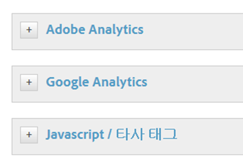
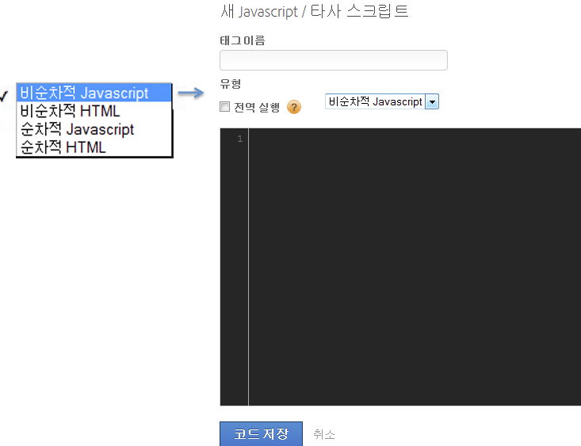
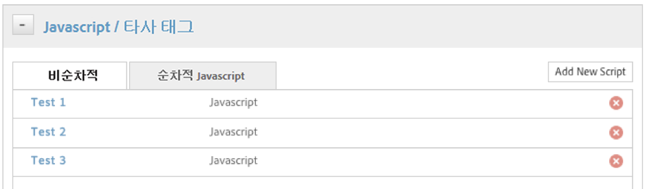

# 조건이 트리거되는 작업 설정

조건으로 트리거할 작업을 설정합니다.

조건을 설정한 후에는 조건이 트리거될 작업을 설정해야 합니다. 이러한 작업에는 [!DNL Analytics] 이벤트, 타사 태그 및 사용자 지정 스크립트가 포함될 수 있습니다. 다음 예에서는 스크립트 또는 타사 태그를 설정하는 방법을 설명합니다.

[!DNL Adobe Analytics] 및 Google Analytics와 같은 통합 도구 이상의 기능을 수행하는 Dynamic Tag Management는 선별된 페이지나 특정 시나리오에서 모든 유형의 JavaScript를 트리거하거나 HTML을 사이트에 삽입할 수 있습니다.

각 규칙은 스크립트나 HTML 주입을 원하는 만큼 트리거할 수 있습니다.

>[!NOTE] DTM을 통해 페이지에 사용자 지정 코드를 삽입할 수 있으므로 교차 사이트 스크립팅(XSS) 취약점이 발생하지 않도록 주의하십시오(자세한 내용은 [OWASP 안내서](https://www.owasp.org/index.php/Cross-site_Scripting_(XSS)) 참조). 스크립트 내에서 데이터 요소를 사용하려면 특별한 주의가 필요합니다. 항상 신뢰할 수 없는 출처의 데이터 요소 값이 될 수 있다고 가정합니다.

**조건이 트리거되는 작업 설정**

1. 을 **[!UICONTROL JavaScript / Third Party Tags]** 클릭하여 새 스크립트를 규칙에 추가합니다.

   

1. 클릭 **[!UICONTROL Add New Script]**.

   

1. 스크립트 이름을 지정합니다.
1. 스크립트를 트리거할 방법을 지정하고 원하는 컨텐츠를 텍스트 영역에 붙여넣습니다. 

1. Click **[!UICONTROL Save Code]**, and the script will be added to the queue for the rule. 

