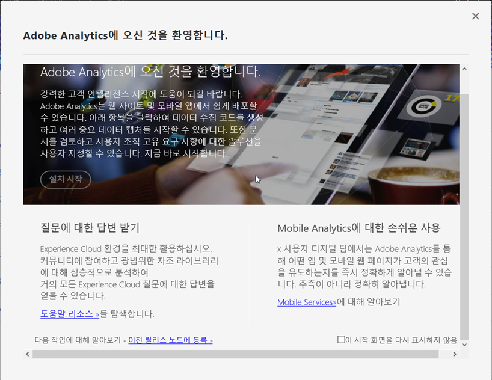

# 구현 모달

<!-- https://activation.adobedtm.com/index.php?redirected=1 -->

&#39;Adobe Analytics에 오신 것을 환영합니다&#39; 모달 창은 보고서 세트를 만드는 간소화된 워크플로우를 제공합니다. 조직에서 더 많은 보고서 세트가 필요할 때마다 이 워크플로우를 사용하는 것이 좋습니다.

## 전제 조건

Adobe ID는 Adobe Analytics와 Adobe Experience Platform Launch 모두에 액세스할 수 있어야 합니다. Launch에 액세스할 수 없는 경우 자격 증명을 확인하는 메시지가 계속 표시되는 인증 루프가 시작될 수 있습니다. Launch에 대한 액세스 권한을 받으려면 조직의 시스템 관리자에게 문의하십시오.

## 모달 액세스

보고서 세트를 만들려면 다음 절차에 따라 모달에 액세스하십시오.

1. Adobe ID 자격 증명을 사용하여 [experiencecloud.adobe.com](https://experiencecloud.adobe.com)에 로그인합니다.
2. 맨 위에 있는 9격자 아이콘을 클릭한 다음 [!UICONTROL Adobe Analytics]를 클릭합니다.
3. 보고서 세트를 아직 만들지 않은 경우 모달이 자동으로 나타납니다. If a report suite exists for this login company, click the Help icon in the top right, then click [!UICONTROL Welcome to Adobe Analytics].

>[!NOTE] 이 [!UICONTROL Welcome to Adobe Analytics] 옵션은 Adobe Experience Cloud를 통해 로그인한 경우에만 나타납니다. 기존 도메인을 통해 로그인하는 경우에는 모달을 사용할 수 없습니다.

## 보고서 세트 만들기

Click the [!UICONTROL Start Setup] button to begin the report suite creation workflow.

### 속성 유형

속성 유형은 Adobe가 Analytics를 구현할 위치를 기반으로 일부 백엔드 설정을 결정하는 데 도움이 됩니다.

* **웹 사이트**: 웹 사이트에 대해서만 Adobe Analytics를 구현하려는 경우.
* **네이티브 모바일 앱**: 모바일 앱에 대해서만 Adobe Analytics를 구현하려는 경우.
* **모두**: 이 보고서 세트에 웹 사이트와 모바일 앱 모두에 대한 데이터가 포함되어 있는 경우.

### 업종

기본 비즈니스 모델을 지정합니다. 이 설정은 Adobe가 기본 비즈니스 모델을 기반으로 일부 변수 이름과 설정을 미리 구성하는 데 도움이 됩니다.

### 데이터 계층

[데이터 계층](data-layer.md)은 구현에 사용된 모든 변수를 하나의 유용한 위치로 구성하는 JavaScript 개체입니다. 자세한 내용은 [데이터 계층](data-layer.md)을 참조하십시오.

### 데이터 저장소

보고서 세트에는 친숙한 이름을 지정하십시오. 보고서 세트 ID(RSID)는 친숙한 이름과 로그인 회사를 기반으로 자동으로 생성됩니다.

### 시간대

Adobe에서 보고서 세트에 대한 올바른 시간대를 감지했는지 확인합니다.

### 예상 일별 페이지 보기 수

웹 사이트 또는 앱의 일일 트래픽 양을 예측합니다. 이 정보를 통해 Adobe는 보고서 세트에 정확한 양의 처리 리소스를 할당할 수 있습니다.

### 기본 통화

보고서 세트에서 통화 값을 저장하는 데 사용하는 통화를 결정합니다.

>[!IMPORTANT] 매출에 대한 보고 요구 사항이 있는 경우 특히 올바른 통화를 명시해야 합니다. 데이터 수집이 시작된 후에는 기본 통화를 변경하기가 어렵습니다.

## 구현 리소스

보고서 세트가 만들어지면 두 옵션 중 하나를 사용하여 구현을 계속 진행할 수 있습니다.

* **Adobe Experience Platform Launch로 이동**: 구현을 구성하고 배포 코드를 다운로드할 수 있는 [launch.adobe.com](https://launch.adobe.com)에 연결합니다. [Launch를 사용한 구현](../launch/overview.md)을 참조하십시오. 대부분의 경우 Launch를 사용하는 것이 좋습니다.
* **구현 코드 다운로드**: 수동 JavaScript 구현을 위해 JavaScript 파일을 다운로드할 수 있는 링크를 제공합니다. [JavaScript용 AppMeasurement](../js/overview.md)를 참조하십시오.
