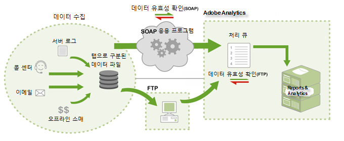

# Data Sources 작동 방식

Adobe에서 데이터 소스에 대한 액세스 권한을 제공하는 방법에 대한 정보.

>[!NOTE]
>
>가져온 데이터가 Data Sources를 통해 전송되면 JavaScript 비콘, actionsource, 데이터 삽입 API 등의 다른 수단으로 수집한 보고 데이터와 구별할 수 없게 됩니다. 가져온 데이터는 삭제할 수 없습니다.

두 가지 방법으로 데이터를 제출할 수 있습니다.

* [FTP](../../import/c-data-sources/datasrc-how-data-sources-works.md#section_0E70022648F94061AF5B4AD6C7145243)
* [API](../../import/c-data-sources/datasrc-how-data-sources-works.md#section_65DACC9CE00C437BBFDD02D19C25A4BD)

## FTP {#section_0E70022648F94061AF5B4AD6C7145243}

FTP 파일 전송을 사용하여 데이터 파일을 데이터 소스로 가져오는 마케팅 보고서를 통해 FTP 기반 데이터 소스를 만들고 관리할 수 있습니다. 데이터 소스를 생성하면 Adobe에서 데이터 소스 파일 업로드에 사용할 수 있는 FTP 위치를 제공합니다. 업로드되면 데이터 소스는 자동으로 이를 찾아서 처리합니다. 처리가 끝난 데이터는 마케팅 보고서에 사용할 수 있습니다.

## API {#section_65DACC9CE00C437BBFDD02D19C25A4BD}

Adobe는 애플리케이션을 데이터 소스에 프로그래밍 방식으로 연결할 수 있는 데이터 소스 API를 제공합니다. 그러면 중개 FTP 서버가 필요 없이 HTTP, SOAP 및 REST를 통해 데이터를 전송할 수 있습니다. 

[데이터 소스 API 문서](https://marketing.adobe.com/developer/documentation/data-sources/c-data-sources-api)를 참조하십시오.
