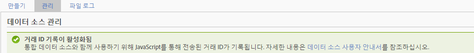

# 거래 및 고객 통합

Data Sources는 온라인 데이터에 발생하는 이벤트를 통합하는 두 가지 추가 방법을 제공합니다.

* [거래 ID 기록 활성화](../../import/c-data-sources/datasrc-integrating-offline-data.md#section_30D6D47AEC0F4A36B87EBFE4C858F20C)
* [거래 통합](../../import/c-data-sources/datasrc-integrating-offline-data.md#section_B3F281CEFF9B47E9A07F9851D61D415D)
* [고객 통합](../../import/c-data-sources/datasrc-integrating-offline-data.md#section_9F4AAD710D2543BDA834090A98115FBF)

이러한 통합은 오프라인 데이터를 특정 온라인 거래 또는 온라인 방문자와 연결합니다.

## 거래 ID 기록 활성화 {#section_30D6D47AEC0F4A36B87EBFE4C858F20C}

ClientCare가 없으면 UI에서 거래 ID를 사용/사용 안 함으로 설정할 수 있습니다.

**[!UICONTROL 관리]** &gt; **[!UICONTROL 보고서 세트]** &gt; **[! Uicontrol[보고서 세트 선택]]** &gt; **[!UICONTROL 설정 편집]** &gt; **[!UICONTROL 일반]** &gt; **[!UICONTROL 일반 계정 설정을]**&#x200B;선택합니다.

<!-- 

When contacting Customer Care, be prepared to provide the following information: 
 
<ul id="ul_C425C7A074484650AFCCF0425E8E3F47"> 
 <li id="li_7640C0C4DF0C49749A3C37E5461DC22F">Report Suite ID of the data source for which you need transaction ID recording enabled. 
In Data Sources, the report suite ID is the first part of the login appended by a random number that identifies the specific data source that was set up. For example, <code> RSID-drmossdev5 Login-drmossdev5_0001343430</code>. 
 </li> 
 <li id="li_4FB0E3EC7BE94A2DBEE9063365A71C9C">The Transaction ID expiration window (described in <a href="../../import/c-data-sources/datasrc-tid-visitor-profile.md#concept_0AF92491E8274BF69E66DB36E5F54A0F" format="dita" scope="local"> Transaction ID and Visitor Profiles</a>). By default this is 90 days, but it can be extended to up to 2 years. </li> 
</ul>

 -->

To see if Transaction ID Recording is enabled, navigate to **[!UICONTROL Analytics]** &gt; **[!UICONTROL Admin]** &gt; **[!UICONTROL Data Sources]**.

[!UICONTROL 관리] 탭에 거래 ID 기록 상태가 표시됩니다.

## 고객 통합 {#section_9F4AAD710D2543BDA834090A98115FBF}

고객 ID는 고객의 오프라인 활동을 지정하고 이를 온라인 활동에 연결하는 데 사용됩니다. 다음 경우에 사용해야 합니다.

* 고객 ID가 *`visitorID`* 변수.
* 리드 제출 또는 구매와 같이, 고객 활동이 오프라인으로 이동하는 지정된 지점이 없는 경우.

이러한 유형의 데이터 소스를 구성하려면 다음을 참조하십시오. [Visitor ID](../../import/c-data-sources/c-datasrc-types/datasrc-visitorid.md#concept_1CFAA61D57A84B22A41F7A8E0DFCAAB5)

## 거래 통합 {#section_B3F281CEFF9B47E9A07F9851D61D415D}

거래 ID는 특정 시간의 방문자 상태를 기록하는 데 사용됩니다. 다음과 같이 고객 경험이 온라인에서 오프라인으로 이동되는 시점에 사용해야 합니다.

* 영업 사원이 고객에게 연락하도록 리드 제출.
* 온라인 구매(나중에 매장에서 반환할 수 있음).
* 제품 구매(나중에 지원 요청 전화를 할 수 있음).

고객이 온라인에서 오프라인으로 이동할 때 익명인 경우가 많습니다.

거래 ID 이벤트는 방문 기여도 지표(마케팅 보고서에 표시된 것)에 포함되어 있지 않지만, 방문자 기여도 지표(애드혹 분석에만 사용 가능)에는 포함되어 있습니다.

이것은 거래 ID 데이터가 방문과는 연결되어 있지 않지만(오프라인 이벤트는 보통 온라인 이벤트에 속하지 않으므로), 방문자와는 연결되어 있기 때문입니다.

see [거래 ID](../../import/c-data-sources/c-datasrc-types/datasrc-transactionid.md#concept_A97302E9EC45468A8F30285FACE8C776).
