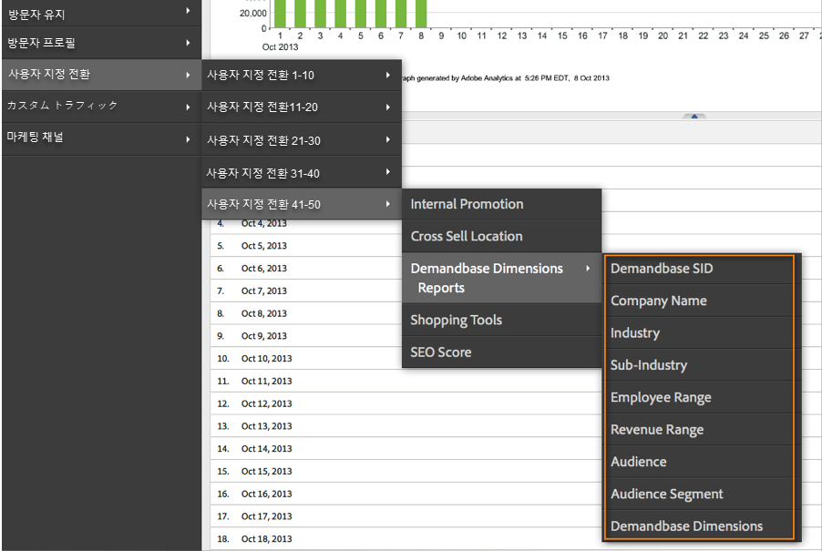
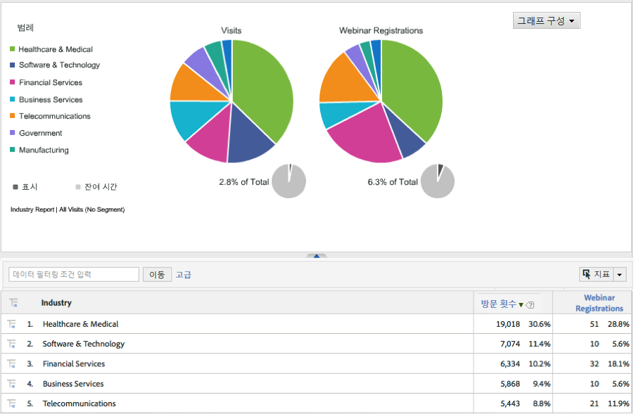

# 통합 배포{#deploying-the-integration}

이 통합 배포는 다음 작업이 필요한 간단한 프로세스입니다.

## Adobe 통합 마법사 완료{#completing-the-adobe-integration-wizard}

통합을 활성화하려면 데이터 커넥터 인터페이스 내에서 구성 마법사를 완료해야 합니다.

1. Adobe Experience Cloud 내에서 데이터 커넥터(이전 Genesis) 영역으로 이동합니다.
1. Demandbase 2.0 통합 마법사를 시작합니다.
1. 원하는 보고서 세트를 선택하고 통합 이름을 제공합니다.
1. 다음 항목을 구성합니다.

<table id="table_8D60DC7C48C144DC9934749E7F9F65FF"> 
 <thead> 
  <tr> 
   <th colname="col1" class="entry"> 항목 </th> 
   <th colname="col2" class="entry"> 설명 </th> 
  </tr>
 </thead>
 <tbody> 
  <tr> 
   <td colname="col1"> 이메일 주소 </td> 
   <td colname="col2"> 기본 연락처의 이메일 주소입니다. </td> 
  </tr> 
  <tr> 
   <td colname="col1"> 설명 </td> 
   <td colname="col2"> (선택 사항) 이 통합 설정에 대한 설명입니다. </td> 
  </tr> 
  <tr> 
   <td colname="col1"> Demandbase API 키 </td> 
   <td colname="col2"> Demandbase 담당자로부터 받을 수 있습니다. </td> 
  </tr> 
  <tr> 
   <td colname="col1"> 사용자 지정 Demandbase 차원 #N </td> 
   <td colname="col2"> 8개의 선택적 차원에 대한 ID입니다. 자세한 내용은 Demandbase 사용자 지정 차원을 참조하십시오. </td> 
  </tr> 
  <tr> 
   <td colname="col1"> Adobe Target으로 보내기 </td> 
   <td colname="col2">"true"이면 숨겨진 mbox를 사용하여 Demandbase 차원도 Adobe Target으로 전송됩니다. <p>참고: 차원을 수집하려면 구성된 mbox.js 파일을 웹 페이지에 구현해야 합니다. </p> </td> 
  </tr> 
 </tbody> 
</table>

1. 다음 변수 매핑 항목을 구성합니다.

   | 항목 | 설명 |
   |---|---|
   | Demandbase 차원 | 보고서 세트에서 사용 가능한 eVar 변수를 선택합니다. |
   | Demandbase 사용자 지정 차원(선택 사항) | 보고서 세트에서 사용 가능한 eVar 변수를 선택합니다. |

1. 사용자 지정 차원의 이름을 구성합니다(해당하는 경우).

   1. 4단계에서 사용자 지정 차원을 포함시키고 5단계에서 선택적 eVar를 매핑하도록 선택한 경우 해당 차원에 대해 친숙한 이름을 제공해야 합니다. 예를 들어 "stock_ticker"를 사용자 지정 차원 1로 입력하도록 선택한 경우 "Dimension 1"이 포함된 상자를 "Stock Ticker"로 변경해야 합니다.
   1. 표준 **8** 차원의 이름(즉, Demandbase SID, Company Name, Industry 등)은 수정하지 마십시오.

1. Demandbase 통합 대시보드를 자동으로 만들려면 이 확인란을 선택합니다(권장).
1. 모든 구성 항목을 검토하고 지금 **[!UICONTROL 활성화를 클릭합니다]**.

## 통합 코드 배포{#deploying-the-integration-code}

통합 마법사를 완료한 후 통합 코드를 Adobe Analytics 배포 코드(s_code)에 배포해야 합니다.

>[!NOTE]
>
>Adobe TagManager 또는 다이내믹 태그 관리를 사용하여 Adobe Analytics를 배포하는 경우 이러한 도구 중 하나를 사용하여 통합 코드를 쉽게 추가할 수 있습니다.

1. 지원 **[!UICONTROL 탭으로 이동하여]** 통합의 리소스 영역에서 `integration code v2_0_1` 리소스를 다운로드하고 저장합니다.

1. 해당되는 경우 코드를 수정해야 합니다. 자세한 내용은 통합 코드 수정(이 페이지)을 참조하십시오.
1. 통합 모듈이 Adobe Analytics 배포 코드에 아직 없는 경우 통합 모듈을 포함하십시오.
1. 다음 방법 중 하나를 사용하여 코드를 배포합니다.

   * Adobe TagManager 또는 다이내믹 태그 관리를 사용하여 코드를 추가합니다.
   * 또는 Adobe Analytics 배포 코드 업데이트를 담당하는 조직 리소스에 코드를 전달할 수 있습니다.

>[!IMPORTANT]
>
>프로덕션 환경에 배포하기 전에 개발/스테이징 환경에서 이 통합에 대한 배포를 테스트해야 합니다.

## 통합 코드 수정{#modifying-the-integration-code}

대부분의 경우 데이터 커넥터 마법사에서 생성한 통합 코드를 수정할 필요가 없습니다.

그러나 조정해야 하는 경우 코드 설정 중 일부가 아래에 설명되어 있습니다.

<table id="table_5405A73CEFD44466B3C39559F4A037C9"> 
 <thead> 
  <tr> 
   <th colname="col1" class="entry"> 코드 설정 </th> 
   <th colname="col2" class="entry"> 설명 </th> 
  </tr>
 </thead>
 <tbody> 
  <tr> 
   <td colname="col1"> s.maxDelay </td> 
   <td colname="col2">Analytics 수집 서버로 실행하기 전에 Adobe Analytics 이미지 요청이 Demandbase 데이터를 기다리는 최대 시간(밀리초)입니다. <p>참고: 이 설정은 통합 모듈을 통해 실행될 수 있는 모든 통합에 적용됩니다. </p> </td> 
  </tr> 
  <tr> 
   <td colname="col1"> _db._key </td> 
   <td colname="col2"> Demandbase API 키 </td> 
  </tr> 
  <tr> 
   <td colname="col1"> _db._apiURL </td> 
   <td colname="col2"> Demandbase API에 대한 URL 템플릿입니다. </td> 
  </tr> 
  <tr> 
   <td colname="col1"> _db._delim </td> 
   <td colname="col2"> Demandbase 차원 값을 Adobe Analytics로 보낼 때 구분 기호로 사용됩니다. 이 설정을 변경하면 기본 분류 규칙이 제대로 작동하지 않을 수 있습니다. </td> 
  </tr> 
  <tr> 
   <td colname="col1"> _db._setTnt </td> 
   <td colname="col2">true인 경우 통합 코드는 숨겨진 mbox를 사용하여 Demandbase 차원을 프로필 매개 변수로 Adobe Target으로 전송합니다. <p>참고: 이를 위해서는 mbox.js 코드가 페이지에 있어야 합니다. </p> </td> 
  </tr> 
  <tr> 
   <td colname="col1"> _db._tntVarPrefix </td> 
   <td colname="col2"> 이 문자열은 Adobe Target으로 보내기 전에 각 Demandbase 차원 이름에 추가됩니다. 예를 들어 이 설정에 "db_" 값이 있으면 "industry" 차원이 "db_industry"로 Adobe Target으로 전송됩니다. </td> 
  </tr> 
  <tr> 
   <td colname="col1"> _db._dimensionsArray </td> 
   <td colname="col2"> Adobe Analytics로 전송되는 표준 Demandbase 차원입니다. 이 설정은 수정하지 않는 것이 좋습니다. "max_size" 속성은 잘림이 발생하기 전에 차원에 대해 허용되는 문자 수입니다. </td> 
  </tr> 
  <tr> 
   <td colname="col1"> _db._dimensionsArrayCustom </td> 
   <td colname="col2"> Adobe Analytics로 전송되는 사용자 지정 Demandbase 차원입니다. "max_size" 속성은 잘림이 발생하기 전에 차원에 대해 허용되는 문자 수입니다. </td> 
  </tr> 
  <tr> 
   <td colname="col1"> _db._cName </td> 
   <td colname="col2"> Demandbase API 통신 상태를 유지하는 데 사용되는 세션 쿠키의 이름입니다. </td> 
  </tr> 
  <tr> 
   <td colname="col1"> _db._contextName </td> 
   <td colname="col2"> 표준 차원을 Adobe Analytics로 전송하는 데 사용되는 contextData 변수의 이름입니다. 이 설정은 수정하지 않는 것이 좋습니다. </td> 
  </tr> 
  <tr> 
   <td colname="col1"> _db._contextNameCustom </td> 
   <td colname="col2"> 사용자 지정 차원을 Adobe Analytics로 전송하는 데 사용되는 contextData 변수의 이름입니다. 이 설정은 수정하지 않는 것이 좋습니다. </td> 
  </tr> 
 </tbody> 
</table>

## 통합 모듈 포함{#including-the-integrate-module}

통합 코드를 사용하려면 통합 모듈이 Adobe Analytics 배포 내에 있어야 합니다.

배포의 일부로 아직 통합 모듈이 없는 경우, 사용 중인 구현 유형에 따라 다음 단계를 완료하십시오.

### AppMeasurement v1.0+의 경우 {#section-f28d090bf2404cabaae34cd9c66fc575}

1. Analytics &gt; 관리 &gt; CodeManager에서 다운로드한 **[!UICONTROL AppMeasurement]** zip **[!UICONTROL 파일의 압축을]** 해제할 **[!UICONTROL 수]**&#x200B;있습니다.

1. 이름이 지정된 파일을 [!DNL AppMeasurement_Module_Integrate.js]엽니다.
1. 이 파일의 내용을 복사하여 기본 [!DNL AppMeasurement.js] 파일에 붙여넣습니다.

   >[!NOTE]
   >
   >파일 내의 이 줄 주석 아래에 있는 내용은 변경하지 마십시오.

### 기존 코드(H-코드)의 경우 {#section-bba8ad8c715e4f97883e7de3269f681a}

1. 데이터 커넥터 UI(지원 탭 아래)의 "리소스" 영역에서 통합 모듈을 다운로드합니다.

   

1. 해당 파일의 내용을 복사하여 [!DNL s_code] 파일에 붙여 넣습니다.

   >[!NOTE]
   >
   >파일 내의 이 줄 주석 아래에 있는 내용은 변경하지 마십시오.

## 통합 확인{#verifying-the-integration}

라이브 추적 및 보고를 확인하여 통합이 데이터를 성공적으로 캡처하는지 확인합니다.

### 라이브 추적 {#section-9c20e8ff6b404ae09387ee07d675c9e2}

DigitalPulse 디버거 도구를 사용하여 Demandbase 차원 데이터가 Adobe Analytics로 전송되고 있는지 확인합니다. 쿠키를 삭제한 후 통합 코드가 배포된 웹 사이트의 페이지를 다시 로드합니다. 현재 IP가 Demandbase에서 인식하는 조직에 매핑된다고 가정할 경우 다음과 유사한 결과를 볼 수 있습니다.

**보고 및 분석(이전 SiteCatalyst)에는 두 가지 Demandbase 컨텍스트 데이터 변수가 포함되어 있습니다.**


**Target Mbox에는 Demandbase 프로필 매개 변수가 포함되어 있습니다.**

페이지에 Target이 구현되어 있고 이 통합이 Adobe Target용으로 구성된 경우에만 이 옵션이 표시됩니다. Adobe 통합 마법사의 4단계를 참조하십시오.


### 보고 {#section-1792fe75dc3249d0ad063dfd87a89162}

Adobe 통합 마법사(7단계)를 사용하여 자동으로 생성된 대시보드를 사용하여 Adobe Analytics 내에서 Demandbase 보고서를 검토합니다.

또는 Adobe Analytics 메뉴 구조 내에서 Demandbase 보고서로 이동할 수 있습니다. 아래 스크린샷을 참조하십시오.

>[!NOTE]
>
>이 데이터는 성공적인 배포 후 24-48시간 이내에 나타나야 합니다.





### FAQ {#section-d926b160a2ef4f07b43ea1bc67ac2a0a}

**"[n/a]"는 무엇을 의미합니까?**

Demandbase 데이터 커넥터는 이 기본값을 설정하여 속성이 "사용할 수 없음"인 경우를 나타냅니다. 기본값이 설정되는 두 가지 일반적인 시나리오가 있습니다.

* Demandbase는 방문자가 회사에 속하지 않는 IP 주소에서 오고 있음을 감지합니다.
* 계정 감시 속성("watch_list"로 시작)이 사용되지만 회사는 계정 감시 목록에 없습니다.

**특정 속성에 대해 "`[n/a]`"가 더 자주 표시되는 이유는 무엇입니까?**

Demandbase는 모든 IP 주소를 분류하고 방문자가 회사 IP에서 오지 않더라도 대상 및 audience_segment 속성을 제공합니다. 대상이 "주거", "무선" 및 "접대"와 같은 값을 반환하면 나머지 속성은 사용할 수 없습니다.

때때로 방문자의 대상은 "SMB"이지만 다른 속성은 "`[n/a]`"로 표시됩니다. 즉, Demandbase는 방문자를 소기업으로 분류할 수 있지만 전체 회사 프로필을 사용할 수 없습니다. 일반적으로 소규모 기업이 두 개 이상 동일한 서비스 제공업체 또는 IP 주소 블록을 사용하고 있는 경우 가장 작은 회사에서 발생합니다.

### 개발자 고려 사항 {#section-d33fff55bc4b4db99f82dee418ef1bc2}

구현에서 기본값을 조정해야 하는 경우 라인을 업데이트합니다.

```
_db._nonOrgMatchLabel = "[n/a]";
```
