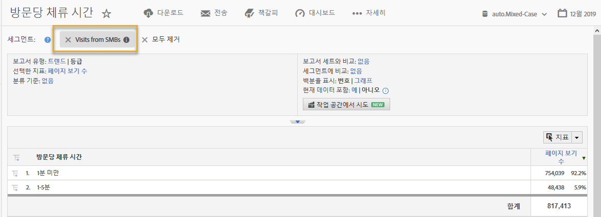

# 통합 사용{#using-the-integration}

통합이 배포되면 제공된 추가 기능을 사용할 수 있습니다.

> [!NOTE] Adobe Analytics 보고 내에서 일부 Demandbase 데이터를 보려면 24-48시간이 걸릴 수 있습니다.

다음은 Adobe Analytics 내에서 이 통합으로 가치를 창출하는 데 사용할 수 있는 몇 가지 작업입니다.

## Demandbase 차원별 트래픽 및 전환 지표 보기{#viewing-traffic-and-conversion-metrics-by-demandbase-dimension}

이 통합은 Adobe Analytics 보고서로 사용할 수 있는 새 차원을 제공합니다.

아래 보고서는 대상 유형과 업계별로 분류된 방문 횟수 및 전환 지표(웨비나 등록)를 분석하는 예입니다.

## Demandbase 차원으로 세그먼트화{#segmenting-by-demandbase-dimensions}

이 통합의 주요 기능은 Demandbase 차원을 기반으로 Adobe Analytics 세그먼트를 만드는 기능입니다.

예를 들어 SMB 조직의 방문자만 포함하는 세그먼트를 만들 수 있습니다. SMB에서 이 방문을 호출할 수 있습니다. 정의:

고객이 SMB입니다.

세그먼트를 만드는 방법에 대한 자세한 내용은 Analytics 세그멘테이션 [안내서를 참조하십시오](https://marketing.adobe.com/resources/help/en_US/analytics/segment/).

그런 다음 이 세그먼트를 실질적으로 모든 보고서에 적용할 수 있습니다. 예를 들면 다음과 같습니다. 
