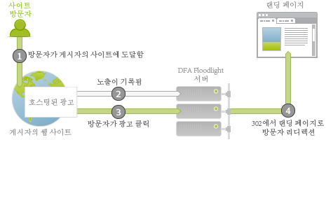
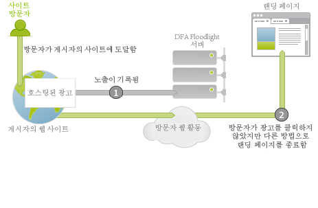

# 광고 서비스 제공 통합 개요{#ad-serving-integration-overview}

이 통합 기능은 여러 가지 방법으로 광고 기반 방문자에 대한 데이터를 캡처합니다. 첫 번째 방법은 광고를 클릭하여 클릭스루라고 하는 태그가 지정된 랜딩 페이지에 도달하는 것입니다.

방문자가 광고를 호스트하는 게시자의 사이트에 도달합니다. 이 광고에는 광고 ID라고 하는 고유한 식별자가 있습니다. 광고는 광고가 게시자의 사이트에 있는 위치와 방문자에게 표시된 컨텐츠를 설명하는 게재위치 및 광고 소재로 구성됩니다. 방문자가 DFA 컨텐츠 서버에서 이 광고, 게재위치 또는 광고 소재를 가져올 때 이 방문자(1)의 DFA Floodlight Server에 대한 노출을 추적합니다.

방문자가 광고(2)를 클릭하면 Floodlight Server가 쿼리되고, 클릭 수를 계산한 다음 302가 방문자를 랜딩 페이지로 리디렉션(3)합니다. 방문자가 랜딩 페이지에 도달한 경우에는 이를 클릭스루라고 합니다. 이 페이지에는 DFA Floodlight Server에서 데이터를 쿼리하는 Adobe 추적 코드가 들어 있습니다.

Floodlight Server에서 클릭을 추적한 후 방문자가 실제로 랜딩 페이지에 도달하지 않은 경우에는 이를 클릭스루라고 하지 않습니다. 일부 광고 및 구현에서는 실제로 방문자의 브라우저가 302 리디렉션을 준수하지 않을 수도 있습니다. 이 항목에 대한 세부 토론은 [지표 불일치 조정](../dfa-data-connector-analytics/dfa-reconciling-metric-discrepancies/dfa-reconciling-metric-discrepancies.md#concept-8c31ebe761ca4b3fab1e3a18ef5d098f)을 참조하십시오.

이 통합에서 캡처한 다음 지표는 방문자가 광고 노출을 받고, 클릭하지 않았지만 빠른 시일 내에 다른 방법으로 랜딩 페이지에 도달하는 경우 발생합니다.

이 시나리오를 뷰스루라고 합니다. 클릭스루 시나리오와 이 시나리오의 차이점은 방문자가 광고를 클릭하지 않지만 대신 랜딩 페이지(2)에 도달하기 전에 다른 활동을 계속한다는 것입니다. 가장 간단한 경우는 방문자가 브라우저에 랜딩 페이지의 URL을 입력합니다. 다른 경우는 방문자가 계속 탐색하지만 방문자를 랜딩 페이지로 안내하는 검색 엔진을 나중에 사용합니다. 어느 경우든지 사용자가 랜딩 페이지에 도달합니다.
