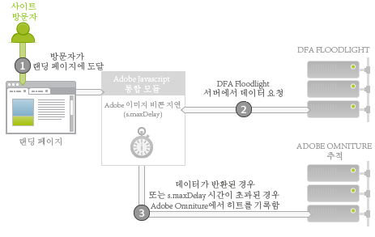

# Adobe 통합: 실시간 데이터 수집{#adobe-integration-real-time-data-collection}

다음 그림은 데이터 수집 방법을 보여줍니다.

Adobe 통합의 데이터 수집 부분은 방문자가 랜딩 페이지(1)에 도달하면 시작됩니다. 랜딩 페이지에서 실행되는 Adobe 데이터 수집 코드는 방문자가 게재된 광고에서 수행했던 기록을 알지 못합니다. Google DFA 팀은 Adobe 코드를 사용하여 현재 사이트(2)에서 방문자에 대한 광고 정보를 쿼리할 수 있도록 DFA Floodlight Server에서 실행되는 서비스를 조정해 왔습니다. 이 데이터를 얻기 위해 Adobe 이미지 비콘을 일시 지연시키고 Floodlight Server에서 데이터를 요청합니다.

데이터가 도착하거나 데이터가 도착하는 데 시간이 너무 오래 걸리면 Adobe 추적 서버(3)로 히트를 발생시킵니다.

통합 모듈은 Adobe 이미지 비콘을 지연시키고 특정 시간 동안 타사 요청을 대기하는( *`s.maxDelay`*). *`s.maxDelay`* 는 방문자의 브라우저로 이미지 태그를 실행할 때까지 통합 모듈이 DFA Floodlight Server의 데이터를 대기하는 시간을 정의합니다. DFA Floodlight Server가 중단되거나 부하가 심한 경우에도 기본 방문자 데이터가 여전히 수집되고 있기 때문에 이 동작은 중요합니다. Floodlight 데이터가 *`s.maxDelay`* 만료 전에 도착하면 Adobe 추적 데이터가 바로 실행되고, 추가 DFA 데이터가 포함됩니다.

시간 초과가 발생하면 페이지 코드가 Adobe 보고 및 분석 이벤트를 시간 초과 이벤트로 사용하도록 지정할 수 있습니다. 이 이벤트는 통합 문제를 진단할 때 또는 *`s.maxDelay`*. 과도한 시간 초과가 있는 경우 *`s.maxDelay`*. *`s.maxDelay`* 이 값을 너무 높게 설정할 수 있지만, 이 경우 방문자는 *`s.maxDelay`* 타이머가 만료되기 전에 사이트를 떠날 가능성이 있습니다. For more discussion on this topic, see [Tuning s.maxDelay](../dfa-data-connector-analytics/dfa-integration/dfa-tuning-s-maxlelay.md#concept-6deb28eee18e414db220d6009d449f0d).

Floodlight Server가 방문자에 대해 오류로 응답하는 경우가 있습니다. 일반적으로 방문자가 아직 광고를 보지 못했거나 DFA 방문자 쿠키를 갖고 있지 않기 때문에 Floodlight Server가 해당 방문자에 대해 전혀 모르는 경우 이러한 문제가 발생합니다. 페이지 코드에서 이러한 오류를 수집하는 사용자 지정 전환 변수(eVar)를 지정하고, 구현 문제 해결을 지원하거나 Google 트랜잭션 문제를 설명할 수 있습니다. 가장 일반적인 오류는 아래 표에 설명된 대로 기록 없음, 쿠키 없음, 쿼리 오류 및 선택 해제입니다.

| 오류 | 이름 | 설명 |
|---|---|---|
| nh | 기록 없음 | 방문자가 광고를 보지 않았거나 클릭하지 않았습니다. |
| nc | 쿠키 없음 | 방문자에게 DFA 방문자 쿠키가 없습니다. |
| qe | 쿼리 오류 | Floodlight Server에 대한 데이터를 쿼리하는 데 오류가 발생했습니다. |
| oo | 선택 해제 | 방문자가 Google 노출/클릭 추적 기능을 선택 해제했습니다. |

