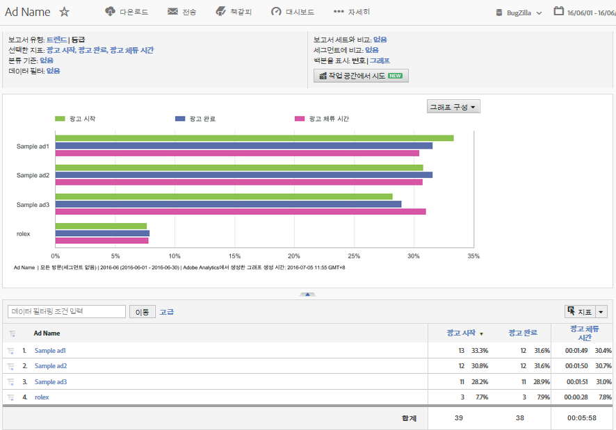

# DFA 데이터를 사용하는 Analytics Reports{#analytics-reports-using-dfa-data}

DFA 및 Adobe® 수집 서버가 통신할 수 있으면 보고 및 분석에서 DFA 데이터가 포함된 보고서를 생성할 수 있습니다.

미리 패키지된 DFA 보고서에는 다음 항목이 포함됩니다.

**채널**: 배너 광고와 유료 검색 및 이메일과 같은 다른 온라인 광고 옵션을 비교하는 데이터를 표시합니다.

**배달 도구**: DoubleClick for Advertisers와 다른 온라인 광고 서비스를 비교하는 데이터를 표시합니다.

**사이트 이름**: DFA 배너 광고가 표시된 웹 사이트를 비교하는 데이터를 표시합니다.

**페이지 이름**: DFA 배너 광고가 표시된 개별 웹 페이지를 비교하는 데이터를 표시합니다.

**광고 이름**: 특정 DFA 배너 광고를 비교하는 데이터를 표시합니다.

**캠페인**: 다른 DFA 광고 캠페인을 비교하는 데이터를 표시합니다.

DFA 보고서를 생성하려면:

1. Adobe Marketing Cloud에 로그인합니다.
1. **[!UICONTROL Analytics]** &gt; **[!UICONTROL 보고 및 분석으로 이동합니다]**. DFA 통합을 설치한 보고서 세트를 선택했는지 확인합니다.

1. 왼쪽 탐색에서 DFA 클릭스루 데이터를 캡처하는 전환 변수를 선택한 다음 원하는 DFA 보고서를 선택합니다.
1. **[!UICONTROL 지표 추가를 클릭합니다]**. 이 경우 [지표 선택기] 대화 상자가 열립니다.
1. **[!UICONTROL 사용 가능한 지표]** 목록에서 노출 횟수 및 클릭 지표를 확인하고 **[!UICONTROL 적용을 클릭합니다]**.

   결과 보고서에 노출 횟수, 클릭 수 및 수익 데이터가 표시되므로 DFA 서비스가 최저 수익으로 변환되는 방식을 볼 수 있습니다.
예를 들어, DFA 광고 이름 보고서는 현재 DFA 광고 캠페인의 특정 배너 광고에 사용된 노출 횟수, 클릭 수 및 수익 데이터를 직접 표시합니다.

   

이 보고서에는 다음과 같은 중요한 기능이 있습니다.

* DFA_Ad 이름 보고서라는 보고서 헤더에는 보고서 기간(2009년 2월)이 표시되며, 가로 막대형 형식을 사용하는 등급 보고서임을 나타냅니다.
* 그래프 자체에 보고서의 각 DFA 광고에 대한 세 개 지표(노출 횟수, 클릭 수 및 수익)가 표시됩니다.
* 그래프는 각 지표에 실제 숫자를 사용하지 않고, 각 지표에 대한 데이터를 지표 합계의 백분율로 표시합니다. **[!UICONTROL 보고서 구성]대화 상자에서 이를 변경할 수 있습니다.**
* 그래프 아래에 있는 DFA_Ad 이름 보고서는 각 DFA 광고에 대한 보고서 세부 사항을 나열하고, 광고 성과에 대한 지표와 백분율 데이터를 모두 표시합니다.
* 특정 DFA 광고에 대한 자세한 정보를 보려면 해당 특정 DFA 광고 이름을 선택하여 옵션 메뉴를 엽니다.
* 각 지표 열에는 그래프에서 지표에 지정한 색상에 해당하는 색상 키가 포함되어 있습니다.
* 보고서는 맨 위에 최고 수익 광고가 있는 수익 지표에 따라 정렬됩니다. 다른 열(지표) 레이블을 클릭하여 보고서 정렬 순서를 변경할 수 있습니다.

