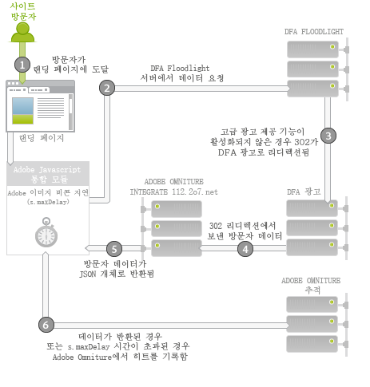

# Adobe Analytics용 DFA Data Connectors{#dfa-data-connector-for-adobe-analytics}

오늘날과 같이 복잡해지고 경쟁이 치열한 온라인 시장에서 온라인 광고주와 에이전시는 온라인 마케팅 환경에 대한 이해도와 광고 지출에 대한 수익률을 지속적으로 향상시켜야 합니다. 이러한 목표 달성을 지원하기 위해 광고주, 에이전시 및 게시자가 모두 개별 도구를 처리해야 하지만, 전혀 다른 데이터 시스템과 프로세스에서 수동으로 데이터를 집계하는 것이 온라인 마케팅 캠페인의 효과를 방해하여 최적이 아닌 캠페인 성과, 데이터 불일치 및 혼동을 야기할 수 있습니다.

DFA(DoubleClick for Advertisers) 통합은 Adobe® Data Connectors™를 사용하여 DoubleClick DFA가 보고 및 분석으로 데이터를 자동으로 전달할 수 있도록 함으로써 이러한 문제를 해결합니다.

**[!UICONTROL Analytics]** &gt; **[!UICONTROL 관리]** &gt; **[!UICONTROL 데이터 커넥터]**

## 핵심적인 이점{#key-benefits}

Data Connectors - DFA 통합의 주요 이점은 다음과 같습니다.

* **향상된 전환**: 클릭 후 방문자 동작 및 기본 설정에 따라 광고 캠페인 게재위치 및 온사이트 전환을 최적화하기 위한 통찰력을 얻을 수 있습니다.
* **데이터 공유 위치**: DoubleClick DFA 클릭스루와 뷰스루 데이터를 보고 및 분석과 결합하여 조직 간 공동 작업 및 객관적인 결정을 내리는 기능을 향상시킬 수 있습니다.
* **부가 가치 분석**: DFA와 Adobe 보고 및 분석 간 자동 통합을 통해 광고주와 에이전시가 데이터 계산에 할애하는 시간을 줄이고 보고서 분석 및 조치에 더 많은 시간을 할애할 수 있습니다.
* **더 깊이 있는 고객 통찰력**: 방문자가 어디에서 오고 사이트에서 어떠한 작업을 수행하는지에 대해 깊이 있는 통찰력을 얻을 수 있습니다.
* **라이프타임 성공 지표**: 전체 방문자 수명 주기에서 획득 캠페인의 효과를 측정합니다.
* **통합 보고**: 간소화된 비즈니스 프로세스 및 보고에 대한 DFA와 보고 및 분석 간 데이터를 자동으로 동기화합니다.
* **라이프타임 방문자 분석**: 여러 사용자 정의 성공 이벤트 및 라이프타임 가치로 캠페인 효과를 측정합니다.
* **비용 지표**: 단일 시스템에서 DFA 비용 수치 및 그러한 비용에서 생성된 수익을 비교하여 투자 수익을 최적화합니다.

## 광고 서비스 제공 통합 개요{#ad-serving-integration-overview}

이 통합 기능은 여러 가지 방법으로 광고 기반 방문자에 대한 데이터를 캡처합니다. 첫 번째 방법은 광고를 클릭하여 클릭스루라고 하는 태그가 지정된 랜딩 페이지에 도달하는 것입니다.

방문자가 광고를 호스팅하는 게시자의 사이트에 도달합니다. 이 광고에는 광고 ID라고 하는 고유한 식별자가 있습니다. 광고는 게재자의 사이트에서 광고가 있는 위치와 방문자에게 표시된 컨텐츠를 설명하는 배치와 크리에이티브를 구성합니다. 방문자가 DFA 컨텐츠 서버에서 이 광고, 게재위치 또는 광고 소재를 가져올 때 이 방문자(1)의 DFA Floodlight Server에 대한 노출을 추적합니다.

방문자가 광고(2)를 클릭하면 Floodlight Server가 쿼리되고, 클릭 수를 계산한 다음 302가 방문자를 랜딩 페이지로 리디렉션(3)합니다. 방문자가 랜딩 페이지에 도달한 경우에는 이를 클릭스루라고 합니다. 이 페이지에는 DFA Floodlight Server에서 데이터를 쿼리하는 Adobe 추적 코드가 들어 있습니다.

Floodlight Server에서 클릭을 추적한 후 방문자가 실제로 랜딩 페이지에 도달하지 않은 경우에는 이를 클릭스루라고 하지 않습니다. 일부 광고 및 구현으로 인해 실제로 방문자의 브라우저가 302 리디렉션을 따르지 않을 수 있습니다. 이 항목에 대한 자세한 내용은 지표 [불일치 조정을 참조하십시오](../dfa-data-connector-analytics/dfa-reconciling-metric-discrepancies.md).

이 통합에서 캡처한 다음 지표는 방문자가 광고 노출을 받고, 클릭하지 않았지만 빠른 시일 내에 다른 방법으로 랜딩 페이지에 도달하는 경우 발생합니다.

이 시나리오를 뷰스루라고 합니다. 클릭스루 시나리오와 이 시나리오의 차이점은 방문자가 광고를 클릭하지 않지만 대신 랜딩 페이지(2)에 도달하기 전에 다른 활동을 계속한다는 것입니다. 가장 간단한 경우는 방문자가 브라우저에서 랜딩 페이지의 URL을 입력합니다. 다른 경우는 방문자가 계속 탐색하지만 방문자를 랜딩 페이지로 안내하는 검색 엔진을 나중에 사용합니다. 어느 경우든지 사용자가 랜딩 페이지에 도달합니다.

## Adobe 통합: 실시간 데이터 수집{#adobe-integration-real-time-data-collection}

다음 그림은 데이터 수집 방법을 보여줍니다.

Adobe 통합의 데이터 수집 부분은 방문자가 랜딩 페이지(1)에 도달하면 시작됩니다. 랜딩 페이지에서 실행되는 Adobe 데이터 수집 코드는 방문자가 게재된 광고에서 수행했던 기록을 알지 못합니다. Google DFA 팀은 Adobe 코드를 사용하여 현재 사이트(2)에서 방문자에 대한 광고 정보를 쿼리할 수 있도록 DFA Floodlight Server에서 실행되는 서비스를 조정해 왔습니다. 이 데이터를 얻기 위해 Adobe 이미지 비콘을 일시 지연시키고 Floodlight Server에서 데이터를 요청합니다.

데이터가 도착하거나 데이터가 도착하는 데 시간이 너무 오래 걸리면 Adobe 추적 서버(3)로 히트를 발생시킵니다.

통합 모듈은 Adobe 이미지 비콘을 지연시키고 특정 시간 동안 타사 요청을 대기하는(`s.maxDelay` 참조). `s.maxDelay` 통합 모듈이 방문자의 브라우저로 이미지 태그를 실행하기 전에 DFA Floodlight Server의 데이터를 기다리는 시간을 정의합니다. DFA Floodlight Server가 중단되거나 부하가 심한 경우에도 기본 방문자 데이터가 여전히 수집되고 있기 때문에 이 동작은 중요합니다. Floodlight 데이터가 `s.maxDelay` 만료 전에 도착하면 Adobe 추적 데이터가 바로 실행되고, 추가 DFA 데이터가 포함됩니다.

시간 초과가 발생하면 페이지 코드가 Adobe 보고 및 분석 이벤트를 시간 초과 이벤트로 사용하도록 지정할 수 있습니다. 이 이벤트는 통합 문제를 진단할 때 또는 `s.maxDelay`. 과도한 시간 초과가 있는 경우 `s.maxDelay`. `s.maxDelay` 그러나 방문자가 `s.maxDelay` 타이머 만료 전에 사이트를 떠날 가능성이 있는 경우 너무 높게 설정할 수 있습니다..

Floodlight Server가 방문자에 대해 오류로 응답하는 경우가 있습니다. 일반적으로 방문자가 아직 광고를 보지 못했거나 DFA 방문자 쿠키를 갖고 있지 않기 때문에 Floodlight Server가 해당 방문자에 대해 전혀 모르는 경우 이러한 문제가 발생합니다. 페이지 코드에서 이러한 오류를 수집하는 사용자 지정 전환 변수(eVar)를 지정하고, 구현 문제 해결을 지원하거나 Google 트랜잭션 문제를 설명할 수 있습니다. 가장 일반적인 오류는 아래 표에 설명된 대로 기록 없음, 쿠키 없음, 쿼리 오류 및 선택 해제입니다.

| 오류 |  이름  | 설명 |
|---|---|---|
| nh | 기록 없음 | 방문자가 광고를 보지 않았거나 클릭하지 않았습니다. |
| nc | 쿠키 없음 | 방문자에게 DFA 방문자 쿠키가 없습니다. |
| qe | 쿼리 오류 | Floodlight Server에 대한 데이터를 쿼리하는 데 오류가 발생했습니다. |
| oo | 선택 해제 | 방문자가 Google 노출/클릭 추적 기능을 선택 해제했습니다. |

## Adobe 통합: 매일 밤 데이터 가져오기{#adobe-integration-nightly-data-import}

통합의 데이터 수집 부분은 사이트 방문자에 대한 클릭스루와 뷰스루 데이터를 수집합니다. DFA 클릭, 노출 및 비용 지표를 가져오려면 Google 및 Adobe에서 이 추가 데이터를 통합된 보고서 세트로 가져오기 위해 조정한 매일 밤 프로세스가 있습니다. 이러한 지표는 데이터 소스를 통해 가져옵니다. 즉, 집계에서만 사용할 수 있고 방문 수준에서는 사용할 수 없습니다.

## 버전 차이{#version-differences}

현재 DFA 통합 버전에는 세 가지 버전 1.0, 1.5 및 2.0이 있습니다.

다음 표는 각 통합 버전의 기능을 요약한 것입니다.

| 기능 | 버전 1.0 | 버전 1.5 | 버전 2.0 |
|---|---|---|---|
| 매일 밤 DFA 클릭 및 노출 지표 | 예 | 예 | 예 |
| 클릭스루 및 뷰스루 추적 | 예 | 예 | 예 |
| 통합은 광고주 수준에서 데이터 수신 | 아니요 | 예 | 예 |
| 통합은 Floodlight 구성 수준에서 데이터 수신 | 아니오 | 아니오 | 예 |
| 비용 지표 | 아니오 | 아니오 | 예 |
| 광고 소재 지표 | 아니오 | 아니오 | 예 |
| 2kb 이상의 쿼리 문자열 | 아니요 | 예 | 예 |
| 최적의 타사 데이터 수집에 통합 모듈 사용 | 아니요 | 예 | 예 |
| 시간 초과 및 오류 추적 | 아니요 | 예 | 예 |
| 협의된 클라이언트측 ID에는 필요하지 않음 | 아니오 | 아니오 | 예 |

### 버전 1.5 정보 {#section-b5a3e967cfa141ea8f740612336181be}

통합 버전 1.5는 랜딩 페이지 Java Script에 통합 모듈을 도입했습니다. 통합 모듈은 이전 통합의 2K 요청 한도를 해결한 DFA 광고 서버(ad.doubleclick.net)에 대한 고정된 크기의 요청을 허용합니다. 또한 구성 가능한 시간 초과를 도입하여 *`s.maxDelay`*, to continue collecting Adobe visitor data when network outages occur. 오류 및 시간 초과를 Analytics 변수에 캡처할 수도 있습니다.

다음 그림은 버전 1.5의 랜딩 페이지에서 네트워크 상호 작용을 보여줍니다.

버전 1.5에서 통합 모듈(2)은 Floodlight 서버(3)에서 데이터를 요청합니다. Floodlight 서버는 DFA 광고 서버로 리디렉션되고, 방문자에 대한 데이터를 버전 1.0에서와 같은 방법으로 반환합니다. 응답 구성을 JSON 개체로 바꾸는 integrate.112.2o7.net에서의 특수한 번역기 서비스로 302 리디렉션(4)합니다. 통합 모듈은 이 JSON 개체를 사용하여 Adobe 추적(5)에 이 정보를 전달합니다.

통합 버전 1.0에서 1.5로 이동하면 JavaScript가 변경됩니다. 이 JavaScript를 가져오려면 Adobe Online Marketing Suite 계정에 로그인하고, Genesis 제품을 선택한 다음, DFA 통합에서 [편집]을 선택하고 마법사를 진행합니다. 클라이언트 사이트 ID를 이전에 지정한 경우 통합을 저장하면 이메일을 통해 새 JavaScript 코드를 바로 받게 됩니다. 이 코드가 있으면 통합 모듈이 있는 핵심 s_code의 새 버전도 필요합니다. 이 코드는 계정 관리자 또는 구현 컨설턴트에게 요청할 수 있습니다.

새 JavaScript 코드의 중요한 기능은 버전 1.5와 버전 2.0 간에 구현 변경이 필요하지 않다는 것입니다.

### 버전 2.0 정보 {#section-afd56de0c56c4489bb5ddc5798d6709a}

최신 DFA 통합 버전은 전체 Floodlight 구성에 대한 데이터를 통합으로 가져옵니다. 2.0 이전 버전에서는 개별 통합이 단일 DFA 광고주에게 연결되었습니다. 이러한 변경 사항을 사용하면 Floodlight 구성 전체에 대한 클릭 수, 노출 횟수 및 비용 지표가 통합된 보고서 세트에 포함됩니다. 또한 그러한 두 사이트가 같은 Floodlight 구성 내에 있을 경우 사이트 간 뷰스루를 추적할 수도 있습니다.

미디어 비용 지표는 통합 버전 2.0부터 사용할 수 있습니다. 통합에 대한 미디어 비용 지표를 활성화하려면 Genesis 마법사에서 미디어 비용에 대한 보고 및 분석 이벤트를 선택하고, DFA 인터페이스의 지표 수치 통화를 지정해야 합니다.

302 리디렉션이 제거되었기 때문에 2.0 통합에서 시간 초과가 줄어들 것으로 예상됩니다. 이러한 홉 수를 제거하면 시간 초과가 줄어들고, 통합할 수 있는 DFA 데이터 양이 늘어납니다.

Floodlight 구성이 DFA에서 공유한 구성인 경우 버전 1. 5에서 2.0으로 업그레이드하면 Floodlight 구성 내에서 공유한 모든 광고주가 보고서 세트에 포함됩니다.

### 버전 2.0으로 업그레이드 {#section-f0bf90b9a7a1434ab1540b6c0999f4c7}

다음 표는 최신 버전의 통합으로 마이그레이션하는 소유자에 대해 요약한 것입니다.

| 마이그레이션 | 소유자 | 작업 |
|---|---|---|
| 버전 1.0 - 1.5 | 고객 | 통합 모듈로 버전 1.5 JavaScript 구현 |
| 버전 1.5 - 2.0 | 고객 | 클라이언트가 업그레이드할 시간 프레임에 대해 Google과 토론을 시작합니다. 승인 후 Google이 고급 광고 제공 기능을 활성화합니다. |
