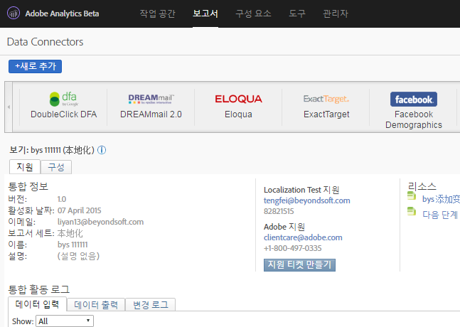

# Adobe Analytics용 DFA Data Connectors{#dfa-data-connector-for-adobe-analytics}

오늘날 복잡하고 경쟁적인 온라인 시장의 증가로 온라인 광고주와 에이전시는 온라인 마케팅 환경에 대한 지식과 광고 지출에 대한 수익률을 계속해서 향상시켜야 합니다. 이러한 목표 달성을 지원하기 위해 광고주, 에이전시 및 게시자가 모두 개별 도구를 처리해야 하지만, 전혀 다른 데이터 시스템과 프로세스에서 수동으로 데이터를 집계하는 것이 온라인 마케팅 캠페인의 효과를 방해하여 최적이 아닌 캠페인 성과, 데이터 불일치 및 혼동을 야기할 수 있습니다.

DFA(DoubleClick for Advertisers) 통합은 Adobe® Data Connectors™를 사용하여 DoubleClick DFA가 보고 및 분석으로 데이터를 자동으로 전달할 수 있도록 함으로써 이러한 문제를 해결합니다.

**[!UICONTROL Analytics]** &gt; **[!UICONTROL 관리]** &gt; **[!UICONTROL 데이터 커넥터]**

