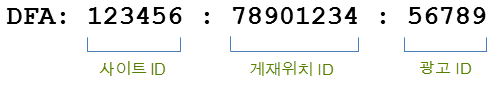
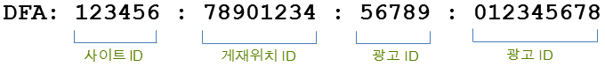

# 통합 기능{#integration-features}

활성화되면 데이터 커넥터 DFA 통합은 Adobe Analytics 보고서에 대해 다음 지표를 제공합니다.

* 뷰스루
* DFA 클릭 수
* 노출 횟수
* (선택 사항) DFA 비용 데이터
* (선택 사항) DFA 쿼리 오류, 시간 초과

>[!NOTE] 이 통합은 클릭 추적기(이전 클릭 명령)를 지원하지 않습니다. 클릭 추적기는 텍스트 링크, 이메일 메시지의 링크 또는 웹 사이트에서 하드 코딩된 다른 요소에 대한 클릭 수를 기록하는 데 사용됩니다.

데이터 커넥터 DFA 통합은 DFA에서 반환된 데이터에서 DFA 추적 코드를 자동으로 생성합니다. 이러한 추적 코드는 연관된 배치 및 크리에이티브와 함께 광고를 고유하게 식별하도록 구성됩니다. 다음은 통합 버전에 따라 추적 코드의 구조에 대한 개요를 설명합니다. 버전 1.5는 다음과 같습니다.

버전 2.0은 다음과 같습니다.

이러한 ID는 Genesis와 DFA 간의 공유 키 역할을 하여 올바른 분류와 지표를 연결합니다.

| 사이트 ID | 광고가 호스트된 타사 사이트입니다. 사이트 이름 분류는 이 사이트 ID의 설명적인 이름을 제공합니다. |
|---|---|
| 광고 ID | 사용자에게 전달되는 상업용 메시지의 ID입니다. 광고 이름 분류에는 DFA 시스템에서 조직에서 정의한 광고 이름이 포함됩니다. 예: `Hybrid Coup Textlink - Build`. |
| 게재위치 ID | 웹 사이트의 DFA 계정, 웹 사이트의 일부 또는 광고 공간을 구입한 웹 사이트 그룹의 표현. |
| 광고 ID | 방문자에게 표시할 이미지, Flash SWF 또는 기타 리소스. 크리에이티브 이름 분류에는 DFA 인터페이스에서 이 크리에이티브를 제공한 이름이 포함되어 있습니다. |

다른 두 분류인 배달 도구(광고주용 DoubleClick)와 채널(배너 광고)은 모든 DFA 캠페인에 대해 동일한 값을 가지며 DFA 가져온 데이터를 구분하는 데 도움이 됩니다.

## SearchCenter 중복 제거 {#section-f809b3bb5e5142aa8ff89bcd5f0d0e49}

DFA 통합은 이제 Adobe SearchCenter에서 확인됩니다. Data Connectors 마법사를 통해 SearchCenter 중복 제거를 활성화하면 검색 기반 방문자가 DFA의 Floodlight Server에서 데이터를 가져오지 않고 DFA에서 *`s.campaign`*&#x200B;을 채우지 않으므로 SearchCenter에서 데이터를 채울 수 있습니다. 또한 DFA 및 SearchCenter는 이제 각 제품의 변수에 중복 제거 값을 채웁니다.

아래 목록은 SearchCenter 중복 제거가 활성화될 때 활성화되는 로직에 대해 대략적으로 설명합니다.

마법사에서 **[!UICONTROL DFA]** > **[!UICONTROL SearchCenter deduplication]** 를 선택한 경우:

* DFA 클릭스루의 경우 통합은 구성된 SCM eVar에 문자열 “DFA 클릭스루”를 입력합니다.
* DFA 뷰스루의 경우 통합은 SCM eVar에 문자열 “DFA 뷰스루”를 입력합니다.

마법사에서 **[!UICONTROL SearchCenter]** > **[!UICONTROL DFA deduplication]** 를 선택한 경우:

* DFA 뷰스루의 경우 통합은 SCM eVar에 문자열 “DFA 뷰스루”를 입력합니다.

>[!NOTE] SearchCenter > DFA 중복 제거를 활성화하고 SearchCenter 쿼리 문자열 매개 변수를 설정한 경우 방문은 DFA 처리로 간주되지 않습니다. 즉, SearchCenter 쿼리 문자열 매개 변수는 DFA 클릭스루 매개 변수와 달라야 하며, 디스플레이 광고에서 SearchCenter 쿼리 문자열 매개 변수를 설정하지 않아야 합니다.

