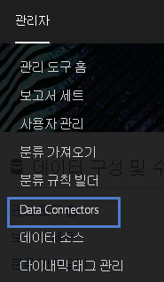
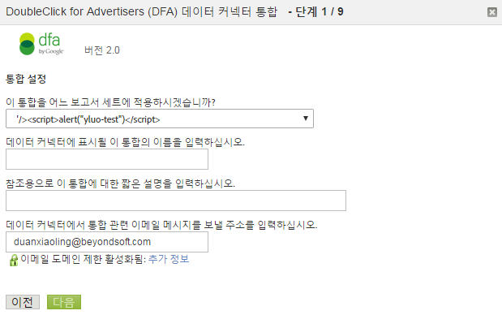

# DFA 통합{#dfa-integration}

DFA 통합 구성에 다음 작업이 포함됩니다.

## DFA 통합 구성{#configure-the-dfa-integration}

DFA Data Connectors 통합을 단계별로 안내합니다.

이 구성 페이지는 자세한 정보에 대한 유용한 링크와 함께 통합 개요를 제공합니다. 이 통합과 관련된 Adobe와 DoubleClick 요금이 있습니다. 두 조직에 적합한 영업 담당자에게 연락하여 요금 구성을 확인합니다.

1. 에 [!DNL Adobe Analytics]로그인합니다.
1. Click **[!UICONTROL Admin]** &gt; **[!UICONTROL Data Connectors]**.

   

1. Locate **[!UICONTROL DoubleClick DFA]**, then click **[!UICONTROL Add New]**.

   

   통합 마법사의 각 페이지에서 필요한 정보를 제공하고 **[!UICONTROL 다음을 클릭합니다]**. 다음 표는 마법사를 통해 통합을 완료하는 데 필요한 정보를 설명합니다.

<table id="table_8F6F7F304C36431DA5FD6E5D54F60FC0"> 
 <thead> 
  <tr> 
   <th colname="col1" class="entry"> 마법사 페이지 # </th> 
   <th colname="col2" class="entry"> 필드 </th> 
   <th colname="col3" class="entry"> 설명 </th> 
  </tr> 
 </thead>
 <tbody> 
  <tr> 
   <td colname="col1"> 1 </td> 
   <td colname="col2"> 통합 이름 </td> 
   <td colname="col3"> Genesis가 보고서 세트의 활성 통합 목록에 표시하는 통합 이름입니다. </td> 
  </tr> 
  <tr> 
   <td colname="col1"> 1 </td> 
   <td colname="col2"> 통합 이메일 주소 </td> 
   <td colname="col3"> 이 통합과 관련된 모든 알림을 수신하는 이메일 주소입니다. </td> 
  </tr> 
  <tr> 
   <td colname="col1"> 2 </td> 
   <td colname="col2"> 사용자 이름 </td> 
   <td colname="col3"> 이 통합에서 사용하는 DFA API 사용자 이름입니다. API 로그인을 위해 사용자를 활성화하려면 DFA 인터페이스에서 API 속성을 선택합니다. API 로그인을 활성화하면 사용자 암호를 제공하는 암호 필드가 표시됩니다. 인증할 마법사에 사용자 이름과 함께 이 암호를 입력합니다. </td> 
  </tr> 
  <tr> 
   <td colname="col1"> 2 </td> 
   <td colname="col2"> 암호 </td> 
   <td colname="col3"> DFA API 암호입니다. </td> 
  </tr> 
  <tr> 
   <td colname="col1"> 2 </td> 
   <td colname="col2"> 광고주 ID </td> 
   <td colname="col3"> <p>DFA 광고주 ID 또는 상위 Floodlight 구성 ID입니다. Data Connectors는 이 ID를 사용하여 추적할 DFA 광고주를 식별합니다(통합 버전 1.5). 이 광고주 ID는 통합 버전 2.0에서 사용되지 않습니다. 상위 Floodlight 구성 ID를 조회하여 사용합니다. 화면의 지침 참조 </p> </td> 
  </tr> 
  <tr> 
   <td colname="col1"> 3 </td> 
   <td colname="col2"> DFA 광고 변수 </td> 
   <td colname="col3"> DFA 캠페인 속성, 노출 횟수 및 클릭 수 데이터를 받는 Analytics eVar입니다. 일반적으로 추적 코드 eVar( <span class="varname"> s.campaign </span>), but you can choose any available eVar. Data Connectors는 다음 DFA 관련 분류를 선택한 eVar에도 추가합니다. <p><b>캠페인</b>: 일반 메시지를 전달하는 여러 사이트에 게재된 광고 모음입니다. </p> <p><b>사이트 이름</b>: 광고가 게재된 사이트입니다. </p> <p><b>광고 이름</b>: DFA 계정에 정의된 광고 이름입니다. </p> <p><b>사이트 게재위치 이름</b>: 광고가 게재된 웹 사이트 및 페이지입니다. </p> <p><b>배달 도구</b>: 광고주용 DoubleClick입니다. </p> <p><b>채널</b>: 배너 광고입니다. </p> <p><b>비용 구성</b>: 광고 비용 구성에 따라 CPM, CPC 또는 고정입니다. </p> <p><b>광고 소재 이름</b>: 광고/게재위치/광고 ID와 관련된 광고 소재 이름입니다. </p> <p><b>DFA &gt; SearchCenter 중복 제거</b>: DFA는 DFA 클릭스루 또는 뷰스루가 발생하는 Searchcenter 변수에 값을 배치하도록 지정합니다. </a> . </p> </td> 
  </tr> 
  <tr> 
   <td colname="col1"> 4 </td> 
   <td colname="col2"> 노출 횟수 </td> 
   <td colname="col3"> DFA 노출 횟수 지표 데이터를 받는 사용자 지정 이벤트입니다. 노출 횟수는 광고가 게재된 횟수를 나타냅니다. </td> 
  </tr> 
  <tr> 
   <td colname="col1"> 4 </td> 
   <td colname="col2"> 클릭 수 </td> 
   <td colname="col3"> DFA 클릭 수 지표 데이터를 받는 사용자 지정 이벤트를 선택합니다. 클릭 수는 DFA의 리디렉션에서 측정한 방문자의 광고 클릭 횟수를 나타냅니다. 클릭 수 지표는 Analytics 클릭스루 지표와 상관 관계가 있습니다. <p>참고: 데이터 수집 방식의 차이로 인해 DFA 클릭 수 및 Analytics 클릭스루가 정확하게 일치하지 않을 수 있습니다.  </a>. </p> </td> 
  </tr> 
  <tr> 
   <td colname="col1"> 5 </td> 
   <td colname="col2"> 뷰스루 변수 </td> 
   <td colname="col3"> <p>DFA 뷰스루 데이터를 받는 Analytics eVar입니다. 뷰스루 변수를 통해 뷰스루가 사이트의 전환율에 어떻게 영향을 주는지 알 수 있습니다. </p> <p>Data Connectors는 DFA 광고 변수에 추가할 때와 같은 동일한 DFA 관련 분류를 이 eVar에 추가합니다(위 참조). </p> </td> 
  </tr> 
  <tr> 
   <td colname="col1"> 5 </td> 
   <td colname="col2"> 마지막으로 본 이후의 시간(뷰스루 시간 버킷 변수) </td> 
   <td colname="col3"> 데이터를 마지막으로 본 이후의 DFA 시간을 받는 Analytics eVar입니다. 마지막으로 본 이후의 시간은 마지막 광고 뷰스루 이후 경과된 시간을 나타냅니다. </td> 
  </tr> 
  <tr> 
   <td colname="col1"> 5 </td> 
   <td colname="col2"> 뷰스루 </td> 
   <td colname="col3"> DFA 뷰스루 지표 데이터를 받는 사용자 지정 이벤트입니다. 뷰스루 변수와 함께 뷰스루 이벤트를 사용하여 직접 클릭스루에 영향을 주진 않았지만 이후 시간에 사이트에 트래픽을 유도하는 역할을 했을 수 있는 캠페인을 확인할 수 있습니다. <p>Data Connectors는 선택한 사용자 지정 이벤트 이름을 “뷰스루”로 변경합니다. </p> </td> 
  </tr> 
  <tr> 
   <td colname="col1"> 6 </td> 
   <td colname="col2"> DFA 쿼리 오류 </td> 
   <td colname="col3"> (선택 사항) 보고한 DFA 쿼리 오류 메시지 코드를 받는 Analytics eVar입니다. 가능한 DFA 메시지 코드는 다음과 같습니다. 
    <ul id="ul_85FC7FB19F7F4ADF83ABCA6DDB44CE19"> 
     <li id="li_0A3181DED5A149588A0D3F1584E2FE8B"><b>nc</b>: DoubleClick 쿠키가 없습니다. </li> 
     <li id="li_D397AA73AD5E4086A18B87F271E4EC14"><b>oo</b>: 사용자가 선택 해제했습니다. </li> 
     <li id="li_5AC1D0C8049340B4AD857D88E275CBD6"><b>nh</b>: 캠페인 내역이 없습니다. </li> 
     <li id="li_73A8C5E905C54E2BB531A1FCDBC6AA1A"><b>qe</b>: 쿼리 오류(시간 초과, 서버 중지 등)입니다. </li> 
    </ul> </td> 
  </tr> 
  <tr> 
   <td colname="col1"> 6 </td> 
   <td colname="col2"> 시간 초과 이벤트 </td> 
   <td colname="col3"> <p>Analytics 카운터 이벤트 <span class="varname"> s.maxDelay </span> timer expires, and no response was received from the DFA servers. Use this event to configure the <span class="varname"> s.maxDelay </span> variable Tuning s.maxDelay </a>.) </p> </td> 
  </tr> 
 </tbody> 
</table>

## DFA 통합에 대한 웹 사이트 업데이트{#web-site-updates-for-the-dfa-integration}

Genesis에서 DFA 통합을 위해 Analytics 보고서 세트를 구성한 후에는 다음을 수행하여 통합을 지원하도록 웹 사이트 및 DFA 환경을 구성해야 합니다.

### 도메인에서 쿠키 공간 확인{#verify-cookie-space-on-the-domain}

DFA에 대한 Data Connectors 통합을 사용하려면 페이지 도메인에서 쿠키를 설정해야 합니다.

드문 경우이긴 하지만 일부 도메인이 일부 웹 브라우저의 최대 쿠키 용량에 도달했습니다. 웹 사이트에서 방문자의 탐색 환경에 영향을 주지 않도록 하려면 네트워크 작업, 개발 팀 또는 엔지니어링 그룹에 문의하여 DFA 통합에 사용된 페이지의 도메인에 다른 쿠키를 추가해도 사용자 환경에 영향을 주지 않는지 확인합니다. 또한 쿠키 이름을 선택해야 합니다.

### DFA 쿼리 문자열 매개 변수 업데이트{#update-your-dfa-query-string-parameter}

DFA 통합 전에 Adobe Analytics로 광고 캠페인을 이미 추적한 경우에는 모든 캠페인(이메일, 검색 또는 배너)에서 같은 쿼리 문자열 매개 변수를 사용하여 랜딩 페이지에서 참조하는 캠페인 ID를 식별할 수 있습니다.

DFA 광고 캠페인에 대한 DFA 데이터에서 뷰스루와 클릭스루 데이터를 요청하는 시기를 알아두려면 Data Connectors에서 방문자가 DFA 캠페인 배너 광고를 클릭한 시간을 식별할 수 있어야 합니다. 이렇게 하려면 Data Connectors에서 DFA 광고 캠페인 페이지와 웹 사이트에 있을 수 있는 다른 광고 캠페인 페이지를 구분할 수 있도록 구별된 쿼리 문자열 매개 변수를 DFA 광고 캠페인의 랜딩 페이지 URL에 추가해야 합니다. DFA에 사용되는 JavaScript 플러그인의 `dfa_overrideParam` 플러그인입니다.

>[!CAUTION]
>
>캠페인 변수를 다른 캠페인에 사용할 수 있지만 DFA 캠페인에 사용하지 마십시오. 캠페인 변수를 DFA 캠페인 랜딩 페이지로 설정한 경우 Adobe에서 노출 횟수와 클릭 수를 DFA 캠페인 클릭스루에 연결할 수 없습니다. 방문당 한 번, Adobe 수집 서버는 DFA 서버에서 이전 클릭스루 또는 뷰스루를 확인합니다. 따라서 DFA 플러그인 코드는 일반적인 랜딩 페이지에만 포함시켜 페이지 로드 시간이 느려지는 불필요한 리디렉션을 방지합니다. 특히 인터넷 연결이 느릴 수 있습니다.

## 웹 사이트의 데이터 수집 코드 업데이트{#update-your-web-site-s-data-collection-code}

DFA용 Genesis 통합은 DFA Floodlight 구성 ID(dfa_SPOTID)를 활용하여 DFA와 Adobe 데이터 수집 시스템 간에 보고서 일관성을 향상시킵니다.

>[!NOTE]
>
>최근 Google DFA 릴리스에서 스포트라이트를 Floodlight로 변경했습니다. JavaScript 매개 변수 `dfa_SPOTID`는 Spotlight 용어를 기반으로 명명되었지만 두 버전에 모두 사용됩니다.

웹 사이트에서 DFA 통합을 활성화하려면 다음을 추가하여 JavaScript 데이터 수집 코드를 업데이트해야 합니다.

* DFA에 대한 통합 모듈
* 수집 코드에 추가

### DFA에 대한 통합 모듈 {#section-fa00e42a732a4e27a4ab3dfcfeae1a5b}

The DFA integration leverages the Adobe Experience Cloud Integrate Module, which adds functionality to your core JavaScript data collection code ( `s_code.js`). 통합 모듈은 코드 관리자에서 JavaScript용 AppMeasurement 코드를 다운로드할 때 .zip 파일의 일부로 제공됩니다. 추가 도움이 필요한 경우에만 Adobe 컨설턴트에게 문의하십시오.

Insert the Integrate Module code in the `Modules` section of your website's `s_code.js` file.

### 수집 코드에 추가 {#section-8f98c727f1ba414fb8b4f02d696b8791}

통합 마법사에서 DFA 통합을 활성화할 때 선택한 항목에 따라 Data Connectors가 JavaScript 데이터 수집 코드에 대한 사용자 정의된 추가 항목을 이메일로 보냅니다. `s_code.js` 함수 또는 다른 함수가 아닌 `doPlugins` 파일의 기본 섹션에 이 코드를 삽입합니다.

아래 표시된 샘플 코드는 단순한 예시용입니다. Data Connectors 통합 마법사를 완료한 후에 이메일로 전송된 코드를 사용하십시오.

수집 코드는 다음 구성 요소로 구성됩니다.

* DFA 통합 설정
* 통합해야 하는 플러그인

**DFA 통합 설정**

```
/************************** DFA VARIABLES **************************/ 
var dfaConfig = { 
   CSID:              "1234567", 
   SPOTID:            "29876543", 
   tEvar:             "eVar17", 
   errorEvar:         "eVar59", 
   timeoutEvent:      "event76", 
   requestURL:         "http://fls.doubleclick.net/ 
json?spot=[SPOTID]&src=[CSID]&var=[VAR]&host=integrate.112.2o7.net%2 
Fdfa_echo%3Fvar%3D[VAR]%26AQE%3D1%26A2S%3D1&ord=[RAND]", 
 
   maxDelay:          "1500", 
   visitCookie:       "s_dfa", 
   clickThroughParam: "CID", 
   searchCenterParam: "s_kwcid", 
   newRsidsProp:      undefined 
}; 
/************************ END DFA Variables ************************/ 
```

DFA 통합 설정 블록은 DFA 통합에 필요한 변수를 설정합니다. 이러한 각 변수에 대한 값은 다음 소스에서 제공됩니다.

**CSID**: 클라이언트측 ID. 통합 마법사를 완료하면 DFA에서 생성합니다. Data Connectors는 이 변수를 DFA CS ID로 먼저 채우고, 사용자가 통합 마법사를 완료하면 사용자에게 설정 이메일로도 이 값을 보냅니다. 이 변수는 계정에 [고급 광고 제공 기능]이 활성화된 경우 필요하지 않습니다.

**SPOTID**: Floodlight 구성(이전에 Spotlight ID라고 함). Data Connectors는 사용자가 통합 마법사에 지정한 DFA 계정 정보에 따라 이 변수를 DFA Floodlight 구성 ID로 미리 채웁니다.

**tEvar**: 전송 변수. Data Connectors는 통합 마법사에 뷰스루 변수에 대해 지정한 Analytics 변수 이름으로 이 변수를 미리 채웁니다. 이 값은 반드시 Adobe 엔지니어링 또는 엔지니어링 서비스를 통해 신중하게 조정하여 변경해야 합니다.

**errorEvar**: 오류 변수. Data Connectors는 통합 마법사에 DFA 쿼리 오류 변수에 대해 지정한 Analytics 변수 이름으로 이 변수를 미리 채웁니다.

**timeoutEvent**: 시간 초과 이벤트. Data Connectors는 통합 마법사에 시간 초과 이벤트 변수에 대해 지정한 Analytics 변수 이름으로 이 변수를 미리 채웁니다.

**requestURL**: 광고 정보를 쿼리할 원격 DFA 호스트. Adobe의 지시 없이는 이 값을 변경하지 마십시오.

**maxDelay**: JavaScript 데이터 수집 코드가 DFA Floodlight 서버로부터 응답을 기다리는 시간(밀리초)을 지정합니다. Adobe는 이 값으로 테스트하여 사이트 트래픽에 따라 최적의 값을 찾을 것을 권장합니다. 예를 들어 이 값을 늘리면 일반적으로 더 많은 DFA 데이터가 수집되지만, 방문자가 지연 기간 동안 사이트를 나가는 경우 기본 방문자 데이터가 손실될 위험이 높아집니다. 이 값을 줄이면 히트 데이터 손실 위험은 줄어들지만 Adobe 히트 데이터로 전송된 DFA 데이터 양이 줄어들 수 있습니다.

**visitCookie**: DFA 호출 횟수를 방문당 한 번으로 제한하는 데 사용되는 쿠키의 이름입니다.

**clickThroughParam**: 클릭이 방금 발생했음을 통합 모듈에 알리는 쿼리 문자열로 일반적으로 모든 광고에 포함됩니다. 쿼리 문자열에 이 매개 변수가 있으면 방문자가 이미 30분 전에 쿼리했는지 여부에 상관없이 요청이 DFA Floodlight 서버로 전달됩니다.

**newRsidsProp**: (선택 사항) 사용되지 않은 트래픽 속성 변수에 매핑됩니다. DFA 통합은 이 값을 수집하고 방문 쿠키에 저장하여 특정 방문자에 대한 데이터를 수집한 보고서 세트를 식별합니다. 이 속성은 Adobe 엔지니어링 서비스에서 사용자 지정 구현에만 필요합니다.

**통합해야 하는 플러그인**

수집 코드 추가 기능은 DFA 통합 작업을 향상시키는 추가 플러그인을 통합합니다.

* DFA 쿼리를 방문당 한 번으로 제한합니다.
* 유연한 쿠키 이름을 제공합니다. 대부분의 조직에서 s_dfa를 사용하지만 DFA 통합에 유효한 쿠키 이름을 사용할 수 있습니다.
* 불필요한 리디렉션을 제거합니다. 뷰스루 데이터는 실시간으로 수집되므로 Adobe 수집 서버 및 DFA에서 모든 페이지 보기의 데이터를 잠재적으로 교환할 수 있습니다. 플러그인은 정보가 필요하지 않은 경우 이러한 데이터 교환을 차단합니다.

>[!CAUTION]
>
>플러그인이 불필요한 DFA 쿼리를 제거하기 위해 사용하는 메커니즘 중 하나는 도메인 기반 방문 쿠키입니다. 여러 도메인을 포괄하는 통합 보고서 세트는 방문자가 DFA의 영향을 받는 뷰스루 또는 클릭스루 이후 도메인을 교차하면 클릭스루 및 뷰스루 데이터를 늘립니다.

## 성공적인 DFA 통합 확인{#confirming-a-successful-dfa-integration}의 단계에 따라 작동 중인 통합이 있는지 확인합니다

필요한 웹 사이트 업데이트를 모두 완료한 후 Charles*, Chrome Developer Tools 또는 Firebug*와 같은 네트워크 트래픽 뷰어를 사용하여 DFA가 Adobe 수집 서버와 통신하는지 확인할 수 있습니다.

DFA 지원 `s_code.js` 파일을 배포한 후 네트워크 트래픽 뷰어를 사용하여 DFA와 Adobe 데이터 수집 서버 간 요청을 확인하여 다음을 찾을 수 있습니다.

* A request to DFA's `fls.doubleclick.net/json` service. 이 서비스는 사용하는 DFA의 버전에 따라 다르게 응답할 수 있습니다. DFA 통합 버전 1.5를 사용하여 다음을 수행하십시오.

   * HTTP 302에서 [!DNL ad.doubleclick.net]으로 리디렉션합니다. 이 경우 광고 방문자에 대한 정보가 들어 있는 위치: 태그를 응답에 보냅니다.
   * This Location tag causes a redirect to [!DNL integrate.112.2o7.net/dfa_echo]. 이 서비스는 광고 방문자에 대한 정보를 JSON(JavaScript Object Notati on) 인코딩 문자열로 변환합니다. 이 데이터는 200 OK HTTP 응답과 함께 반환됩니다.

* DFA 통합 버전 2.0(고급 광고 제공 기능)을 사용하여 다음을 수행하십시오.

   * [!DNL fls.doubleclick.net]이 200 OK로 직접 응답합니다.

어느 경우든지 요청이 성공하면 vX 매개 변수(여기서 X는 뷰스루 eVar 번호)가 있는 Adobe 데이터 수집 서버로 요청이 전달됩니다. 이 매개 변수 값은 DFA-XXXX-XXXX- XXXX-XXXX-XXXX-XXXX-XXXX-XXXX-XXXX 형식을 사용합니다. 이 문자열에는 마지막 클릭 및 현재 방문자의 마지막 노출에 대한 정보가 들어 있습니다.

## s.maxDelay 조정{#tuning-s-maxdelay}을 참조하십시오

DFA를 성공적으로 구현하면 특정 사이트에 맞게 s.maxDelay가 최적화됩니다.

일반적으로, 증가 또는 감소 결정은 더 많은 DFA 방문자 데이터를 입수하고 Adobe 방문자 데이터 수집을 위태롭게 하는 *`s.maxDelay`* 것과 상충됩니다. Increasing *`s.maxDelay`* obtains more DFA visitor data, but (placed excessively high) could endanger the collection of Adobe visitor data. s.maxDelay를 줄이면 Adobe 방문자 데이터 수집이 보장되지만 DFA 방문자 데이터를 손실할 수 있습니다.

*`s.maxDelay`* 는 네트워크 통신에서 DFA에 연락하는 시간 이상을 캡슐화합니다. 또한 이러한 통신이 기반으로 하는 JavaScript를 실행하고 평가하는 브라우저 지연을 나타냅니다. 이것은 통합 모듈이 DFA Floodlight 서버에서 데이터를 가져오는 DOM에 HTML 요소를 삽입한 후 타이머를 *`s.maxDelay`* 시작했기 때문입니다. 브라우저에서 이 새 HTML 요소를 기반으로 하여 HTTP 요청을 실제로 시작하는 데 걸리는 시간은 동시에 로드하는 다른 이미지 또는 JavaScript 파일, 방문자 컴퓨터의 속도 및 특정 브라우저 구현에 따라 달라집니다. 또한 JSON 데이터를 DFA Floodlight 서버에서 검색할 때 브라우저에서 JavaScript를 평가해야 합니다. 이 작업은 브라우저에서 완전히 통제되며, 동시에 실행되는 JavaScript 코드 양이 많거나 비동기 JavaScript 요청이 많은 경우 지연될 수 있습니다.

이러한 사항을 염두에 두고 랜딩 페이지의 복잡성과 DFA의 네트워크 지연 정도에 따라 *`s.maxDelay`* 를 설정해야 합니다. 일부 사이트에서 복잡성을 줄이는 한 가지 방법은 페이지 로드 초반에 Adobe 수집 코드를 실행하여 Floodlight 서버에 요청할 때 브라우저에서 진행 중인 작업이 적어지도록 하는 것입니다.

시간 초과 변수는 *`s.maxDelay`*, because it is incremented every time the s.maxDelay timeout is reached. 증가 또는 감소 여부를 결정할 *`s.maxDelay`* 때 다음 프로세스를 권장합니다.

1. 특정 값으로 *`s.maxDelay`* 설정된 며칠 간의 데이터를 수집합니다.
1. 시간 범위에 [!DNL Daily Unique Visitors Report] 대해 a를 실행합니다.
1. Run the [!DNL Timeout Event Report] to check the number of timeouts that are coming through. 시간 초과는 방문자당 한 번만 수집됩니다.

이제 숫자를 확인하고 계산해 보겠습니다

```
Timeout Percentage = [Step 3] / [Step 2] * 100
```

시간 초과 비율은 실제로 사이트에 대한 모든 방문자를 고려합니다. 그러한 방문자 중 일부는 DFA에 전혀 연결되지 않으므로 시간 초과가 잘못된 것입니다. To improve this computation, another analysis could consider only unique visitors to pages with the `clickThroughParam` set (for example, `?CID=1`). 이로 인해 정확성이 더 향상됩니다.

시간 초과 비율이 매우 낮으면 *`s.maxDelay`*. 너무 높으면 *`s.maxDelay`*. When decreasing *`s.maxDelay`*, you will want to rerun the [!DNL Timeout Report] to ensure that timeouts have not dramatically increased. When increasing *`s.maxDelay`*, you will want to run a [!DNL Page Views Report] to make sure page views aren’t falling out due to lost data. Each time *`s.maxDelay`* is changed observe the data for several days in order to ensure that the data represents a trend, and not just a day-to-day fluctuation.

The optimal setting for *`s.maxDelay`* is the point at which the timeout percentage is minimized while Page Views do not drop off.

시간 초과는 통합 버전 2.0으로 이동할 때 줄어들 수 있습니다. 302개 리디렉이 삭제되기 때문입니다. 베타 클라이언트에서 초기 찾기는 시간 초과에서 일관된 감소를 보여 주었으므로 더 많은 DFA 데이터가 수집되고 있음을 보여주었습니다.
