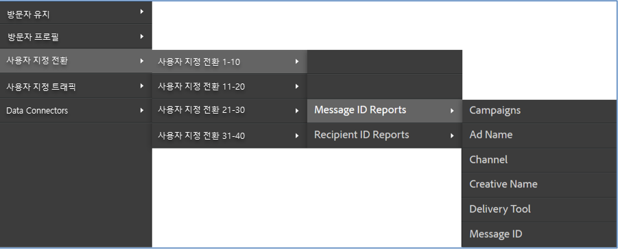
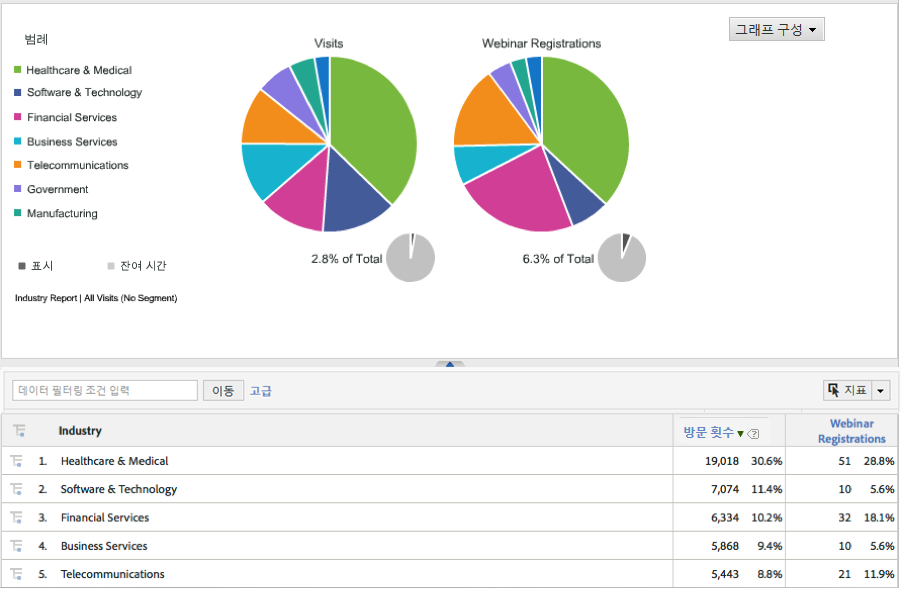

# 통합 배포{#deploying-the-integration}

이 통합 배포는 Adobe 통합 마법사를 완료하고 통합을 확인하는 간단한 프로세스입니다.

## Adobe 통합 마법사 완료{#completing-the-adobe-integration-wizard}

Data Connectors 인터페이스에서 통합 마법사를 완료하는 절차.

1. Adobe Experience Cloud 내에서 Data Connectors(이전 Genesis) 영역으로 이동합니다.
1. Dynamic Signal 통합 마법사를 시작합니다.
1. 원하는 보고서 세트를 선택하고 통합 이름을 제공합니다.
1. 다음 항목을 구성합니다.

   | 항목 | 설명 |
   |---|---|
   | 이메일 주소 | 기본 연락처의 이메일 주소입니다. |
   | 설명 | (선택 사항) 이 통합 설정에 대한 설명입니다. |
   | 커뮤니티 ID | 이 ID는 Dynamic Signal 담당자에게 받을 수 있습니다. |

1. 다음 **[!UICONTROL 변수 매핑]** 항목을 구성합니다.

   | 항목 | 설명 |
   |---|---|
   | 추적 코드 | 보고서 세트에서 사용 가능한 eVar 변수를 선택합니다. |

1. 이 통합을 위해 만들 분류를 검토합니다.
1. Dynamic Signal 통합 대시보드를 만들려면 이 확인란을 선택합니다(선택 사항이지만 적극 권장).
1. 모든 구성 항목을 검토하고 **[!UICONTROL 지금 활성화]**&#x200B;를 클릭합니다.
1. **중요**: 마법사를 완료하면 Dynamic Signal 담당자에게 알려 VoiceStorm 플랫폼에서 통합을 활성화할 수 있습니다.

## 통합 확인{#verifying-the-integration}

Adobe Experience Cloud에서 Dynamic Signal VoiceStorm 통합 설정을 보는 절차

1. 통합 활동 로그에서 Dynamic Signal 통합 설정을 봅니다.
   1. Adobe Experience Cloud에서 **[!UICONTROL 지원]** > **[!UICONTROL 통합 활동 로그]**&#x200B;로 이동합니다.

      

   1. **[!UICONTROL 분류 데이터를 가져왔습니다]**&#x200B;와 같은 항목을 찾습니다. 이러한 항목은 성공적으로 배포한 후 24시간 이내에 표시됩니다.
1. Adobe 통합 마법사(7단계)에서 자동으로 생성된 대시보드를 사용하여 Adobe Analytics 내에서 Dynamic Signal 보고서를 검토합니다. 또는 Adobe Analytics 메뉴 구조 내에서 Dynamic Signal 보고로 이동할 수 있습니다. 다음 스크린샷을 참조하십시오.

   **참고**: 이 데이터는 성공적으로 배포한 후 24-48시간 이내에 표시됩니다.

   

   
