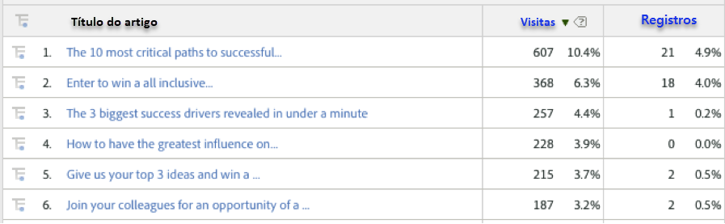
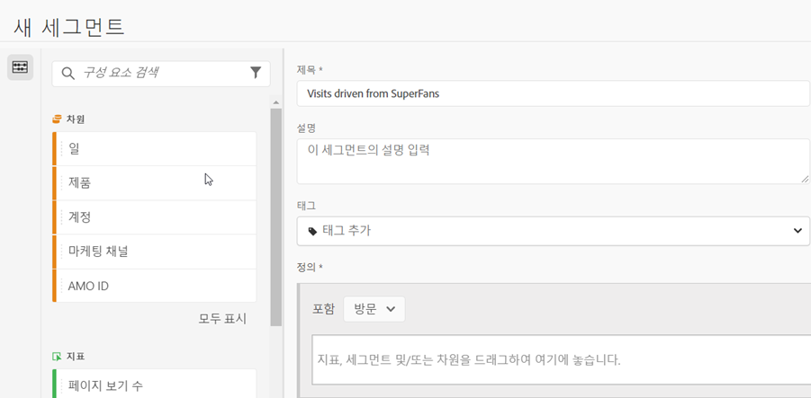
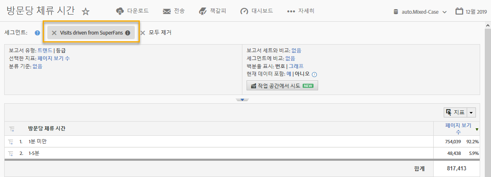

# 통합 사용{#using-the-integration}

배포되면 이 통합이 제공하는 추가 기능을 사용할 수 있습니다.

**참고**:Adobe Analytics 보고에서 일부 동적 신호 데이터를 보려면 24-48시간이 걸릴 수 있습니다.

다음 작업으로 인해 Adobe Analytics 내의 이 통합에서 값이 추가됩니다.

## 동적 신호 차원으로 트래픽 및 전환 지표 보기{#viewing-traffic-and-conversion-metrics-by-dynamic-signal-dimensions}

Adobe Analytics의 보고서 예입니다.

이 통합은 Adobe Analytics 보고서로 사용할 수 있는 새 차원을 제공합니다. 아래 보고서는 아티클 제목별로 분류된 방문 횟수와 전환 지표(등록)를 모두 분석하는 예입니다.

## 동적 신호 차원으로 세그먼트화{#segmenting-by-dynamic-signal-dimensions}

동적 신호 차원을 기반으로 한 세그먼트의 예.

이 통합의 주요 기능은 통합된 보고 차원을 기반으로 Adobe Analytics 세그먼트를 만드는 기능입니다. 예를 들어 특정 VoiceStorm 커뮤니티에서 시작된 방문만 포함하는 세그먼트를 만들 수 있습니다. 이를 "수퍼 팬에서 시작된 방문"이라고 할 수 있습니다. 이 세그먼트 정의는 다음과 같을 수 있습니다.

## 통합된 보고 차원{#integrated-reporting-dimensions}

이 통합에 포함된 동적 신호 보고 차원을 나열합니다.

| 측정기준 | 설명 |
|---|---|
| 채널 유형 | 사용자가 커뮤니티 게시물을 공유한 소셜 네트워크(또는 블로그 플랫폼). 사용자는 여러 채널에서 게시물을 공유할 수 있습니다. 클릭과 기타 활동은 채널당 세그먼트화됩니다. 이 필드에는 Facebook, Twitter 등이 표시됩니다. 활동을 유도하는 채널 유형을 확인할 수 있습니다. |
| 아티클 ID | 아티클 ID는 동적 신호 커뮤니티에서 각 컨텐츠를 고유하게 식별합니다. |
| 소스 유형 | 이 필드는 게시물이 "구성원" 또는 "브랜드"에 의해 만들어졌는지 여부를 나타냅니다. 두 경우 모두 애플리케이션에서 컨텐츠를 수동으로 만들거나 외부 피드에서 가져올 수 있습니다. |
| 사용자 이름 | 소셜 네트워크에서 게시물을 공유하여 사이트에 클릭스루를 생성하는 사용자. |
| 소스 ID | 소스 ID 파섹 이는 대부분 특정 멤버 또는 외부 피드입니다. |
| 사용자 ID | 사용자 ID 파섹 이 경우 사용자는 소셜 네트워크에서 게시물을 공유한 공유자입니다. |
| 소스 이름 | 소스는 공유 게시물의 작성자(또는 작성자)입니다. 대부분의 경우 커뮤니티 또는 외부 피드의 구성원입니다. |
| 아티클 제목 | 사이트로 다시 클릭하는 공유 게시물의 제목입니다. |
| 커뮤니티 이름 | 동적 신호 커뮤니티의 이름입니다. |

