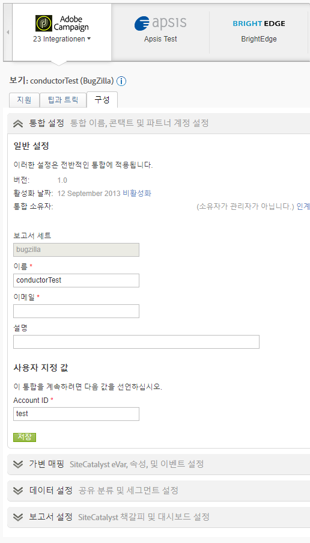

# 데이터 커넥터 개요

Adobe는 디지털 전략 및 마케팅 이니셔티브에 대하여 실용적인 실시간 인텔리전스를 조직에 제공합니다. Data Connectors를 사용하면 타사 애플리케이션의 추적 데이터를 Analytics로 가져와 중앙의 위치에서 데이터를 모으고 사용할 수 있습니다.  파트너 제품 중 하나를 사용할 경우 애플리케이션 데이터를 마케팅 보고에 가져오는 통합을 만들 수 있습니다. 통합되면 사용 중인 애플리케이션의 데이터를 포함하는 보고서를 생성할 수 있습니다.

예를 들어, 이메일 통합은 이메일 파트너를 사용하여 이메일 캠페인을 배포해야 할 수 있습니다. 방문자가 웹 사이트에 들어올 때 이메일 캠페인에 대한 응답으로 들어온 방문자를 알고 싶어합니다. Data Connectors는 이메일 파트너의 데이터를 마케팅 보고에 통합하므로, 이 정보를 확인하여 이메일 캠페인의 효과를 측정할 수 있습니다.

**시스템 요구 사항**

Data Connectors는 자주 사용되는 브라우저와 적절히 통합되어야 합니다. 그러나, 다음 권장 사항을 충족하는 시스템에서 보고서 표시 및 기능이 가장 잘 수행됩니다.

* 브라우저: Microsoft Internet Explorer 버전 6 이상
* 쿠키: 필수
* JavaScript: 활성화
* 운영 체제: Windows 기반
* Macromedia Flash Player: 버전 6 이상
* 모니터 해상도: 1024x768(800x600도 작동함)
* 색상 깊이: 16비트 이상

또한 데이터 수집은 웹 브라우저에서 JavaScript가 사용 가능하게 설정되어 있을 때 개선됩니다.

**전제 조건**

해당 제품에 대한 Data Connectors 통합을 구성하기 전에 다음 작업을 수행하십시오.

* 마케팅 보고와 통합하려는 모든 데이터에 액세스하는 권한과 함께 파트너 제품 계정에 필요한 액세스 자격 증명을 가지고 있어야 합니다. 보고서 배포자용 및 통합 작업에 관한 알림용 특수 이메일 계정을 만들어야 할 수 있습니다.
* 캠페인 정보를 가지는 사용자 지정 변수를 식별합니다. 흔히 이것을 캠페인 추적 코드라고 하지만, 조직은 다른 용어를 사용할 수 있습니다.
* 노출 횟수를 수신하려는 이벤트를 확인하고 데이터를 클릭합니다. 이벤트의 이름을 적절하게 바꾸어야 할 수 있습니다.
* 랜딩 페이지에 해당 코드를 놓으면 Analytics가 파트너 제품에서 생성되는 데이터로 적절한 모델링을 수행할 수 있습니다. 각 파트너 제품에 대한 특정 지침은 Data Connectors 쇼케이스의 리소스 탭에서 찾을 수 있습니다.

## 통합 추가

데이터 커넥터 랜딩 페이지(콘솔)에 액세스하려면 현재 [!UICONTROL 계정이] 있어야 합니다. 또한 Adobe Analytics에 익숙한 것이 좋습니다.

1. Adobe Experience Cloud에 로그인합니다.
1. Click **[!UICONTROL Analytics]** &gt; **[!UICONTROL Admin]** &gt; **[!UICONTROL Data Connectors]**.
1. **[!UICONTROL 새로 추가]**&#x200B;를 클릭합니다.
1. 통합 추가 **[!UICONTROL 인터페이스를]** 단계별로 진행합니다.

   개별 제품 통합에 따라, 통합 프로세스의 일부로 특정 구성 정보를 제공해야 할 수 있습니다.

   통합이 완료되면 파트너 제품 아이콘이 데이터 커넥터 네트워크 페이지에 표시되며 메뉴에서 사용할 수 있습니다.

## Data Connectors 콘솔

통합을 활성화하면 데이터 커넥터 [!UICONTROL 페이지에 표시됩니다] . 콘솔에서 세부 사항을 보고 구성을 변경할 수 있습니다. 회사의 모든 보고서 세트 간에 활성 통합을 볼 수 있습니다. 또한 활동 로그를 보고 통합을 대시보드로 설정하고 통합을 구성하고 도움말을 찾을 수 있습니다.



## 데이터 커넥터의 재마케팅 세그먼트

리마케팅 세그먼트는 Data Connectors 통합에 사용된 변수를 기반으로 하여 생성되는 데이터 파일입니다.

Adobe Analytics는 데이터 웨어하우스를 통해 별도의 일별 파일로 이러한 파일을 Adobe가 제3자를 위해 만든 FTP로 전송합니다. 그러면 타사에서 이러한 파일을 클라이언트에게 배포합니다. 회사에서는 이러한 파일을 사용하여 사이트를 방문했고 제품을 보았지만 구매하지 않은 방문자에게 리마케팅합니다. (예를 들면, 제품을 보았지만 구매하지 않은 제품에 대해 할인을 제공하는 클라이언트에게 연락할 수 있습니다).

**세그먼트**

* [!UICONTROL 장바구니 포기]: 장바구니에 항목을 추가했지만 구매하지 않은 방문자의 비율입니다. 엄밀히 말하면 주문 수를 장바구니에 추가한 횟수로 나누어 계산된 지표입니다.
* [!UICONTROL 구매]: 특정 제품의 메시지 ID를 기반으로 하여 구입한 수신자 ID(또는 방문자 ID)입니다.
* [!UICONTROL 제품 보기]:장바구니 [!UICONTROL 포기와]유사하며 계산된 지표이기도 합니다. It reports [!UICONTROL Product Views] divided by Orders, because customers' viewing the product shows some interest.

**구현 예제**

리마케팅 세그먼트를 성공적으로 구현하려면 다음 조건을 충족해야 합니다.

* Data Connectors 계약이 설정되어 귀사가 Adobe 컨설턴트와 구현 단계를 완료했습니다.
* 해당 이벤트가 제품 변수와 동일하게 실행됩니다.
   * 장바구니 포기: `scAdd` 이벤트
   * 구매: `purchase` 이벤트
   * Product Views: `prodView` event

**** 참고:연결된 이벤트 없이 제품이 정의된 경우 prodView 이벤트가 자동으로 실행됩니다.
위의 요구 사항을 충족하지 않으면 해당 리마케팅 세그먼트가 올바르게 보고되지 않습니다.

[!UICONTROL  장바구니 포기]: 사용자가 제품을 장바구니에 추가한 후에 실행됩니다.

```
s.products=";cat";
s.events="scAdd";
```

[!UICONTROL 구매]: 구매 확인 페이지에서 실행됩니다.

```
s.products=";
cat;1;50";
s.events="purchase";
//Note: Though optional, adding the purchaseID variable increases accuracy by preventing duplicate purchases
```

**일반 문제**

| 문제 | 설명 |
| -----------| ---------- |  
| 제품 ID 정보가 리마케팅 세그먼트 파일에 표시되지 않습니다. | 올바른 이벤트가 실행되지만 동일한 이미지 요청에 제품 변수가 없을 때 발생합니다. 이 문제를 수정하려면 위의 구현 예제에서처럼 제품 변수와 해당 이벤트가 같은 페이지에서 실행되었는지 확인합니다. |
| 리마케팅 세그먼트 파일을 받지 않았습니다. | 파일을 받지 않은 경우 조직의 지원 사용자 중 한 명에게 ClientCare에 연락하여 보고서를 제대로 받지 못한 이유를 조사하도록 합니다. |

> [!IMPORTANT]
>
> 컨설턴트는 표준 데이터 커넥터 통합 리마케팅 세그먼트 파일 외에 일일 예약 보고서로 데이터 웨어하우스 요청을 설정하는 것이 일반적입니다. 이 데이터 웨어하우스 요청에 Data Connectors 변수뿐만 아니라 Data Connectors 이외 변수가 포함되며, 조직의 특별한 요청이 있을 때만 이 요청을 예약할 수 있습니다. 문제 해결 시 혼동하지 않도록 문제가 있는 파일이 실제 리마케팅 세그먼트 파일인지 아니면 Genesis 이외의 변수가 포함된 데이터 웨어하우스 요청인지 지정합니다.
