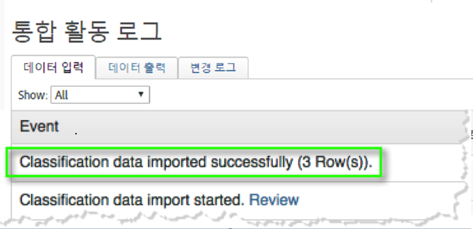
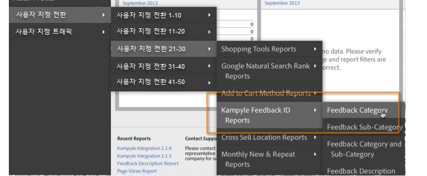

# 통합 배포{#deploying-the-integration}

이 통합 배포는 Adobe 통합 마법사를 완료하고 플러그인 코드(javascript)를 배포하고 통합을 확인하는 간단한 과정입니다.

## Adobe 통합 마법사 완료{#complete-the-adobe-integration-wizard}

통합을 활성화하려면 데이터 커넥터 인터페이스 내에서 구성 마법사를 완료해야 합니다.

1. Adobe Experience Cloud에 로그인합니다.
1. 데이터 커넥터( **[!UICONTROL 이전 Genesis]** )로 이동합니다.
1. Kampyle 통합 마법사를 시작합니다.
1. 원하는 보고서 세트를 선택하고 통합 이름을 제공합니다.
1. 다음 항목을 구성합니다.

   1. **[!UICONTROL 이메일 주소]** - 기본 연락처의 이메일 주소입니다.
   1. **[!UICONTROL 설명]** - (선택 사항) 이 통합 설정에 대한 설명입니다.
   1. **[!UICONTROL Kampyle]** Key - Kampyle 애플리케이션에서 이 키를 **[!UICONTROL 피드백 양식]** &gt; 피드백 양식 **[!UICONTROL 사용자 정의에서 찾을 수 있습니다]**.
   1. **[!UICONTROL 추적 서버]** - Adobe Analytics 데이터를 추적하는 데 사용하는 추적 서버(도메인) 설정입니다.
   1. **[!UICONTROL 추적 서버 보안]** - 추적 서버가 보안/https 트래픽에 대해 다른 경우 여기에서 해당 설정을 제공합니다.
1. 다음 변수 **[!UICONTROL 매핑]** 항목을 구성합니다.

   1. **[!UICONTROL Kampyle 피드백]** ID - 보고서 세트에서 사용 가능한 eVar 변수를 선택합니다.
   1. **[!UICONTROL 피드백 등급]** - 보고서 세트에서 사용 가능한 성공 이벤트("카운터" 유형)를 선택합니다.
   1. **[!UICONTROL 피드백]** 항목 - 보고서 세트에서 사용 가능한 성공 이벤트("카운터" 유형)를 선택합니다.
   1. **[!UICONTROL 등급 피드백]** - 보고서 세트에서 사용 가능한 성공 이벤트("카운터" 유형)를 선택합니다.
1. Kampyle 통합 대시보드를 자동으로 만들려면 이 확인란을 선택합니다(권장).
1. 모든 구성 항목을 검토하고 지금 **[!UICONTROL 활성화를 클릭합니다]**.

## 통합 구성 개체 배포{#deploy-the-integration-configuration-object}

통합 마법사를 완료한 후 통합 구성 개체를 웹 속성에 배포해야 합니다.

대부분의 경우 통합 구성 개체를 배포하는 가장 쉬운 방법은 Adobe Analytics 배포 코드에 통합 구성 개체를 포함하는 것입니다.

>[!NOTE]
>
>Adobe TagManager 또는 다이내믹 태그 관리를 사용하여 Adobe Analytics를 배포하는 경우 해당 도구를 통해 통합 구성 개체를 쉽게 추가할 수 있습니다.

1. 통합의 **[!UICONTROL 리소스]** &gt; **[!UICONTROL 지원]** 탭으로 이동합니다.
1. Kampyle JS( **[!UICONTROL Integration Code)]** 리소스를 다운로드하여 저장합니다. 코드는 다음과 비슷합니다.

   ```
   /* Kampyle:  Integration configuration settings */
     window.k_sc_param = { "version":1.1 }
   ```

1. 다음 방법 중 하나를 사용하여 코드를 배포합니다.

   | **Adobe TagManager 또는 다이내믹 태그 관리를 사용합니다.** | 태그 관리 인터페이스를 사용하여 코드를 추가합니다. |
   |---|---|
   | **다른 모든 경우** | Adobe Analytics 배포 코드 업데이트를 담당하는 조직 리소스에 코드를 제공합니다. |

## 통합 확인{#verify-the-integration}

통합이 두 가지 검사를 완료하여 데이터를 성공적으로 전송하는지 확인합니다.

### 통합 활동 로그 {#section-0472df9180db4f218db5f6040cab07af}

지원 &gt; 통합 활동 로그로 이동하여 Adobe Experience Cloud에서 Kampyle **[!UICONTROL 통합]** 설정을 봅니다 ****. 데이터 **[!UICONTROL 위치]** 탭 아래에서 분류 데이터를 성공적으로 가져왔다는 항목이 표시됩니다.

>[!NOTE]
>
>로그 항목은 성공적으로 배포한 후 24시간 이내에 표시됩니다.



### Adobe 보고 데이터 {#section-1ae9f0a5e6bc40988478ff55aefd56ac}

Adobe Analytics에서 해당 메뉴 구조 내에서 Kampyle 보고서로 이동하여 Kampyle 피드백 보고서를 봅니다.

>[!NOTE]
>
>통합 피드백 양식이 제출물을 적극적으로 수신하고 있다고 가정할 경우 보고서 데이터는 성공적인 배포 후 24-48시간 이내에 나타나야 합니다.



