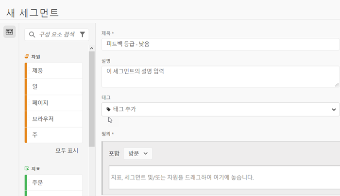
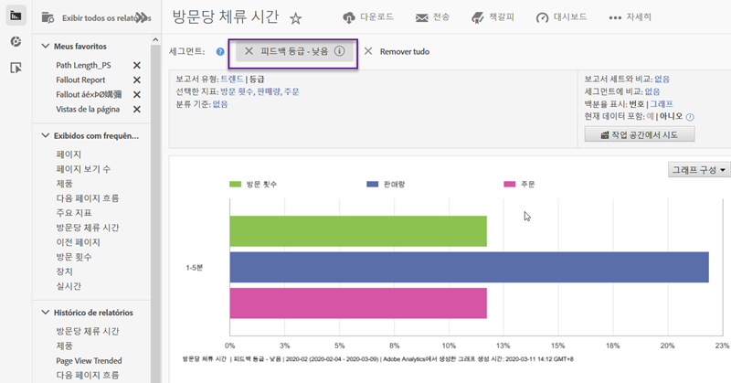

# 통합 사용{#using-the-integration}

배포되면 이 통합이 제공하는 추가 기능을 사용할 수 있습니다. 다음은 Adobe Analytics 내에서 이 통합으로 가치를 얻기 위해 수행하는 작업입니다.

>[!NOTE] Adobe Analytics 보고 내에서 Kampyle 응답 데이터를 보려면 24-48시간이 걸릴 수 있습니다.

## 피드백 및 온사이트 행동 데이터 혼합{#mix-feedback-and-onsite-behavior-data}

피드백 차원별로 Reports &amp; Analytics 보고서를 분류할 수 있습니다.

Adobe Reports &amp; Analytics를 사용하여 보고서에서 사용할 수 있는 다양한 피드백 차원으로 드릴다운할 수 있습니다. 아래 보고서는 특정 피드백 카테고리로 드릴다운한 다음 피드백 설명에 따라 분류되는 예입니다. 간편한 분석을 위해 Reports &amp; Analytics 지표(방문 및 고객 서비스 문의 수) 및 Kampyle 지표(평균 피드백 등급)가 나란히 제공됩니다.

## 피드백 차원별 세그먼트{#segment-by-feedback-dimension}

피드백 차원을 기반으로 세그먼트를 만들 수 있습니다.

이 통합의 주요 기능은 Kampyle 피드백 차원을 기반으로 Adobe Analytics 세그먼트를 만드는 기능입니다. 예를 들어, 1등급 또는 2등급을 받은 방문만 포함하는 세그먼트를 만들 수 있습니다. 이를 &quot;피드백 등급 - 낮음&quot;이라고 할 수 있습니다. 이 세그먼트 정의는 다음과 같이 나타납니다.

이 세그먼트는 실질적으로 모든 보고서에 적용할 수 있습니다. 한 가지 예를 들자면 여기에 표시된 방문당 체류 시간 보고서입니다.

