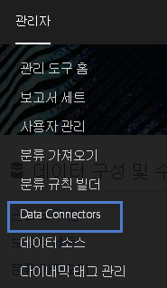
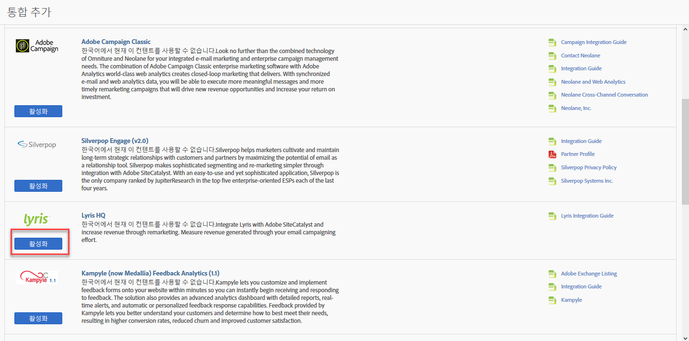
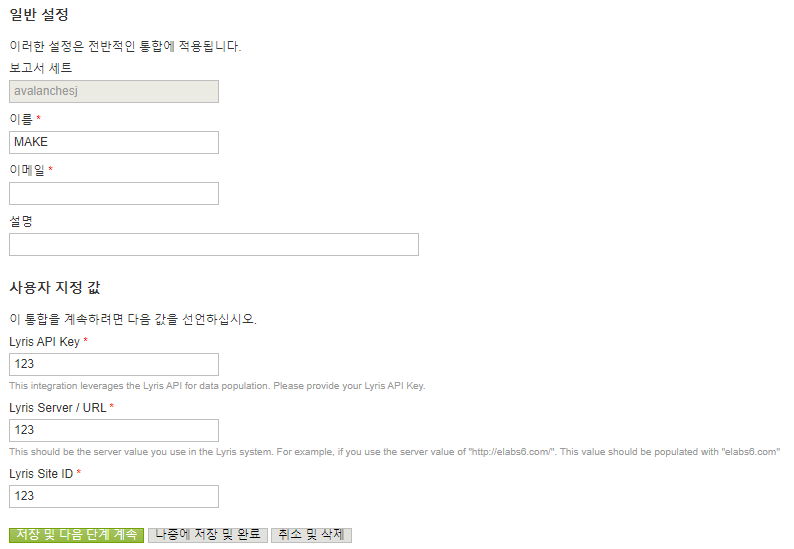
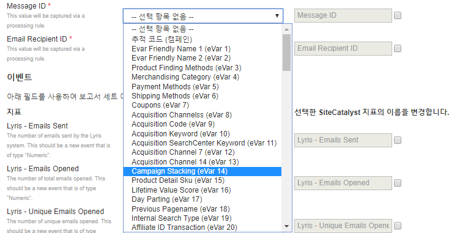
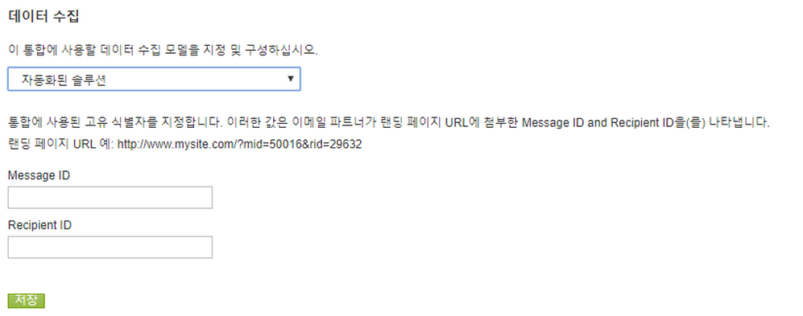
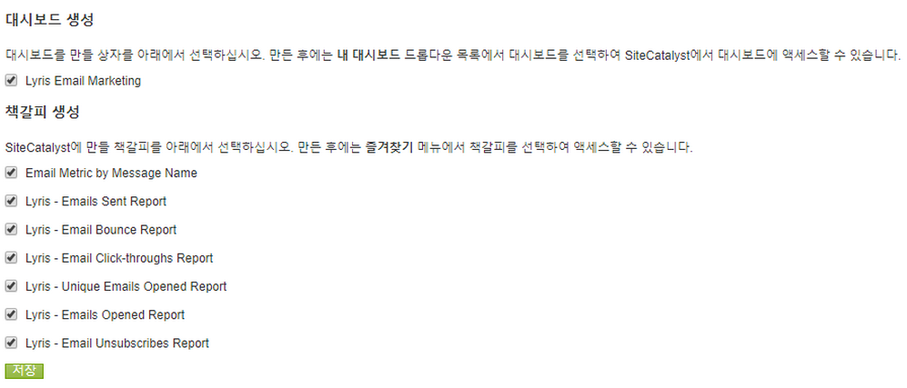
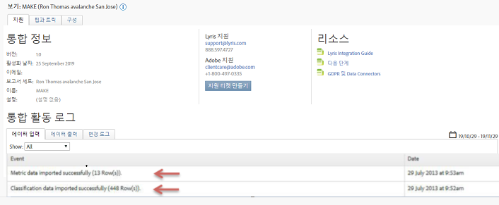

# 통합 배포{#deploying-the-integration}

3단계 배포 프로세스에 대해 설명합니다.

이 통합 배포는 다음 작업이 필요한 간단한 프로세스입니다.

## 통합 마법사 완료{#completing-the-integration-wizard}

통합 마법사 사용 절차.

통합을 활성화하려면 데이터 커넥터 인터페이스 내에서 Lyris 통합 마법사를 완료해야 합니다.

1. Adobe Experience Cloud 내에서 데이터 커넥터(이전 Genesis) 영역으로 이동합니다.

   

1. 통합 **[!UICONTROL 추가에서]** Lyris 플러그인을 Adobe Experience Cloud로 드래그하여 놓습니다. 그러면 Lyris 데이터 커넥터 통합이 열립니다.

   

1. 일반 **[!UICONTROL 설정에서]**&#x200B;원하는 보고서 세트를 선택하고 통합 이름을 제공합니다.
1. 사용자 지정 값 아래에 모든 Lyris 계정 관련 정보를 **[!UICONTROL 입력합니다]**.

   

1. 드롭다운 메뉴에서 적절한 예약된 eVar 및 이벤트를 선택합니다.

   

1. 자동화된 3개의 파트너 세그먼트와 **[!UICONTROL 별도로]** 사용자 세그먼트 아래에서 고유한 세그먼트를 선택할 수 있습니다.
1. 이 통합을 사용하려면 Lyris 계정에 몇 개의 데이터 포인트를 다운로드해야 할 수 있습니다. 액세스 요청에서 액세스 권한을 부여할 **[!UICONTROL 수 있습니다]**.
1. 데이터 **[!UICONTROL 수집에서]**&#x200B;자동화된 솔루션 또는 수동 솔루션(JavaScript 플러그인)을 선택하여 랜딩 페이지 URL에서 쿼리 문자열 매개 변수를 수집할 수 있습니다. 자동화된 솔루션을 갖도록 선택한 경우 메시지 ID 및 수신자 ID에 대한 쿼리 문자열 매개 변수를 입력합니다. JavaScript 플러그인은 Adobe 컨설턴트에게 문의하십시오.

   

1. Lyris Dashboard 및 책갈피를 자동으로 생성하도록 선택할 수 있습니다.

   

1. 통합 요약을 검토하고 활성화를 **[!UICONTROL 클릭합니다]**.

## Lyris EmailLabs 내의 구성{#configuration-within-the-lyris-emaillabs}

마법사 완료 후 Lyris 내에서 구성할 내용을 설명하는 단계입니다.

1. 통합 마법사를 완료한 후 Lyris Professional 팀과 협력하여 Lyris HQ 계정 통합을 완료하고 테스트를 용이하게 해야 합니다.
1. URL 쿼리 문자열 매개 변수 추가:URL 첨부 문자열이 사용자 인터페이스의 조직 설정 영역에 제대로 입력되었는지 확인합니다. 여기에는 캠페인 수준 ID(hq_m) 및 수신자 수준 ID(hq_v)가 포함되어야 합니다.

   An example of a string ID is:

   ```
   hq_lid=149&hq_m=96843&hq_l=23&hq_v=7703a51905
   ```

   >[!NOTE]
   >
   >If you are applying Lyris’s native analytics tool, Click Tracks tags all of the required variables that are added.**

## Verifying the Integration{#verifying-the-integration}

Steps to verify that the Lyris/Adobe Analytics integration was successful.

Once all deployment steps have been completed, you can validate that the integration is successfully transferring data.

>[!NOTE]
>
>It takes a few days for the data exchange to begin. Please make sure you contact Lyris after you activate the integration.

1. 데이터 커넥터 내에서 Lyris 통합으로 이동합니다. Under the Support tab &gt; Integration Activity Log, you should see events like Metric data imported successfully and/or Classification data imported successfully:****************

   

1. Now view your Lyris message reports with the appropriate metrics. In the Adobe Experience Cloud, select Reports &amp; Analytics.****
1. 적절한 보고서 세트를 선택합니다.
1. Under Custom Conversions, select the Message ID Reports and choose Message ID/Message Name.************

## Query String Param Plug-In Code{#query-string-param-plug-in-code}

Shows the Lyris plug-in code to use with Adobe Analytics.

>[!NOTE]
>
>Please make sure that you reserved the necessary eVars in the Admin Tool of Adobe Analytics before you work with the code below. Once you know which eVars you have reserved, replace eVarN with the relevant eVar. 예: eVar10.

```
/* 
  * Plugin: getQueryParam 2.3 
  */ 
s.getQueryParam=new Function("p","d","u","" 
+"var s=this,v='',i,t;d=d?d:'';u=u?u:(s.pageURL?s.pageURL:s.wd.locati" 
+"on);if(u=='f')u=s.gtfs().location;while(p){i=p.indexOf(',');i=i<0?p" 
+".length:i;t=s.p_gpv(p.substring(0,i),u+'');if(t){t=t.indexOf('#')>-" 
+"1?t.substring(0,t.indexOf('#')):t;}if(t)v+=v?d+t:t;p=p.substring(i=" 
+"=p.length?i:i+1)}return v"); 
s.p_gpv=new Function("k","u","" 
+"var s=this,v='',i=u.indexOf('?'),q;if(k&&i>-1){q=u.substring(i+1);v" 
+"=s.pt(q,'&','p_gvf',k)}return v"); 
s.p_gvf=new Function("t","k","" 
+"if(t){var s=this,i=t.indexOf('='),p=i<0?t:t.substring(0,i),v=i<0?'T" 
+"rue':t.substring(i+1);if(p.toLowerCase()==k.toLowerCase())return s." 
+"epa(v)}return ''"); 
 
/*in the s_doPlugins function - Replace N with actual eVar number*/ 
s.eVarN=s.getQueryParam("<insert Lyris QS Param>");  
//places query param value from Message ID in eVarN variable s.eVarN=s.getQueryParam("<insert Lyris QS Param>");  
//places query param value from Recepient ID in eVarN variable 
```
