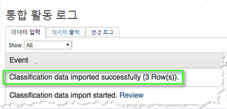
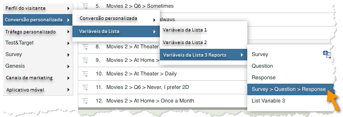
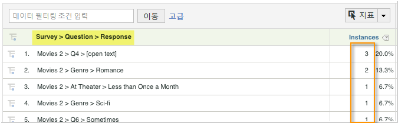

# 통합 배포{#deploying-the-integration}

이 통합 배포는 다음 작업이 필요한 간단한 프로세스입니다.

## Adobe 통합 마법사 완료{#completing-the-adobe-integration-wizard}

통합을 활성화하려면 데이터 커넥터 인터페이스 내에서 Qualtrics 통합 마법사를 완료해야 합니다

1. 데이터 커넥터로 이동하고 Qualtrics 통합 마법사를 시작합니다.
1. 이 통합에 사용할 보고서 세트를 선택하고 이름을 제공합니다.

   다음 단계에 설명된 정보를 제공하여 통합 마법사를 완료합니다. 1.마법사 **1단계**

   | Email Address | 기본 연락처 이메일 주소입니다. |
   |---|---|
   | 설명 | (선택 사항) 이 통합 설정에 대한 설명입니다. |
   | Qualtrics 조직 ID | [Qualtrics 조직 ID 조회](../qualtrics-overview/qualtrics-org-id.md) |
   | Adobe SiteCatalyst 토큰 | [Adobe Analytics 토큰 생성](../qualtrics-overview/qualtrics-token.md) |

1. **마법사 2단계 - 변수 매핑**| Qualtrics 응답 목록| 보고서 세트에서 사용 가능한 목록 변수를 선택합니다. (보고서 세트 관리자에서 새 listVar를 활성화해야 할 수 있습니다.)  ||—|—|| Qualtrics 응답 ID| 보고서 세트에서 사용 가능한 eVar 또는 prop을 선택합니다. (보고서 세트 관리자에서 새 listVar를 활성화해야 할 수 있습니다.)  || 추적 서버|Adobe Analytics 데이터를 추적하는 데 사용하는 추적 서버(도메인) 설정을 제공합니다. 표준 추적 서버 설정과 다른 경우 `trackingServerSecure` 추적 서버를 사용합니다.  || Qualtrics 설문 조사 제출| 보고서 세트에서 사용 가능한 이벤트를 선택합니다(보고서 세트 관리자 내에서 새 이벤트를 활성화해야 할 수 있습니다).  |

1. **마법사 3단계**:정보 제공만을 위한 필수 조건 없음

   단계 결과 1. **마법사 4단계 - 내보내기 설정**

   | eVar | Qualtrics로 내보낼 eVar 중 최대 5개를 선택합니다. |
   |---|---|
   | 이벤트 | Qualtrics로 내보낼 사용자 지정 이벤트 최대 5개를 선택합니다. |
   | Prop | Prop을 최대 5개까지 선택하여 Qualtrics로 내보내기 |
   | 액세스 요청 | Qualtrics로 내보내려는 표준 지표 및 차원에 대한 확인란을 선택합니다. 내보내기가 제대로 작동하도록 허용하려면 `visitor_id` 이 필요합니다. |

1. **마법사 5단계**:구성을 검토하고 지금 **[!UICONTROL 활성화를 클릭합니다]**.

## Qualtrics Research Suite의 통합 활성화{#enabling-the-integration-in-qualtrics-research-suite}

통합 마법사를 완료한 후 연결하려는 각 Qualtrics 설문 조사에 대한 통합을 활성화해야 합니다.

1. Qualtrics Research Suite에 로그인합니다.
1. 내 **[!UICONTROL 설문 조사]** 탭에서 **[!UICONTROL 통합하려는]** 설문 조사의 편집 단추를 클릭합니다.
1. 고급 옵션 **[!UICONTROL 메뉴를]** 클릭하고 Adobe Analytics를 **[!UICONTROL 선택합니다]**. 이 옵션이 표시되지 않으면 관리자에게 필요한 권한을 요청하십시오.

   

1. Adobe Analytics 구성을 선택한 다음 저장을 **[!UICONTROL 클릭합니다]**. 사용할 수 있는 구성이 없는 경우 Adobe 통합 마법사를 아직 완료하지 않았을 수 있습니다.
   1. 부분 **[!UICONTROL 응답 포함]** 확인란을 사용하여 각 부분 설문 조사 화면이 완료된 후 Adobe Analytics로 데이터를 캡처할 수 있습니다. 선택하지 않으면 완료된 설문 조사에 대해서만 데이터가 전송됩니다.
   1. 타임스탬프를 **[!UICONTROL 비콘으로]** 보내기 확인란은 타임스탬프가 지정된 데이터를 수신하도록 구성된 보고서 세트와 통합할 때만 사용해야 합니다(일반적이지 않음).
   

## 통합 확인{#verifying-the-integration}

모든 배포 단계가 완료되면 통합이 성공적으로 데이터를 전송하고 있는지 확인할 수 있습니다.

1. **통합 작업 로그**:데이터 커넥터 UI에서 Qualtrics **[!UICONTROL 통합의 지원]** 탭을 봅니다. 통합 활동 로그 **[!UICONTROL 제목]** 아래에서 가져온 성공적인 분류 데이터를 설명하는 항목이 표시됩니다.

   >[!NOTE]
   >
   >이러한 항목은 성공적으로 배포한 후 1시간 이내에 표시됩니다.

   

1. **보고 데이터**:Qualtrics 설문 조사 보고([목록 변수] 아래)를 탐색하여 마케팅 보고 및 분석 UI로 Qualtrics **[!UICONTROL 설문 조사 보고서를 봅니다]**.

   >[!NOTE]
   >
   >통합 설문 조사가 응답을 적극적으로 수신한다고 가정할 경우 이 데이터는 성공적인 배포 후 24-48시간 이내에 나타나야 합니다.

    

