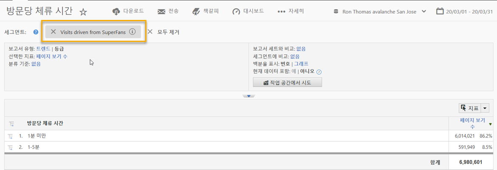

# 통합 사용{#using-the-integration}

배포가 완료되면 이 통합이 제공하는 추가 기능을 사용할 수 있습니다.

>[!NOTE]
>
>Adobe Analytics 보고 내에서 Qualtrics 응답 데이터를 보기 시작하는 데 24-48 시간이 걸릴 수 있습니다.

다음은 Adobe Analytics 내에서 이 통합의 가치를 얻는 데 필요한 작업입니다.

1. 설문 조사 응답 데이터를 사용하여 세그먼트를 만듭니다 (세그먼트 만들기 참조).
1. 세그먼트를 주요 보고서에 적용합니다.

## 예 {#section-07051d0d60a44408a4e108034586c42f}

다음은 분석가가 설문 조사 응답 데이터를 사용하여 Adobe Analytics 세그먼트를 정의하는 방법을 보여줍니다. 이 사례는 "오늘 방문을 얼마나 만족하셨습니까?" 와 같은 설문 조사 질문을 가정합니다. 이 질문을 사용하여 세그먼트를 만들어 "undersatisfied" 방문자를 식별할 수 있습니다. 이러한 세그먼트는 아래와 같이 구매 전환 단계와 같이 Adobe Analytics 보고서를 드릴다운하는 데 사용할 수 있습니다.

 

