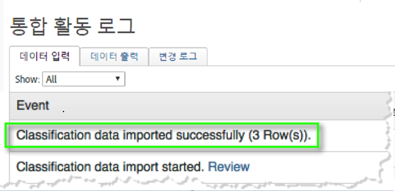
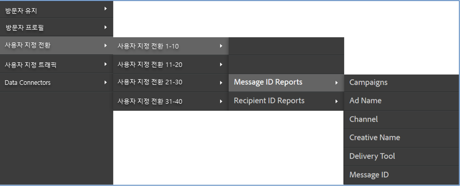

# 통합 확인{#verifying-the-integration}

배포 후 다음 검사를 통해 통합이 성공적으로 데이터를 전송하는지 확인해야 합니다.

1. 통합 작업 로그를 봅니다.
   1. Adobe Experience Cloud에서 지원 &gt; **[!UICONTROL 통합]** 활동 **[!UICONTROL 로그로 이동합니다]**.

      

   1. 성공적으로 **[!UICONTROL 가져온 분류 데이터,]**&#x200B;성공적으로 **[!UICONTROL 가져온 지표]**&#x200B;데이터 및 지표 데이터를 성공적으로 ****&#x200B;내보낸 지표 데이터와 같은 항목을찾습니다. 이러한 항목은 배포가 성공한 후 1일 이내에 표시됩니다.
1. Adobe Analytics에서 보고 데이터를 봅니다.
   1. 사용자 지정 **[!UICONTROL 전환]** &gt; **[!UICONTROL 사용자 지정 전환 1-10]** &gt; 메시지 ID **[!UICONTROL 보고서로 이동합니다]**.

      

   1. Responsys 보고를 찾습니다. 이 데이터는 성공적인 배포 후 24-48시간 이내에 