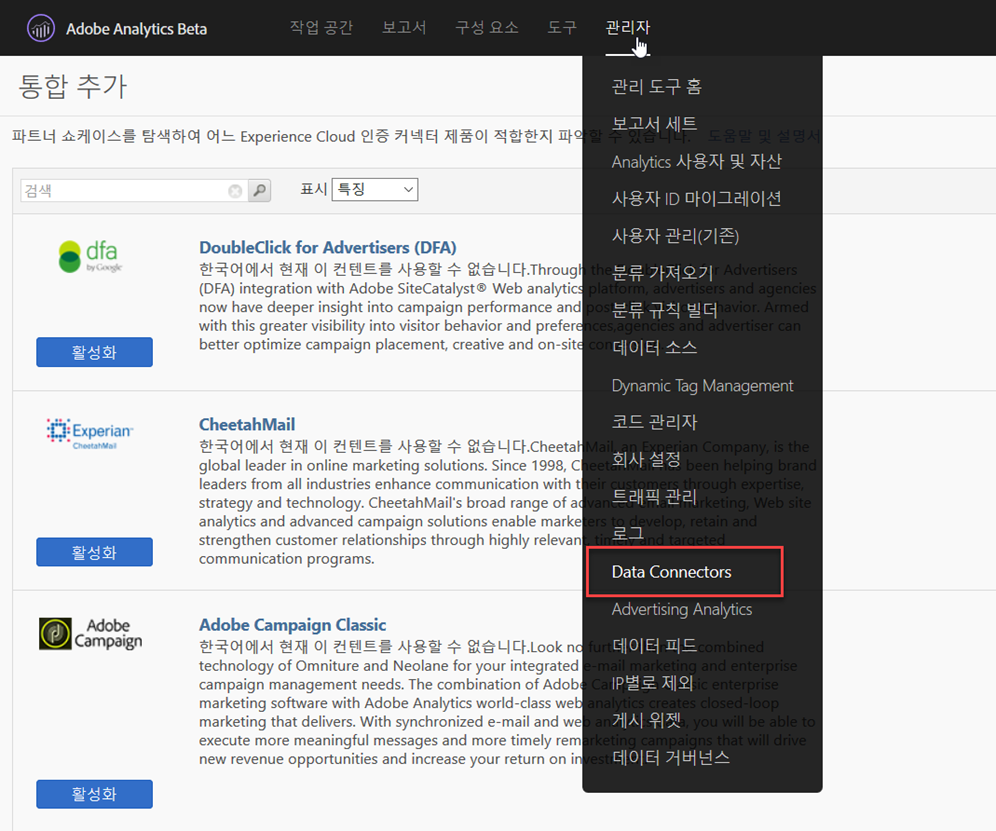
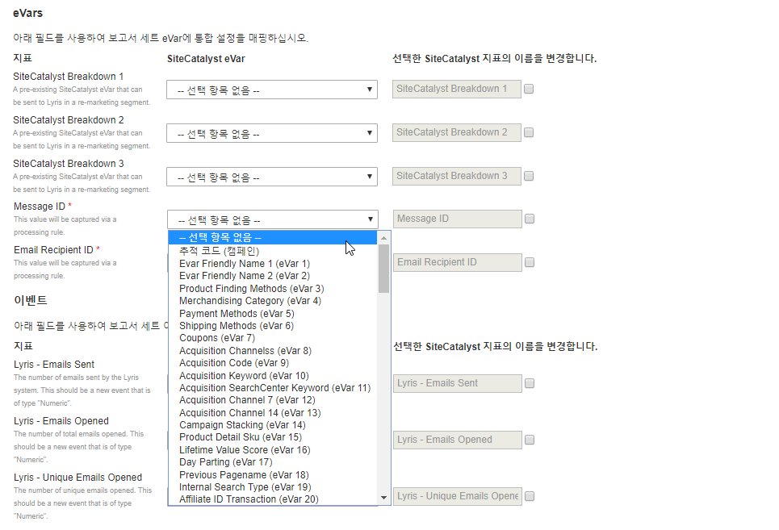
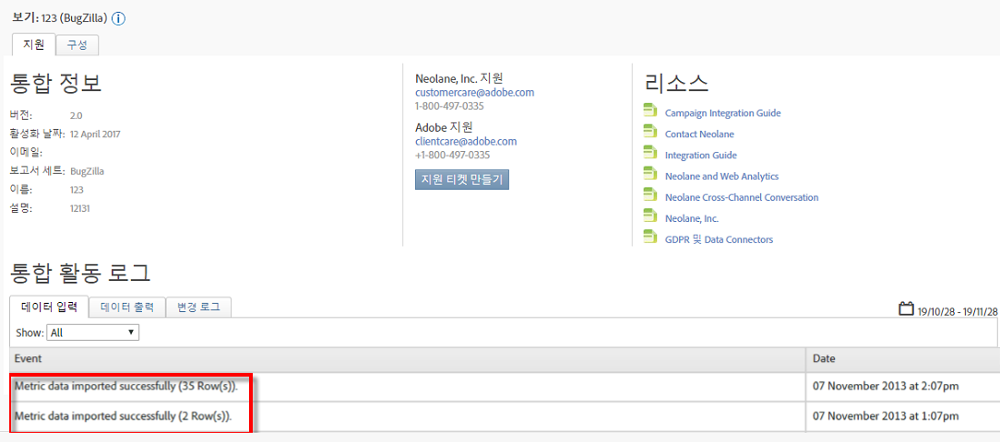

# 통합 배포{#deploying-the-integration}

이 통합 배포는 간단한 3단계 프로세스입니다.

## 통합 마법사 완료{#completing-the-integration-wizard}

통합을 활성화하려면 데이터 커넥터 인터페이스 내에서 지능적인 통합 마법사를 완료해야 합니다.

1. Adobe Experience Cloud 내의 데이터 커넥터 영역으로 이동합니다.

   

1. 통합 **[!UICONTROL 추가에서]** Sellligent 플러그인을 Adobe Experience Cloud에 드래그하여 놓습니다.

   

   그러면 Sellligent Data Connector 통합이 열립니다.

1. **통합 설정**:원하는 보고서 세트를 선택하고 통합 설정에서 통합 이름을 **[!UICONTROL 제공합니다]**.

1. 사용자 **[!UICONTROL 지정 값에서]**&#x200B;모든 지능형 계정 관련 정보를 입력합니다.

   

1. **변수 매핑**:드롭다운 메뉴에서 적절한 예약된 eVar 및 이벤트를 선택합니다.

   

1. **데이터 설정**:3개의 자동화된 파트너 세그먼트와 **[!UICONTROL 별도로]** 사용자 세그먼트 아래에서 자신의 세그먼트를 선택할 수 **[!UICONTROL 있습니다]** .

1. 이 통합을 사용하려면 Smart 계정에 몇 개의 데이터 포인트를 다운로드해야 할 수 있습니다. 액세스 요청에서 동일한 항목에 대한 액세스 권한을 부여할 **[!UICONTROL 수 있습니다]**.
1. 데이터 **[!UICONTROL 수집에서]**&#x200B;자동화된 솔루션 또는 수동 솔루션(JavaScript 플러그인)을 선택하여 랜딩 페이지 URL에서 쿼리 문자열 매개 변수를 수집합니다. 자동화된 솔루션을 선택하는 경우 메시지 ID와 MID와 RID인 수신자 ID에 대한 쿼리 문자열 매개 변수를 각각 입력합니다. JavaScript 플러그인은 Adobe 컨설턴트에게 문의하십시오.
1. **보고서 설정**:대시보드 **[!UICONTROL 생성에서]**&#x200B;이 상자를 선택하면 Selective Dashboard가 자동으로 생성됩니다.

   

1. 통합 요약을 검토하고 활성화를 **[!UICONTROL 클릭합니다]**.

## Selective의 구성{#configuration-within-selligent}

Adobe Analytics 내에서 통합이 활성화되면 지능적인 쪽에서 자동 구성이 활성화됩니다.

모든 이메일을 추적하는 추적기가 만들어졌습니다. 특정 도메인으로 제한하려면 추적기 구성을 업데이트하십시오.

Adobe Analytics의 추적 매개 변수를 URL에서 맨 앞으로 이동하는 것이 좋습니다. 이렇게 하면 Adobe 처리 규칙이 랜딩 페이지 URL에서 매개 변수를 선택하게 됩니다. 아래 표시된 확인란을 선택하여 추적을 활성화합니다.

## 통합 확인{#verifying-the-integration}

모든 배포 단계가 완료되면 통합이 성공적으로 데이터를 전송하고 있는지 확인할 수 있습니다.

데이터 교환을 시작하는 데 며칠이 걸릴 것입니다. 통합을 활성화한 후 Selligent에 문의하십시오.

### 통합 활동 로그 {#section-927e270495db479fba9578915d9ae9c9}

데이터 커넥터 내에서 지능적인 통합으로 이동합니다. 지원 **[!UICONTROL 탭에서]** 가져온 지표 데이터 및/또는 분류 데이터와 같은 이벤트를 볼 수 있습니다.

### 보고 데이터 {#section-ebd481a162324e66bd6dc8cb4b8d2424}

적절한 지표를 사용하여 지능형 메시지 보고서를 봅니다.

1. Adobe Experience Cloud의 보고 및 분석으로 이동합니다.
1. 적절한 보고서 세트를 선택합니다.
1. 사용자 **[!UICONTROL 지정 전환]**&#x200B;아래에서 **[!UICONTROL 메시지 ID 보고서를]** 선택하고 **[!UICONTROL 메시지 ID/메시지]**&#x200B;이름을 선택합니다.
