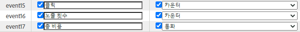
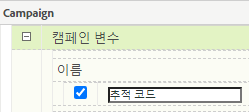
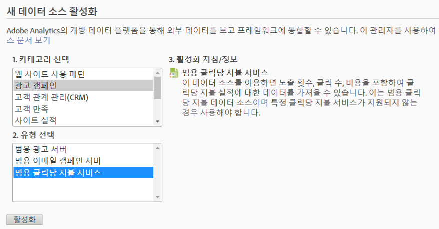
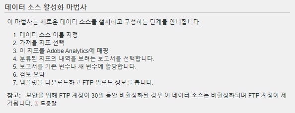
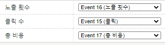
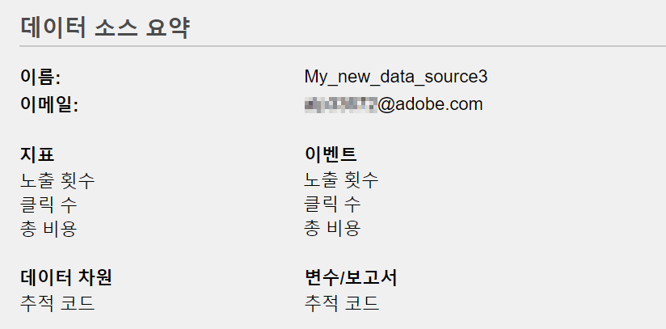

# [!UICONTROL 데이터 소스]를 사용하여 [!UICONTROL 유료 검색] 지표 가져오기

많은 마케팅 조직에서 신규 고객에게 도달하고 기존 고객을 유지하는 가장 유용하고 믿을 수 있는 방법 중 하나가 유료 검색입니다. Adobe Analytics의 [!UICONTROL 데이터 소스] 기능을 사용하면 Google AdWords와 같은 디지털 광고 플랫폼에서 고급 유료 검색 데이터를 쉽게 가져올 수 있습니다. 현장 행동 및 고객 속성 데이터와 더불어, 마케팅 데이터의 나머지 부분과 통합하여 조직의 유료 검색 활동에 대한 더 나은 통찰력을 얻을 수 있습니다.

이 단계에서는 키워드 데이터와 노출수, 클릭수, 클릭당 비용 등의 지표를 가져오도록 AdWords와의 통합을 구성하는 방법을 보여 줍니다.

클릭당 과금 데이터의 일회성 가져오기를 설정하는 방법을 설명하는 단계입니다. 단, [!UICONTROL 데이터 소스]에서는 여기에 설명된 파일 형식을 사용하여 데이터를 지속적으로 가져올 수 있습니다. 유료 검색 플랫폼에 따라 정기적 내보내기(매일, 매월 등)를 예약하고, 이러한 내보내기를 Adobe Analytics에 필요한 파일 형식으로 변환하는 자동화된 프로세스를 설정하고, 유료 검색 통합 보고를 진행하기 위해 이러한 파일을 Adobe Analytics에 업로드할 수 있습니다.

## 사전 요구 사항

* 유료 검색 감지를 구현했습니다.
* 추적 코드 데이터를 캡처하고 있습니다.
* 각 광고 그룹에 대해 고유한 추적 코드가 있습니다.

## [!UICONTROL 성공 이벤트] 구성

첫 번째 단계는 지표를 받도록 Adobe Analytics를 준비하는 것입니다. 이렇게 하려면 몇 가지 성공 이벤트를 설정해야 합니다.

[!UICONTROL 성공 이벤트]는 추적할 수 있는 작업입니다. [!UICONTROL 성공 이벤트]가 무엇인지는 직접 결정하십시오. [!UICONTROL 유료 검색] 지표를 추적하기 위해서는 [!UICONTROL 클릭수], [!UICONTROL 노출수], [!UICONTROL 총 비용]에 대한 [!UICONTROL 성공 이벤트]가 설정되고 [!UICONTROL 추적 코드]가 활성화되어야 합니다.

1. **[!UICONTROL Adobe Analytics > 관리자 > 보고서 세트]**&#x200B;로 이동합니다.
1. 보고서 세트 선택.
1. **[!UICONTROL 설정 편집 > 변환 > 성공 이벤트]**&#x200B;를 클릭합니다.

   

1. 사용자 정의 성공 이벤트에서 **[!UICONTROL 새로 추가]**&#x200B;를 사용하여 [!UICONTROL 클릭수] (카운터), [!UICONTROL 노출수] (카운터) 및 [!UICONTROL 총 비용] (통화)의 3가지 사용자 정의 성공 이벤트를 만듭니다.

   

1. 저장을 클릭합니다.
저장이 승인되었다는 메시지가 표시됩니다.
1. **[!UICONTROL 관리자 > 보고서 세트 > 설정 편집 > 전환 >전환 변수]**&#x200B;로 이동합니다.
1. **[!UICONTROL 캠페인 > 캠페인 변수]**&#x200B;에서 **[!UICONTROL 추적 코드]** 옆의 확인란을 선택하여 추적 코드를 활성화합니다.

   

## 데이터 소스 설정

[!UICONTROL 데이터 소스]를 사용하면 클릭스트림이 아닌 데이터를 Adobe Analytics와 공유할 수 있습니다. 이 경우 Adobe Analytics를 사용하여 유료 검색 지표를 추적합니다. 추적 코드를 키로 사용하여 유료 검색 지표와 Adobe Analytics 지표라는 두 가지 데이터를 연결합니다.

1. **[!UICONTROL Adobe Analytics > 관리자 > 모든 관리 > 데이터 소스]**&#x200B;로 이동합니다.
1. **[!UICONTROL 만들기]** 탭을 선택하여 새 데이터 소스 활성화를 시작합니다.
1. **[!UICONTROL 카테고리 선택]**&#x200B;에서 **[!UICONTROL 광고 캠페인]**&#x200B;을 선택합니다.

   

1. **[!UICONTROL 유형 선택]**&#x200B;에서 **[!UICONTROL 범용 클릭당 과금 서비스]**&#x200B;를 선택합니다.
1. **[!UICONTROL 활성화]**를 클릭합니다.
[!UICONTROL 데이터 소스 활성화 마법사]가 표시됩니다.

   

1. **[!UICONTROL 다음]**&#x200B;을 클릭하고 데이터 소스의 이름을 지정합니다. 이 이름은 데이터 소스 관리자에 나타납니다.
1. 서비스 계약에 동의하고 **[!UICONTROL 다음]**&#x200B;을 클릭합니다.
1. 세 가지 표준 지표([!UICONTROL 노출수], [!UICONTROL 클릭수] 및 [!UICONTROL 총 비용])를 선택하고 **[!UICONTROL 다음]**&#x200B;을 클릭합니다.
1. 이제 이 새로운 데이터 소스를 [성공 이벤트 구성](/help/admin/admin/c-success-events/t-success-events.md)에서 생성한 사용자 정의 이벤트에 “매핑”하십시오.

   

1. 데이터 지표 선택
추적 코드 옆의 확인란을 선택하고 **[!UICONTROL 다음]**&#x200B;을 클릭합니다.
1. 데이터 차원을 매핑합니다.
가져온 데이터 차원(속성)을 저장하려는 Adobe Analytics 속성에 매핑합니다. 이는 표준 차원 또는 eVar일 수 있습니다. **[!UICONTROL 다음]**&#x200B;을 클릭하면 결과 매핑이 요약에 표시됩니다.

   

1. **[!UICONTROL 저장]**&#x200B;을 클릭합니다.
1. **[!UICONTROL 다운로드]**를 클릭하여 이 데이터 소스의 템플릿 파일을 다운로드합니다.
파일 이름은 처음에 지정한 데이터 소스 유형과 일치합니다. - 이 경우 “범용 클릭당 지불 서비스 template.txt”입니다.
1. 즐겨 사용하는 텍스트 편집기에서 템플릿을 엽니다.
파일은 이미 지표와 차원 및 해당 매핑으로 채워져 있습니다.

## PPC 데이터 내보내기 및 Analytics에 업로드

Google Adwords, MSN, Yahoo 및 기타 PPC 계정에 대해 이와 유사한 단계를 수행합니다.

### 데이터 내보내기

1. PPC 계정에 로그인하고 새 보고서를 만들거나 내보내기합니다.
내보내기에 날짜, 대상 URL(랜딩 페이지), 노출수, 클릭수 및 비용 필드가 포함되어 있는지 확인합니다. 내보내기에는 다른 필드가 포함될 수 있지만 아래 단계에서 해당 필드를 삭제해야 합니다.
1. 가능한 경우 보고서를 `.csv` 또는 탭으로 구분된 파일로 저장합니다. 이렇게 하면 다음 단계에서 보다 쉽게 작업할 수 있습니다.
1. Microsoft Excel에서 파일을 엽니다.

### Microsoft Excel에서 파일 편집

1. Microsoft Excel에서 위에서 언급한 열을 제외한 모든 열을 삭제합니다.
1. 맨 위에 있는 추가 행을 삭제합니다.
1. 대상 URL에서 추적 코드를 분리하려면 다음 단계를 따르십시오.
a. 모든 열에서 데이터를 복사하여 붙여넣습니다.
b. **[!UICONTROL 데이터 > 텍스트 나누기]**를 클릭합니다.
c. 마법사의 1단계에서 **[!UICONTROL 구분]**&#x200B;이 선택되었는지 확인하고 **[!UICONTROL 다음]**을 클릭합니다.
d. 마법사의 2단계에서 URL을 어떻게 만들었는지에 따라 구분 기호를 지정하고(? 또는 &amp;) **[!UICONTROL 다음]**을 클릭합니다.
e. 마법사의 3단계에서 데이터를 미리 보고 열 중 하나가 “trackingcodename=trackingcode”인지 확인합니다. 추가 변수가 있는 경우 이 단계를 반복합니다(구분 기호로 &amp; 사용).
f. 추적 코드, 노출수, 클릭수 및 비용을 제외한 모든 열을 삭제합니다. 날짜라는 새 열을 추가하고 날짜 :: 추적 코드 :: 노출수 :: 클릭수 :: 비용의 순서로 열을 구성합니다.
1. 위의 “데이터 소스 설정” 섹션에서 다운로드한 템플릿에 이 데이터를 추가합니다.
이제 파일을 업로드할 준비가 완료되었습니다.

### FTP를 통해 Adobe Analytics에 파일 업로드

지침을 보려면 데이터 원본 마법사로 돌아가 FTP를 통해 파일을 업로드합니다.

## 계산된 지표 만들기

계산된 지표를 추가하면 클릭당 과금 결정을 내릴 때 도움이 됩니다.

예를 들어 다음 [계산된 지표](https://experienceleague.adobe.com/docs/analytics/components/calculated-metrics/calcmetric-workflow/cm-build-metrics.html#calculated-metrics)를 추가할 수 있습니다.

| 이름 | 공식 | 지표 유형 | 설명 |
| --- | --- | --- | --- |
| 방문당 페이지 보기 횟수 | 페이지 보기 횟수/방문 수 | 숫자 | 사이트 수준에서 적용할 때 방문당 평균 페이지 수를 보여 줍니다. 가장 방문 빈도가 높은 페이지 보고서에서 적용할 때 특정 페이지가 방문당 표시되는 평균 횟수를 보여 줍니다. |
| 평균 주문 가격 | 매출액/주문 수 | 통화 | 주문당 평균 매출을 표시합니다. |
| 방문당 매출액 | 매출/방문 | 통화 | 방문당 평균 매출을 보여 줍니다. |
| 클릭스루 비율(CTR) | 클릭수/노출수 | 숫자 | 온라인 광고 또는 이메일 마케팅 캠페인의 노출수에 대한 클릭수의 비율을 측정합니다. |
| 이익 | 매출 - 비용 | 통화 | 캠페인 매출에서 비용을 뺀 값을 보여 줍니다. |
| 노출수당 이익(PPI) | (매출 - 비용)/노출수 | 통화 | 광고가 표시될 때마다 비용과 견주어 얼마나 많은 수익이 발생했는지 보여 줍니다. |
| 광고 투자 수익률(ROAS) | 판매액/광고비 | 통화 | (ROI) 해당 광고에 지출된 달러당 벌어들인 달러를 나타냅니다. |

## 보고서 구성 및 실행

마지막 단계는 데이터 소스 지표와 계산된 지표 추적 코드 보고서에 추가하고 캠페인을 드릴다운하여 각 광고 그룹의 실적을 즉시 확인하는 것입니다.

1. **[!UICONTROL Adobe Analytics > 보고서]**&#x200B;에서 데이터 소스를 가져온 보고서 세트를 선택합니다.
1. **[!UICONTROL 보고서 > 캠페인 > 추적 코드 > 추적 코드]**&#x200B;로 이동합니다.
1. 날짜 범위를 선택합니다.
1. **[!UICONTROL 지표 > 추가]**&#x200B;를 클릭하고 표준 지표 목록에서 데이터 소스 지표(클릭수, 노출수, 총 비용)를 추가합니다.
1. 추가했을 수 있는 모든 계산된 지표에 대해서도 동일한 작업을 수행합니다. 지표를 추가하면 보고서가 업데이트됩니다.
