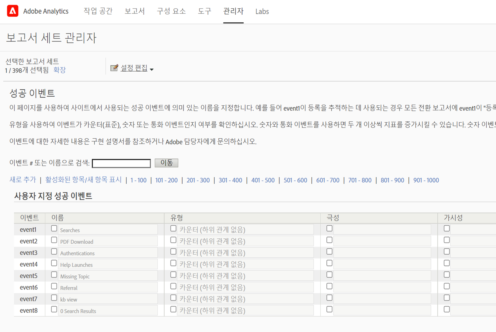

# [!UICONTROL 데이터 소스]를 사용하여 [!UICONTROL 유료 검색] 지표 가져오기

많은 마케팅 조직의 경우 유료 검색은 신규 고객에게 도달하고 기존 고객을 &#x200B; 유지하는 가장 중요하고 안정적인 방법 중 하나입니다. Adobe Analytics의 [!UICONTROL Data Sources] 기능을 사용하면 Google AdWords와 같은 디지털 광고 플랫폼에서 고급 유료 검색 데이터를 쉽게 가져올 수 있습니다. 사이트 내 행동 및 고객 속성 데이터와 함께 이를 나머지 마케팅 데이터와 통합하여 조직의 유료 검색 노력에 대한 통찰력을 높일 수 있습니다.

이 단계에서는 노출 횟수, 클릭 수, 클릭당 비용 등과 같은 지표뿐만 아니라 키워드 데이터를 가져오기 위해 AdWords와의 통합을 구성하는 방법을 보여줍니다.

이 단계에서는 클릭당 지불 데이터를 한 번 가져오는 방법을 설명합니다. 그러나 [!UICONTROL Data Sources]에서는 여기에 설명된 파일 형식을 사용하여 데이터를 계속 가져올 수 있습니다. 유료 검색 플랫폼에 따라 주기적인 내보내기(일별, 월별 등)를 예약하고, 이러한 내보내기를 Adobe Analytics이 필요로 하는 파일 형식으로 변환하기 위한 자동화된 프로세스를 설정하고, 유료 검색 통합 보고를 위해 이러한 파일을 Adobe Analytics에 업로드할 수 있습니다.

## 사전 요구 사항

* 유료 검색 감지를 구현했습니다.
* 추적 코드 데이터를 캡처하고 있습니다.
* 각 광고 그룹에 대한 고유한 추적 코드가 있습니다.

## [!UICONTROL 성공 이벤트 구성]

첫 번째 단계는 Adobe Analytics이 지표를 받을 수 있도록 준비하는 것입니다. 이를 수행하려면 몇 가지 성공 이벤트를 설정해야 합니다.

[!UICONTROL 성공 이벤트는 추적할 수 있는 작업입니다. ] [!UICONTROL 성공 이벤트]가 무엇인지 결정합니다. [!UICONTROL 유료 검색] 지표를 추적하기 위해 [!UICONTROL 클릭], [!UICONTROL 노출 횟수], [!UICONTROL 총 비용]과 [!UICONTROL 추적 코드]를 기준으로 [!UICONTROL 성공 이벤트]를 설정하려고 합니다.

1. **[!UICONTROL Adobe Analytics > 관리 > 보고서 세트]**&#x200B;로 이동합니다.
1. 보고서 세트 선택.
1. **[!UICONTROL 설정 편집 > 변환 > 성공 이벤트]**&#x200B;를 클릭합니다.

   

1. 사용자 지정 성공 이벤트 아래에서 **[!UICONTROL 새로 추가]**&#x200B;를 사용하여 3개의 사용자 지정 성공 이벤트를 만듭니다.[!UICONTROL 클릭](카운터), [!UICONTROL 노출 횟수](카운터) 및 [!UICONTROL 총 비용](통화)을 클릭합니다.

   

1. 저장을 클릭합니다.
저장 내용이 승인되었다는 메시지를 수신해야 합니다.
1. **[!UICONTROL 관리 > 보고서 세트 > 설정 편집 > 전환 > 전환 변수]**&#x200B;로 이동합니다.
1. **[!UICONTROL 캠페인 > 캠페인 변수]**&#x200B;에서 **[!UICONTROL 추적 코드]** 옆의 확인란을 선택하여 추적 코드를 활성화합니다.

   

## 데이터 소스 설정

[!UICONTROL 데이터 ] 소스를 사용하면 비클릭 스트림 데이터를 Adobe Analytics과 공유할 수 있습니다. 이 경우 Adobe Analytics을 사용하여 유료 검색 지표를 추적합니다. 추적 코드를 핵심 요소로 사용하여 두 데이터(유료 검색 지표 및 Adobe Analytics 지표)를 함께 연결합니다.

1. **[!UICONTROL Adobe Analytics > 관리 > 모든 관리 > 데이터 소스]**&#x200B;로 이동합니다.
1. **[!UICONTROL 만들기]** 탭을 선택하여 새 데이터 소스 활성화를 시작합니다.
1. **[!UICONTROL 카테고리 선택]**&#x200B;에서 **[!UICONTROL 광고 캠페인]**&#x200B;을 선택합니다.

   

1. **[!UICONTROL 유형]**&#x200B;에서 **[!UICONTROL 일반 클릭당 지불 서비스]**&#x200B;를 선택합니다.
1. **[!UICONTROL 활성화]**를 클릭합니다.
[!UICONTROL 데이터 소스 활성화 마법사]가 표시됩니다.

   

1. **[!UICONTROL 다음]**&#x200B;을 클릭하고 데이터 소스의 이름을 지정합니다. 이 이름은 데이터 소스 관리자에 나타납니다.
1. 서비스 계약에 동의하고 **[!UICONTROL 다음]**&#x200B;을 클릭합니다.
1. 3개의 표준 지표를 선택합니다.[!UICONTROL 노출 횟수], [!UICONTROL 클릭 수] 및 [!UICONTROL 총 비용]을 클릭하고 **[!UICONTROL 다음]**&#x200B;을 클릭합니다.
1. 이제 이 새 데이터 소스를 [성공 이벤트 구성](/help/admin/admin/c-success-events/t-success-events.md)에서 만든 사용자 지정 이벤트에 &quot;매핑&quot;합니다.

   

1. 데이터 차원 선택
추적 코드 옆의 상자를 선택하고 **[!UICONTROL 다음]**&#x200B;을 클릭합니다.
1. 데이터 Dimension 매핑
가져온 데이터 차원(속성)을 저장할 Adobe Analytics 속성에 매핑합니다. 표준 차원이거나 eVar일 수 있습니다. **[!UICONTROL 다음]**&#x200B;을 클릭하면 결과 매핑이 요약에 표시됩니다.

   

1. **[!UICONTROL 저장]**&#x200B;을 클릭합니다.
1. **[!UICONTROL 다운로드]**를 클릭하여 이 데이터 소스의 템플릿 파일을 다운로드합니다.
파일 이름은 처음에 지정한 데이터 소스 유형에 해당합니다. 이 경우 &quot;범용 클릭당 지불 서비스 템플릿.txt&quot;입니다.
1. 즐겨 사용하는 텍스트 편집기에서 템플릿을 엽니다.
이 파일은 지표 및 차원 및 해당 매핑으로 이미 채워집니다.

## PPC 데이터를 내보내고 Analytics에 업로드

Google Adwords, MSN, Yahoo 및 기타 PPC 계정에 대해 이러한 작업과 유사한 단계입니다.

### 데이터 내보내기

1. PPC 계정에 로그인하여 새 보고서를 만들거나 내보냅니다.
내보내기에 다음 필드가 포함되어 있는지 확인합니다.날짜, 대상 URL(랜딩 페이지), 노출 횟수, 클릭 수 및 비용 내보내기에는 다른 필드가 포함될 수 있지만 아래 단계를 삭제합니다.
1. 가능한 경우 보고서를 `.csv` 또는 탭으로 구분된 파일로 저장합니다. 이렇게 하면 다음 단계에서 작업이 더 쉬워집니다.
1. Microsoft Excel에서 파일을 엽니다.

### Microsoft Excel에서 파일 편집

1. Microsoft Excel에서 위에 언급된 열 이외의 열을 모두 삭제합니다.
1. 맨 위에 있는 추가 행을 삭제합니다.
1. 대상 URL에서 추적 코드를 분리하려면:
a.모든 열의 데이터를 복사하여 붙여넣을 수 있습니다.
b.**[!UICONTROL 데이터 > 열로 텍스트]**를 클릭합니다.
c. 마법사의 1단계에서 **[!UICONTROL 구분]**&#x200B;이 선택되었는지 확인하고 **[!UICONTROL 다음]**을 클릭합니다.
d.마법사의 2단계에서 URL을 만든 방법에 따라 구분 기호를 지정합니다(둘 중 하나?). 또는 &amp;)를 클릭하고 **[!UICONTROL 다음]**을 클릭합니다.
e.마법사의 3단계에서 데이터를 미리 보고 열 중 하나가 &quot;trackingcodename=trackingcode&quot;인지 확인합니다. 추가 변수가 있는 경우 다음 단계를 반복합니다(&amp;를 구분 기호로 사용).
f.추적 코드, 노출 횟수, 클릭 수 및 비용을 제외한 모든 열을 삭제합니다. Date라는 새 열을 추가하고 다음 순서로 열을 구성합니다.날짜::추적 코드::노출 횟수::클릭 수:비용.
1. 위의 &quot;데이터 소스 설정&quot; 섹션에서 다운로드한 템플릿에 이 데이터를 추가합니다.
이제 파일을 업로드할 준비가 되었습니다.

### FTP를 통해 Adobe Analytics에 파일 업로드

데이터 소스 마법사로 돌아가 FTP를 통해 파일을 업로드합니다.

## 계산된 지표 만들기

계산된 지표를 추가하면 클릭당 지불 결정을 내릴 때 유용합니다.

예를 들어 다음 [계산된 지표](https://experienceleague.adobe.com/docs/analytics/components/calculated-metrics/calcmetric-workflow/cm-build-metrics.html?lang=en#calculated-metrics)를 추가할 수 있습니다.

| 이름 | 공식 | 지표 유형 | 설명 |
| --- | --- | --- | --- |
| 방문당 페이지 보기 횟수 | 페이지 보기 횟수/방문 수 | 숫자 | 사이트 수준에서 적용할 때 방문당 평균 페이지 수를 보여줍니다. 가장 방문 빈도가 높은 페이지 보고서에서 적용할 때 특정 페이지가 방문당 표시되는 평균 횟수를 보여줍니다. |
| 평균 주문 가격 | 매출액/주문 수 | 통화 | 주문당 평균 매출을 표시합니다. |
| 방문당 매출 | 매출/방문 | 통화 | 방문당 평균 매출액을 표시합니다. |
| 클릭스루 비율(CTR) | 클릭/노출 횟수 | 숫자 | 온라인 광고 또는 이메일 마케팅 캠페인의 노출 횟수에 대한 클릭 수를 측정할 수 있습니다. |
| 이윤 | 매출 - 비용 | 통화 | 캠페인의 매출에서 비용을 뺀 값을 표시합니다. |
| 노출 당 이익(PPI) | (매출 - 비용)/노출 수 | 통화 | 광고가 표시될 때마다 발생한 매출액을 원가와 균형 있게 표시합니다. |
| ROAS(광고비 투자 수익률) | 판매 금액/광고 비용 | 통화 | (ROI) 해당 광고에 사용된 달러 당 획득한 달러를 나타냅니다. |

## 보고서 구성 및 실행

마지막 단계는 데이터 소스 지표와 계산된 지표를 추적 코드 보고서에 추가하고 캠페인으로 드릴다운하여 각 광고 그룹이 수행되는 방식을 즉시 확인하는 것입니다.

1. **[!UICONTROL Adobe Analytics > 보고서]**&#x200B;에서 데이터 소스를 가져온 보고서 세트를 선택합니다.
1. **[!UICONTROL 보고서 > 캠페인 > 추적 코드 > 추적 코드]**&#x200B;로 이동합니다.
1. 날짜 범위를 선택합니다.
1. 표준 지표 목록에서 **[!UICONTROL 지표 > 추가]**&#x200B;를 클릭하고 데이터 소스 지표(클릭 수, 노출 횟수, 총 비용)를 추가합니다.
1. 추가한 모든 계산된 지표에 대해서도 동일한 작업을 수행합니다. 지표를 추가하면 보고서가 업데이트됩니다.
