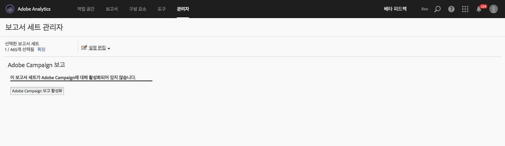

# Adobe Campaign 보고

이 통합을 구성하는 방법에 대한 자세한 내용은 [Adobe Campaign 설명서](https://helpx.adobe.com/campaign/standard/integrating/using/about-campaign-analytics-integration.html)를 참조하십시오.

Adobe Analytics와 Adobe Campaign을 통합하면

* KPI(핵심 성능 지표) 데이터를 Adobe Campaign Standard에서 Adobe Analytics에 공유할 수 있습니다.
* Adobe Analytics 매개 변수를 사용하는 수식 추적 기능이 향상됩니다.
* **[!UICONTROL Analytics]** &gt; **[!UICONTROL 보고서]** &gt; **[!UICONTROL Adobe Campaign 아래에 새 보고서를 추가합니다.]**
* 5개의 새로운 Adobe Campaign 분류가 추가됩니다.
* 10개의 새로운 Adobe Campaign 지표가 추가됩니다.
* 6개의 새로운 Adobe Campaign 차원이 추가됩니다.
* 데이터가 15분마다 Analytics에 동기화됩니다.

## 1단계. Adobe Campaign 보고 활성화 {#section_C685EF10505045708A6536BB13F6CD58}

Analytics에서 Campaign 데이터를 보려면 먼저 Campaign 보고를 활성화해야 합니다.

1. **[!UICONTROL Analytics]** &gt; **[!UICONTROL 관리]** &gt; **[!UICONTROL 보고서 세트]** &gt; **[!UICONTROL <select report suite>]** &gt; 설정 **[!UICONTROL 편집]** &gt; **[!UICONTROL Adobe Campaign]** &gt; **[!UICONTROL Adobe Campaign 보고로]** 이동합니다.
1. **[!UICONTROL Campaign 보고 활성화를 클릭합니다]**.

   

## 2단계. Adobe Campaign 보고서 보기 {#section_9C18A29F3CC54BD4AC5EA96417F17B33}

The integration between Adobe Campaign Standard and Adobe Analytics adds the following report under  **[!UICONTROL Analytics]** &gt; **[!UICONTROL Reports]**

<table id="table_3627F40DC90646A7B5E217A88B6FD630"> 
 <thead> 
  <tr> 
   <th colname="col1" class="entry"> 보고서 </th> 
   <th colname="col2" class="entry"> 정의 </th> 
  </tr> 
 </thead>
 <tbody> 
  <tr> 
   <td colname="col1"> 
Adobe Campaign 수행된 배달 ID 
 </td> 
   <td colname="col2"> 
Adobe 캠페인에서 전송된 이메일에 대한 Adobe Campaign에서 가져온 데이터를 표시합니다. 
 </td> 
  </tr> 
 </tbody> 
</table>

## 3단계. Adobe Campaign 분류 사용 {#section_74A28AF3F4CA4091943789DE4D8B2B63}

**[!UICONTROL Analytics]** &gt; **[!UICONTROL 관리]** &gt; **[!UICONTROL 보고서 세트]** &gt; **[!UICONTROL <select report suite>]** &gt; **[!UICONTROL 설정]** 편집 &gt; **[!UICONTROL Adobe Campaign]** &gt; **[!UICONTROL Adobe Campaign 분류]**

보고서 세트가 Adobe Campaign에 대해 활성화되면 다음의 분류를 사용할 수 있습니다.

* 배달 ID(Campaign에 표시되는 내부 배달 이름)
* 배달 레이블 ((캠페인에서 전달 - 개별 배달/반복 배달/거래 게재)
* 캠페인 ID(Campaign에 표시되는 내부 캠페인 이름)
* 캠페인 레이블(Adobe Campaign의 캠페인)
* 수행된 배달 레이블(개별 수행된 배달 목록)

## Adobe Analytics에서 사용할 수 있는 Adobe Campaign 차원 및 지표 {#section_F33385C9660644AF84172EC39601469B}

Adobe Analytics 보고서 세트의 Campaign에서 다음 **지표**&#x200B;를 사용할 수 있습니다.

* Adobe Campaign 전송 수
* Adobe Campaign 발행 수
* Adobe Campaign 클릭 수
* Adobe Campaign 처리 수
* Adobe Campaign 게재 수
* Adobe Campaign 고유 발행 수
* Adobe Campaign 고유 클릭 수
* Adobe Campaign 구독 해지 수
* Adobe Campaign 총 바운스 수
* Adobe Campaign 수행된 배달 ID 인스턴스 수

Adobe Analytics 보고서 세트의 Campaign에서 다음 **차원**&#x200B;을 사용할 수 있습니다.

| 차원 이름 | 정의 |
|--- |--- |
| 캠페인 ID | 기간 동안 KPI가 전송된 모든 캠페인의 ID |
| 캠페인 레이블 | 캠페인 ID의 레이블 |
| 배달 ID | 기간 동안 KPI가 전송된 모든 배달의 ID. 반복 배달 및 트랜잭션 배달에 대한 마스터 배달의 ID도 포함합니다. 예: 반복 배달 DM1이 예약되었으며 DM2, DM3, DM4 및 DM5는 반복 배달의 하위 배달입니다.  배달 ID는 모든 배달(DM1~DM5)의 결과를 표시합니다. |
| 배달 레이블 | 배달 ID의 레이블 |
| 수행된 배달 ID | 수행된 배달 전용 ID입니다. 반복/트랜잭션 마스터 배달의 ID가 없습니다. 예: 반복 배달 DM1이 예약되었으며 DM2, DM3, DM4 및 DM5는 반복 배달의 하위 배달입니다. 수행된 배달 ID는 DM2에서 DM5로 시작하는 모든 배달(실제로 수행된 배달)의 결과를 표시합니다. |
| 수행된 배달 레이블 | 수행된 배달 ID의 레이블 |
