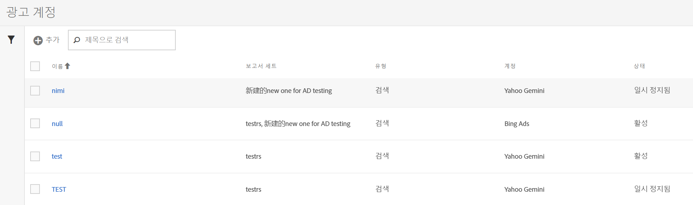
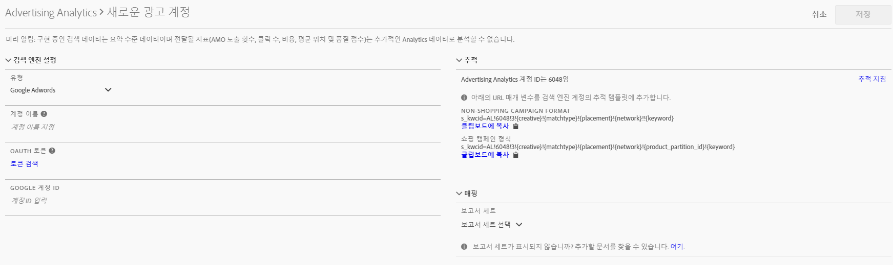

# 광고 계정 설정

Adobe Analytics 관리자는 새로운 광고 계정을 만들고 여러 계정을 여러 보고서 세트에 매핑(일대일, 일대다, 다대다)할 수 있습니다.

또한 관리자는 광고 계정을 설정할 [관리자가 아닌 사용자에게 액세스 권한을 부여](../../../integrate/c-advertising-analytics/overview.md#section_FCC58EB635954A32990D4E67B52B4369)할 수 있습니다.

1. In Adobe Analytics, navigate to **[!UICONTROL Admin]** &gt; **[!UICONTROL Advertising Accounts]**.
1. (처음 사용 시에만 해당) 최종 사용자 라이센스 계약서 약관에 동의합니다.
1. **[!UICONTROL + 추가를]**&#x200B;클릭합니다.
1. [!UICONTROL 새 검색 엔진 계정] 대화 상자가 표시됩니다.

   

1. 다음 지침에 따라 **[!UICONTROL 검색 엔진 설정]을 입력합니다.**

   <table id="table_B3BE66B7D4C54766B8FFD2C6DCD657AF"> 
    <thead> 
      <tr> 
      <th colname="col1" class="entry"> 설정 </th> 
      <th colname="col2" class="entry"> 설명 </th> 
      </tr>
    </thead>
    <tbody> 
      <tr> 
      <td colname="col1"> 
유형 
 </td> 
      <td colname="col2"> 
두 가지 옵션이 있습니다. Google Adwords 및 Microsoft Bing 광고. 
 
참고: Yahoo Gemini는 2019년 3월 31일에 Microsoft Bing에 흡수되었습니다. 따라서 Yahoo Gemini 광고 계정 옵션은 더 이상 사용할 수 없습니다.  
 </td> 
      </tr> 
      <tr> 
      <td colname="col1"> 
계정 이름 
 </td> 
      <td colname="col2"> 
이 계정 이름을 사용자에게 맞는 이름으로 설정하도록 선택할 수 있습니다. UI에 표시되는 계정의 친숙한 이름입니다. 
 </td> 
      </tr> 
      <tr> 
      <td colname="col1"> 
OAuth 토큰 
 </td> 
      <td colname="col2"> 
참고: OAuth는 액세스 위임에 대한 개방형 표준으로, 일반적으로 웹 사이트 또는 응용 프로그램에 다른 웹 사이트에 있는 해당 정보에 액세스할 권한을 부여하는 방법으로 사용되지만 암호를 제공하지 않습니다.  
 
참고: 사용자는 타사 URL(efrontier.com)로 라우팅됩니다. Adobe는 efrontier를 사용하여 세 개의 검색 엔진 모두에 대한 OAuth 인증 프로세스를 진행합니다. 
 
참고: Internet Explorer 11(또는 이전 버전)을 사용하는 경우 세 개의 검색 엔진에 대한 Oauth 토큰을 성공적으로 검색할 수 없습니다. 대신 다른 웹 브라우저를 사용하십시오. 
 
검색 토큰을 클릭하면 OAuth2 인증 프로세스가 실행됩니다. 즉, 사용자의 자격 증명을 사용하여 /Google/Bing 검색 계정에 로그인하라는 메시지가 표시됩니다. 선택한 검색 엔진에 따라 프로세스가 약간 다릅니다. 
 
        <ul id="ul_FC9B5612F6554495B04C357CB0AB72EB"> 
        <li id="li_CD54231BFF134F83B3B5B14B34A0E1D2">Google Adwords: Google 계정 ID를 제공합니다. </li> 
        <li id="li_89B9D54BAA914E5DB2959B193489582E">Microsoft Bing: Bing 계정 ID 및 Bing 고객 ID를 제공합니다. </li> 
        </ul> 
이러한 ID에 대한 자세한 내용은 <a href="../../../integrate/c-advertising-analytics/c-adanalytics-workflow/aa-locate-account-id.md#concept_F7F67448F3B44342967E0419E96F384D" format="dita" scope="local"> 계정 ID 찾기</a>를 참조하십시오. 
 
로그인하면 OAuth 토큰 필드가 표시됩니다. 
        <systemoutput>
          검색됨
        </systemoutput>에서 보냅니다. 
 </td> 
      </tr> 
    </tbody> 
    </table>

1. **[!UICONTROL 추적]섹션에서 Adobe Analytics 구현으로 검색 엔진 데이터를 추적하는 방법에 대한 정보를 제공합니다.** 이 단계는 검색 엔진 데이터를 사용하여 Adobe Analytics 데이터를 적절하게 늘리는 데 필요한 단계입니다.
다음 지침에 따라 **[!UICONTROL 추적 설정]을 입력합니다.**

   <table id="table_1AB4E31456E84ABF8209B02058259C4D"> 
    <thead> 
      <tr> 
      <th colname="col1" class="entry"> 설정 </th> 
      <th colname="col2" class="entry"> 설명 </th> 
      </tr>
    </thead>
    <tbody> 
      <tr> 
      <td colname="col1"> 
유형 
 </td> 
      <td colname="col2"> 
        <ul id="ul_1C5A0502A4984E57A08417A91CCD6FFE"> 
        <li id="li_5736E38286FF494ABDDC6E85281D7F2A">  자동: Advertising Cloud 엔진은 추적 매개 변수가 검색 엔진의 추적 템플릿/대상 URL에 추가되는 방법을 결정합니다. 가장 간단한 방법이지만 최상의 통합 데이터 세트를 생성할 수는 없습니다. 
중요: [자동 모드]에서 검색 엔진 계정을 구성하려면 다음 조치를 수행해야 합니다. 
          <ul id="ul_4FF9D1E3CC4E452BA339E0A725D29FEE"> 
            <li id="li_6F3A6D6259C0420CB7E6FD2C26A1B6E0">"s_kwcid" 매개 변수 및 값이 추가되는 계정의 계정 추적 템플릿 또는 랜딩 페이지 URL에 추가됩니다. URL의 끝에 삽입됩니다. 따라서 웹 서버에서 URL 끝에 특정 키=값 쌍이 필요하거나 URL에 새 키=값 쌍을 지원하는 업데이트가 필요한 경우 추가 작업이 필요할 수도 있습니다. </li> 
            <li id="li_A04D4AA31A934392808639E46C86573F">또한 키워드는 "s_kwcid" 값의 일부로 랜딩 URL에 키워드를 삽입할 수 있으므로, 특수 문자 또는 기호가 포함되어 있는 경우 웹 서버에서 해당 문자를 지원할 수 있는지 확인하십시오(일반적인 특수 문자의 예는 "Broad Match Modified" 키워드에서 사용되는 "+"). </li> 
          </ul> 
 </li> 
        <li id="li_EAA7A7CA1E584854A7EC1E43E13B63FE"> 수동: 추적 매개 변수가 검색 엔진의 추적 템플릿/대상 URL에 추가되는 방식을 관리할 수 있습니다. <a href="../../../integrate/c-advertising-analytics/c-adanalytics-workflow/aa-manual-vs-automatic-tracking.md#concept_87B28BA9E7F84BA5972F69E6F3482A33" format="dita" scope="local"> 각 검색 엔진에 대한 이러한 수동 추적 예를 참조하십시오</a>. </li> 
        </ul> </td> 
      </tr> 
    </tbody> 
    </table>

1. **[!UICONTROL 매핑]섹션에서 이 검색 엔진 계정에 연결할 보고서 세트를 선택합니다.** 광고 계정을 저장하기 전에 한 개 이상의 보고서 세트를 제공해야 합니다. 여러 개의 계정을 여러 보고서 세트(일대일, 일대다, 다대다)에 매핑할 수 있습니다. AMO가 검색 엔진에서 가져오는 데이터는 매핑된 보고서 세트에 복사되므로 데이터를 분할하지 않습니다.

   >[!IMPORTANT]
   >
   >Only report suites that have been [mapped to an Experience Cloud organization](https://marketing.adobe.com/resources/help/en_US/mcloud/map-report-suite.html) will be available for selection. If you do not see your report suite listed, refer to [Troubleshoot Advertising Analytics](/help/integrate/c-advertising-analytics/c-adanalytics-workflow/aa-troubleshooting.md).

   **[!UICONTROL 매핑 설정]에 대해 다음 지침을 따르십시오.**

   <table id="table_AF876DC40F97403882C0AA528BD204FF"> 
    <thead> 
      <tr> 
      <th colname="col1" class="entry"> 설정 </th> 
      <th colname="col2" class="entry"> 설명 </th> 
      </tr>
    </thead>
    <tbody> 
      <tr> 
      <td colname="col1"> 
보고서 세트 매핑 
 </td> 
      <td colname="col2"> 
보고서 세트 매핑은 이 검색 엔진 계정에 연결되는 보고서 세트를 결정합니다. 즉, 검색 엔진 데이터가 전송되는 보고서 세트를 결정합니다. 
 
해당 보고서 세트가 표시되지 않으면 이 도구를 사용하여 <a href="https://marketing.adobe.com/resources/help/en_US/mcloud/map-report-suite.html" format="html" scope="external">Experience Cloud 조직에 보고서 세트를 매핑</a>할 수 있습니다. 
 </td> 
      </tr> 
    </tbody> 
    </table>

1. **[!UICONTROL 저장을 클릭합니다]**.
1. 저장하면 면책조항에 경고 목록이 표시됩니다. 이 계약을 읽고 이해했는지 확인하는 메시지가 표시됩니다. 확인란을 클릭한 다음 **[!UICONTROL 확인을 클릭합니다]**.

   이제 새로 작성한 계정이 나열된 광고 계정 [관리 UI](../../../integrate/c-advertising-analytics/c-adanalytics-workflow/aa-manage-ad-accounts.md#concept_531B99165A4E47B4B8849376B532AFDB)로 이동합니다.

>[!NOTE]
>
>검색 엔진 데이터가 Analytics 보고서에 채우기를 시작하기 최소 24 시간 전에 기다려야 합니다.

