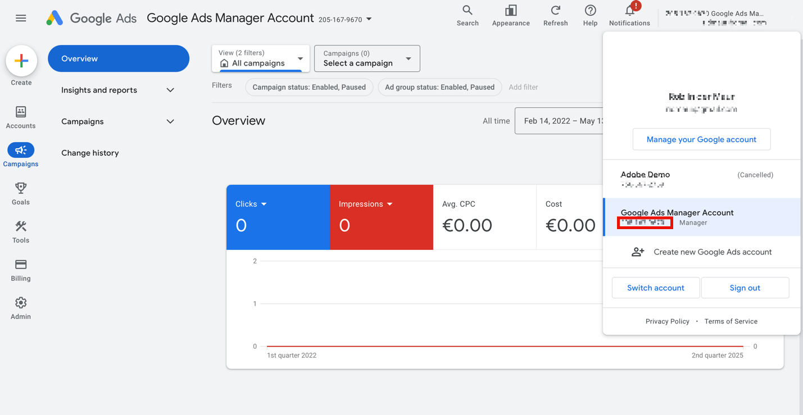

# 계정 ID 찾기 {#locate-your-account-ids}

Google Ads 및 Microsoft Advertising에 대한 계정 ID를 찾는 방법에 대해 알아봅니다.

## Google 광고(AdWords) {#google}

>[!IMPORTANT]
>
>Google Ads는 두 가지 유형의 계정을 사용합니다.
>
>- MCC(내 클라이언트 센터) 계정 및
>- 표준 계정입니다.
>
>Adobe Analytics과 통합하려면 **MCC 계정 로그인이 아닌 표준 계정 로그인**&#x200B;을 사용해야 합니다. 이유는 MCC 계정이 단일 로그인으로 여러 Google Ads 계정에 액세스할 수 있는 &quot;umbrella&quot; 계정 역할을 하지만, 표준 계정 로그인은 로그인당 하나의 계정에만 액세스할 수 있기 때문입니다. Google은 하나의 이메일을 연결하여 5개의 계정을 관리할 수 있지만, Advertising Analytics은 아직 이 기능을 지원하지 않습니다. 하나의 이메일은 하나의 Google 광고 계정에만 연결할 수 있습니다.

오른쪽 상단에 있는 계정 아이콘을 클릭하여 Google Ads 계정 번호(고객 ID)를 확인합니다.

## Microsoft Advertising (Bing) {#microsoft}

>[!NOTE]
>
>Microsoft Advertising(이전의 Bing) 계정이 Google 가져오기 기능을 사용하는 경우 올바른 추적 문자열을 업데이트해야 합니다. 추적 문자열은 Google 버전에서 올바른 Microsoft Advertising 추적 문자열로 자동 업데이트되지 않으며 지정되지 않은 데이터가 발생할 수 있습니다. 자세한 내용은 Microsoft Advertising 도움말의 [Google 광고에서 가져오는 항목](https://help.ads.microsoft.com/apex/index/3/en/50851/)을 참조하십시오.

**[!UICONTROL 계정 ID]** 및 **[!UICONTROL 관리자 계정 ID]**&#x200B;은(는) 모두 필요합니다.

- **[!UICONTROL 계정 ID]**&#x200B;은(는) **[!UICONTROL 설정]** > **[!UICONTROL 계정 설정]** > **[!UICONTROL 계정 ID]**&#x200B;에 있습니다. [!UICONTROL 계정 번호]이(가) 아닌 [!UICONTROL 계정 ID]을(를) 사용해야 합니다.
- **[!UICONTROL 관리자 계정 ID]**&#x200B;은(는) **[!UICONTROL 설정]** > **[!UICONTROL 관리자 계정 설정]** > **[!UICONTROL 관리자 계정 ID]**&#x200B;에 있습니다. [!UICONTROL 관리자 계정 번호]이(가) 아닌 [!UICONTROL 관리자 계정 ID]을(를) 사용하는지 확인하십시오.

>[!CONTEXTUALHELP]
>id="adanalytics_ma_account_id"
>title="계정 ID"
>abstract="“계정 ID”는 Microsoft Advertising 인터페이스에 있는 숫자 값입니다. 설정 > 계정 설정 > 계정 ID에서 찾을 수 있습니다."

>[!CONTEXTUALHELP]
>id="adanalytics_ma_manager_account_id"
>title="관리자 계정 ID"
>abstract="“관리자 계정 ID”는 Microsoft Advertising 인터페이스에 있는 숫자 값입니다. 설정 > 관리자 계정 설정 > 관리자 계정 ID에서 찾을 수 있습니다."
