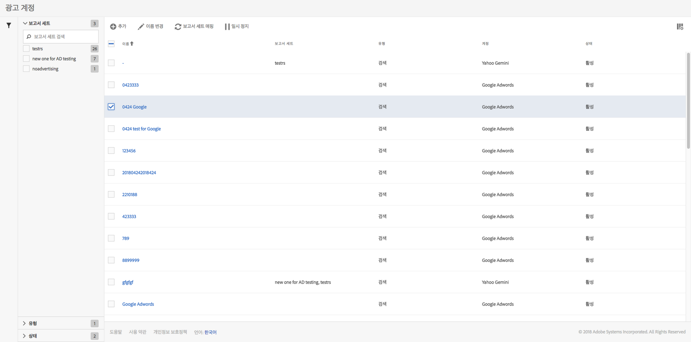

# 광고 계정 관리

**[!UICONTROL 관리]** &gt; **[!UICONTROL 광고 계정으로 이동하여 관리 UI에 액세스할]**&#x200B;수 있습니다.

<table id="table_BE318026CF024E94A885EED86AA7077F"> 
 <thead> 
  <tr> 
   <th colname="col1" class="entry"> 요소 </th> 
   <th colname="col2" class="entry"> 정의 </th> 
  </tr>
 </thead>
 <tbody> 
  <tr> 
   <td colname="col1"> 
<b>작업</b> 
 </td> 
   <td colname="col2"> 
<b>참고: 하나 이상의 광고 계정을 선택한 경우에만 작업이 표시됩니다. </b> 
 </td> 
  </tr> 
  <tr> 
   <td colname="col1"> 
+ 추가 
 </td> 
   <td colname="col2"> 
<a href="../../../integrate/c-advertising-analytics/c-adanalytics-workflow/aa-create-ad-account.md#concept_1958E8C15C334E8B9DC510EC8D5DCA7C" format="dita" scope="local">광고 계정 설정</a> UI로 이동합니다. 
 </td> 
  </tr> 
  <tr> 
   <td colname="col1"> 
이름 변경 
 </td> 
   <td colname="col2"> 
매핑된 모든 보고서 세트에서 이 계정의 이름을 바꿉니다. 
 </td> 
  </tr> 
  <tr> 
   <td colname="col1"> 
보고서 세트 매핑 
 </td> 
   <td colname="col2"> 
보고서 세트 매핑을 편집할 수 있습니다. 
 </td> 
  </tr> 
  <tr> 
   <td colname="col1"> 
일시 정지 
 </td> 
   <td colname="col2"> 
계정을 비활성화합니다. 다시 활성화하려면 활성화를 클릭합니다. 
 </td> 
  </tr> 
  <tr> 
   <td colname="col1"> 
<b>열 머리글</b> 
 </td> 
   <td colname="col2"> </td> 
  </tr> 
  <tr> 
   <td colname="col1"> 
이름 
 </td> 
   <td colname="col2"> 
이 광고 계정에 지정한 이름입니다. 
 </td> 
  </tr> 
  <tr> 
   <td colname="col1"> 
보고서 세트 
 </td> 
   <td colname="col2"> 
이 광고 계정에 매핑된 보고서 세트입니다. 
 </td> 
  </tr> 
  <tr> 
   <td colname="col1"> 
유형 
 </td> 
   <td colname="col2"> 
현재는 한 개의 유형(검색)만 지원합니다. 
 </td> 
  </tr> 
  <tr> 
   <td colname="col1"> 
계정 
 </td> 
   <td colname="col2"> 
2 개의 지원되는 계정 유형 중 하나를 나열합니다. Google Adwords 또는 Bing 광고. 
 </td> 
  </tr> 
  <tr> 
   <td colname="col1"> 
상태 
 </td> 
   <td colname="col2"> 
다음과 같은 2개의 표시기가 있습니다. 
 
    <ul id="ul_376263DEF6EE44B48564D272D3CBFCBC"> 
     <li id="li_75E329B68B4D4E929E227E717C993082"><b>활성</b>: 계정이 활발하게 검색 데이터를 가져옵니다. </li> 
     <li id="li_5E2DF98B22D34437A2A2C93F996C1EA2"><b>일시 정지됨</b>: 계정이 현재 비활성화되어 검색 데이터를 가져호지 않습니다. </li> 
    </ul> </td> 
  </tr> 
  <tr> 
   <td colname="col1"> 
<b>필터</b> 
 </td> 
   <td colname="col2"> 
(왼쪽 여백) 보고서 세트, 유형 및 상태별로 광고 계정을 필터링할 수 있습니다. 
 </td> 
  </tr> 
 </tbody> 
</table>

