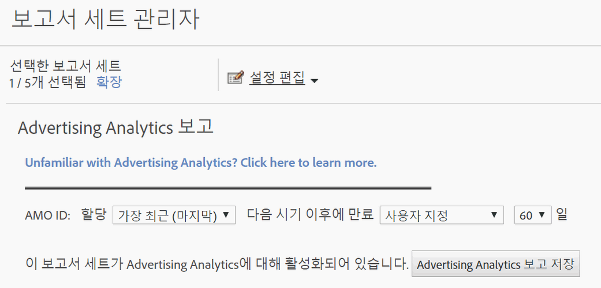

# 광고 분석을 위한 보고서 세트 활성화

Analytics에서 광고 분석 검색 데이터를 확인하려면 광고 분석 보고를 위해 각 Experience Cloud에 매핑된 보고서 세트를 구성해야 합니다.

1. [보고서 세트를 조직에 매핑합니다](https://marketing.adobe.com/resources/help/en_US/mcloud/map-report-suite.html).
1. **[!UICONTROL 관리]** &gt; **[!UICONTROL 보고서 세트로 이동합니다]**.

1. Select the report suite that is [mapped to your Experience Cloud organization](https://marketing.adobe.com/resources/help/en_US/mcloud/map-report-suite.html).
1. Click **[!UICONTROL Edit Settings]** &gt; **[!UICONTROL Advertising Analytics Configuration]**.

   

   >[!IMPORTANT]
   >
   >AMO ID는 검색 데이터가 삽입될 Adobe Advertising Cloud 변수를 나타냅니다.

1. AMO ID 변수에 사용할 변수 할당 및 만료를 설정합니다. Adobe Analytics에서 전환 변수(eVar)를 사용하면 성공 이벤트를 특정 변수 값에 의한 것으로 처리할 수 있습니다. 때때로 변수에서 성공 이벤트를 생성하기 전에 두 개 이상의 값을 받을 수 있습니다. 이런 경우, 해당 이벤트에 대해 크레딧을 받는 변수 값은 할당이 결정합니다.

   | 설정 | 정의 |
   |--- |--- |
   | 원래 값(처음) | 표시된 첫 번째 값은 해당 변수의 후속 값에 관계없이 전체 할당 크레딧을 받습니다. |
   | 최근(마지막) | 표시된 마지막 값은 전에 실행된 변수에 관계없이 성공 이벤트에 대한 전체 할당 크레딧을 받습니다. |
   | 다음 동작이 끝나면 만료 | eVar 값이 만료된 후 기간 또는 이벤트를 지정할 수 있습니다(예: 성공 이벤트에 대한 크레딧을 더 이상 받지 않음).  성공 이벤트가 eVar 만료 후 발생하는 경우 값이 해당 이벤트에 대한 크레딧을 받지 않습니다(eVar가 활성화되지 않았음). |

1. Click **[!UICONTROL Enable Advertising Analytics Reporting]** (first time), or **[!UICONTROL Update Advertising Analytics Reporting]** (subsequent times). 이제 보고서 세트가 Advertising Analytics 검색 데이터를 받을 준비가 되었습니다. [광고 계정을 생성](../../../integrate/c-advertising-analytics/c-adanalytics-workflow/aa-create-ad-account.md#concept_1958E8C15C334E8B9DC510EC8D5DCA7C)할 준비가 되지 않았습니다.

