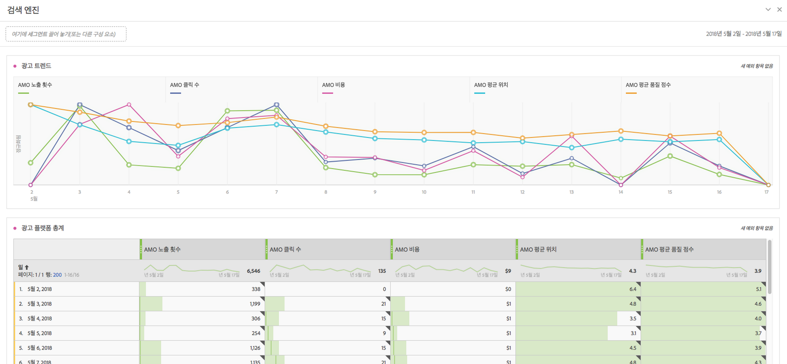
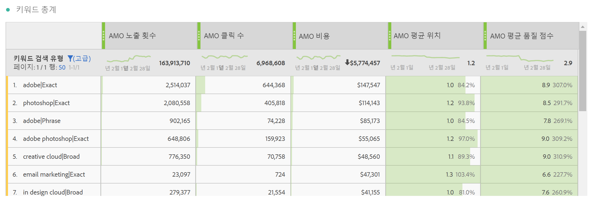
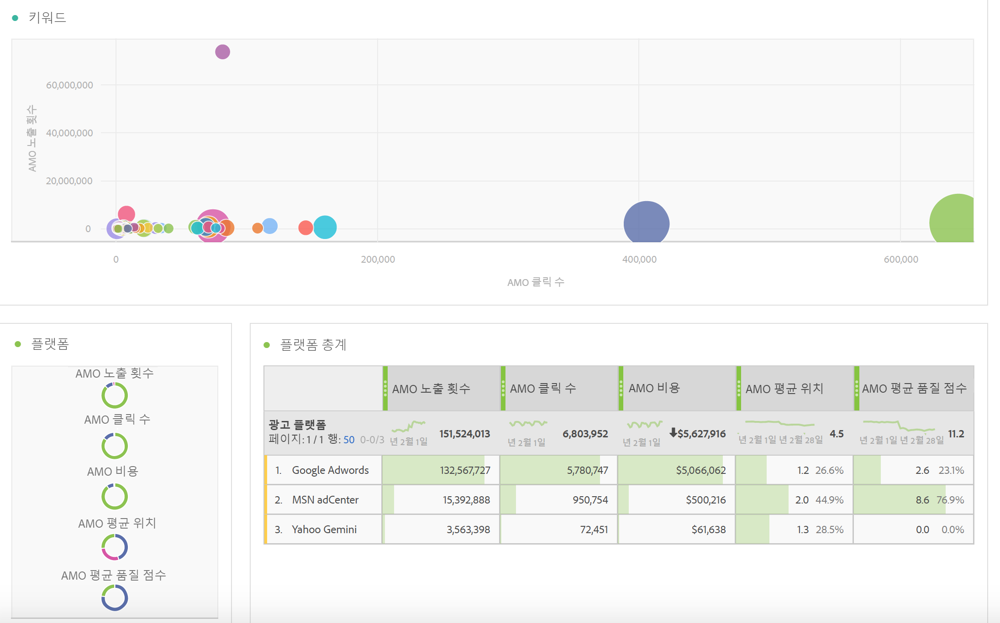
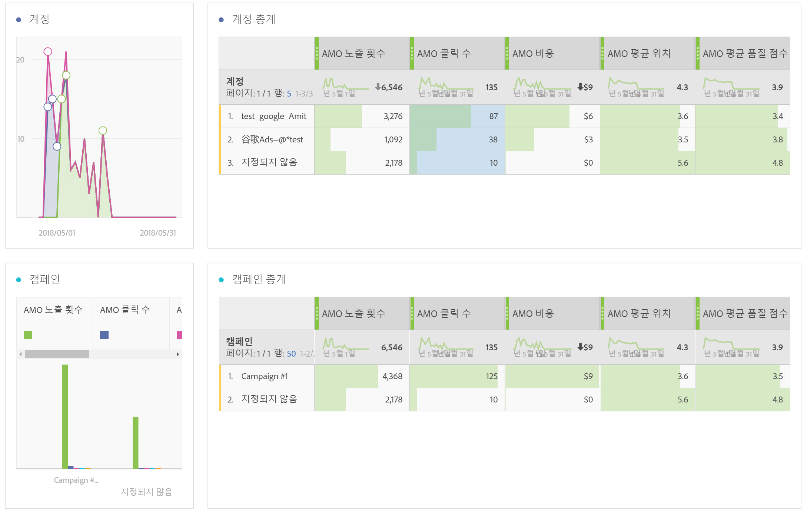
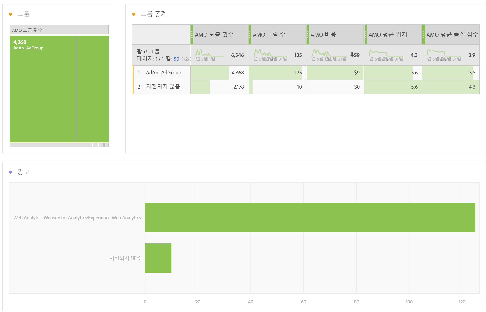
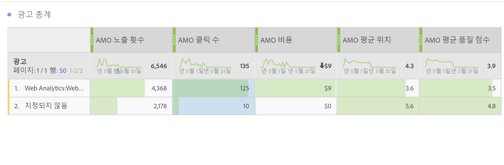
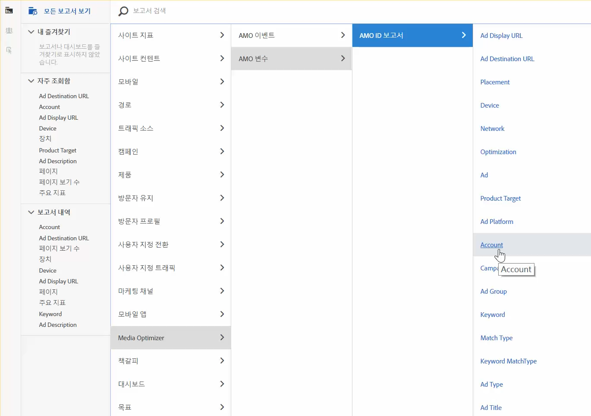

# Adobe Analytics의 광고 데이터에 대한 보고서

Analysis Workspace 템플릿과 Reports &amp; Analytics 및 Report Builder의 보고에 대한 세부 사항입니다.

> [!NOTE] 검색 엔진 데이터가 Analytics 보고서에 채워지기 시작하기 전에 최소 24시간 정도 기다려야 합니다. AMO 데이터가 시간별 세부기간을 지원하지 않으므로 Analytics 보고에서 시간별 세부기간 데이터를 반환하지 않습니다.

## Analysis Workspace: Search Engines {#section_8173F42B2C784F41B9FD82CBB66F9ADF}

이 템플릿을 사용하면 이 검색 엔진 통합을 구현하는 모든 사용자가 Analytics 내에서 방대한 검색 엔진 데이터에 액세스할 수 있습니다. You can access it via **[!UICONTROL Workspace]** &gt; **[!UICONTROL Templates]** &gt; **[!UICONTROL Advertising]** &gt; **[!UICONTROL Search Engines.]**

>[!NOTE]
>
> 광고 템플릿 카테고리는 광고 계정을 구현하지 않았더라도 모든 고객이 볼 수 있습니다. 하지만 제공되지 않은 회사의 검색 엔진 템플릿을 열려고 하면 검색 엔진 계정을 아직 구성하지 않았다는 오류 메시지가 표시됩니다. 이 경우 **[!UICONTROL 지금 구성]**&#x200B;을 클릭합니다. 그러면 [광고 계정 설정](/help/integrate/c-advertising-analytics/c-adanalytics-workflow/aa-create-ad-account.md) 화면으로 이동합니다.

       

| 테이블/시각화 | 설명 |
|--- |--- |
| 광고 트렌드 | AMO 노출 횟수, AMO 클릭 수 및 AMO 비용에 대한 일별 트렌드 개요. |
| 광고 플랫폼 | 상위 2개 플랫폼(Google, Bing)의 비용을 위한 도넛형 차트 |
| 광고 플랫폼 총계 | AMO 노출 횟수, AMO 클릭 수, AMO 비용, AMO 평균으로 분류된 최상위 플랫폼의 자유 형식 테이블. 위치, AMO 평균. 품질 점수. |
| 계정 | 비용의 누적 영역. |
| 계정 합계 | 연관된 지표로 분류된 최상위 계정의 자유 형식 테이블. |
| 캠페인 | 캠페인 비용의 막대 차트. |
| 캠페인 총계 | 연관된 지표로 분류된 최상위 캠페인의 자유 형식 테이블. |
| 그룹 | 비용의 트리 맵. |
| 그룹 총계 | 연관된 지표로 분류된 최상위 광고 그룹의 자유 형식 테이블. |
| 광고 | 노출 횟수, 클릭 수 및 비용의 가로 막대 차트. |
| 광고 총계 | 연관된 지표로 분류된 최상위 광고의 자유 형식 테이블. |
| 키워드 | 모든 키워드/일치 유형 조합에 대한 노출 횟수, 클릭 수 및 비용의 분산형 차트. |
| 키워드 총계 | 연관된 지표로 분류된 최상위 키워드/일치 유형 조합의 자유 형식 테이블. |

## Reports &amp; Analytics {#section_BB2E75DF909C49EA8D4E92D14D6DFD85}

Advertising Analytics 계정을 설정하면 바로 Advertising Analytics 보고서를 사용할 수 있습니다.

## Report Builder {#section_8E0371CF81144C33990D909685D1726E}

Advertising Analytics 계정을 설정하면 바로 Advertising Analytics 보고서를 사용할 수 있습니다.
