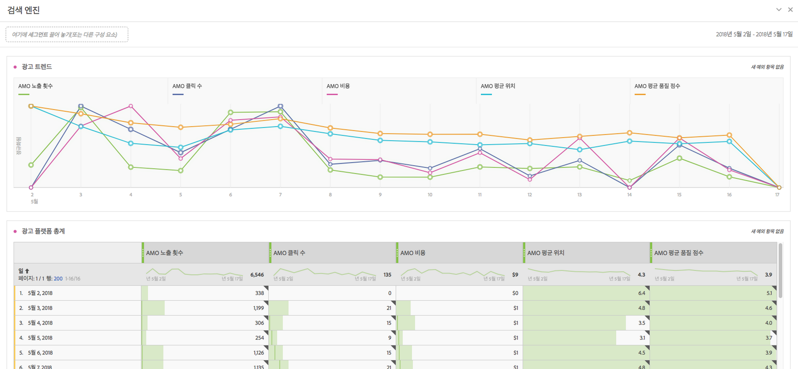
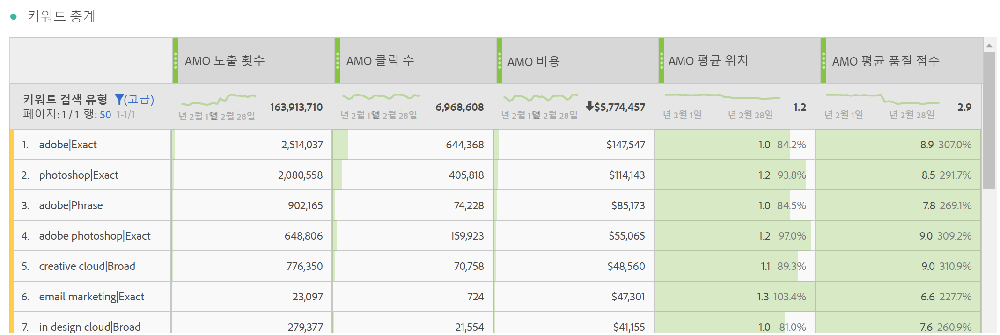
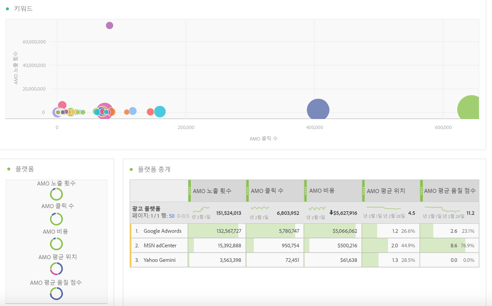
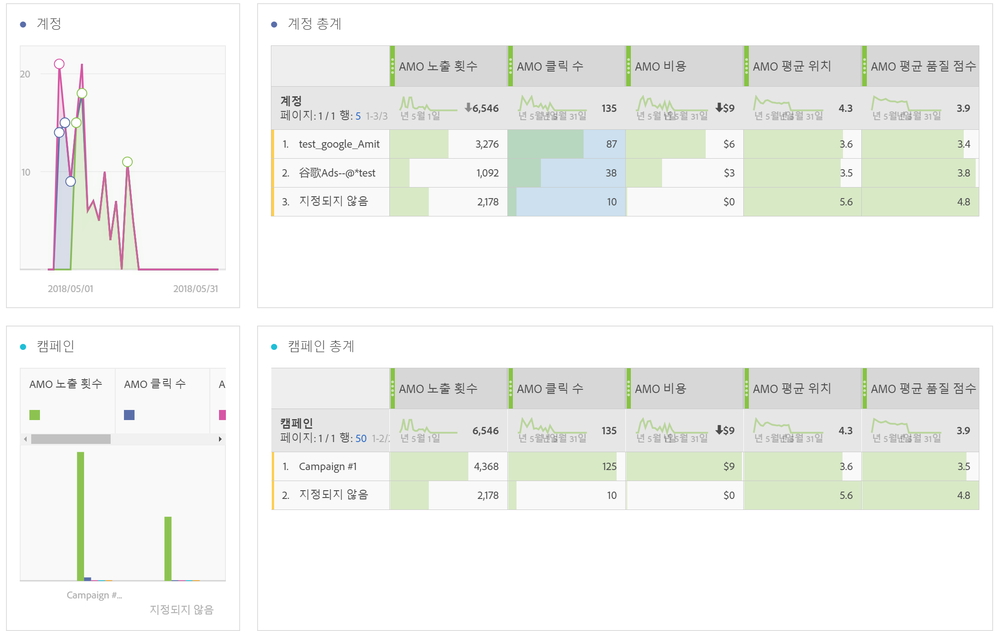
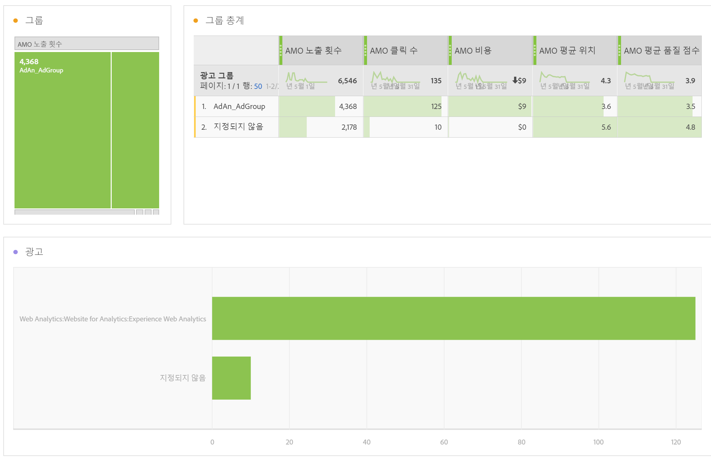
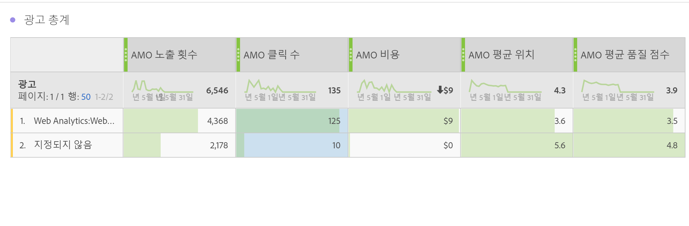

# 광고 데이터에 대한 보고서

이 문서에서는 Analysis Workspace 보고서 및 Report Builder 보고에 대한 세부 사항을 제공합니다.

>[!NOTE]
>
>Expect to wait at least 24 hours before search engine data starts populating Analytics reports. Adobe Advertising 데이터는 시간별 세부기간을 지원하지 않으므로 Analytics 보고에서는 시간별 세부기간에 대한 데이터를 반환하지 않습니다.

## 유료 검색 보고서 {#section_8173F42B2C784F41B9FD82CBB66F9ADF}

이 보고서를 사용하면 검색 엔진 통합을 구현하는 모든 사용자가 Analytics 내의 검색 엔진 데이터에 액세스할 수 있습니다. **[!UICONTROL Workspace]** > **[!UICONTROL 보고서]** > **[!UICONTROL 획득]** > **[!UICONTROL Advertising Analytics: 유료 검색]**&#x200B;을 통해 액세스할 수 있습니다.

>[!NOTE]
>
>Advertising 계정을 구현하지 않았더라도 유료 검색 보고서는 모든 고객에게 표시됩니다. 프로비저닝되지 않은 회사에 대한 유료 검색 보고서를 열려고 하면 검색 엔진 계정을 구성하지 않았다는 오류 메시지가 표시됩니다. **[!UICONTROL 지금 구성]**&#x200B;을 선택하면 [Advertising 계정 설정](/help/integrate/c-advertising-analytics/c-adanalytics-workflow/aa-create-ad-account.md) 화면으로 이동합니다.

       

| 테이블/시각화 | 설명 |
|--- |--- |
| Advertising 트렌드 | AMO 노출 횟수, AMO 클릭 수 및 AMO 비용에 대한 일일 트렌드 개요. |
| Ad Platforms | Donut chart for cost of top 2 platforms (Google Ads, Microsoft Advertising). |
| 광고 플랫폼 합계 | AMO 노출 횟수, AMO 클릭 수, AMO 비용, AMO 평균으로 분류된 최상위 플랫폼의 자유 형식 테이블. 위치, AMO 평균 품질 점수입니다. |
| 계정 | 누적 비용 영역입니다. |
| 계정 합계 | 연결된 지표로 분류된 최상위 계정의 자유 형식 테이블. |
| 캠페인 | Bar chart of campaign cost. |
| Campaign Totals | Freeform table of the top campaigns broken down by the associated metrics. |
| 그룹 | 비용의 트리 맵. |
| 그룹 합계 | 관련 지표로 분류된 상위 광고 그룹의 자유 형식 테이블. |
| 광고 | 노출, 클릭 수 및 비용의 가로 막대 차트. |
| 광고 합계 | Freeform table of the top ads broken down by the associated metrics. |
| Keywords | Scatter chart of impressions, clicks, and cost for all keyword/match type combinations. |
| Keyword Totals | 관련 지표로 분류된 최상위 키워드/일치 유형 조합의 자유 형식 테이블입니다. |

## Report Builder {#section_8E0371CF81144C33990D909685D1726E}

Advertising Analytics 계정을 설정하면 바로 Advertising Analytics 보고서를 사용할 수 있습니다.
