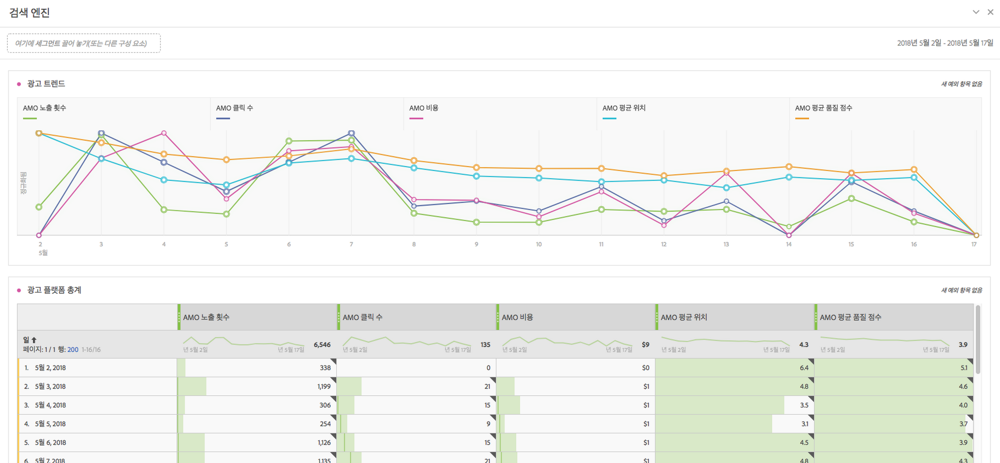

# 광고 분석 개요

Advertising Analytics를 사용하여 Adobe Analytics 내에서 Google 및 Bing 유료 검색 데이터를 나란히 볼 수 있습니다. 이전에는 모든 Google adwords/DFA 또는 Microsoft Bing 광고 데이터를 AMO (Adobe Advertising Cloud) 또는 Google/Bing에서 봐야 했습니다. 이제는 Adobe Analytics 내의 노출 횟수, 클릭 수, 비용, 품질 점수 및 평균 위치 데이터를 검색 엔진과 AMO ID 인스턴스(클릭 인스턴스)에서 직접 가져옵니다.

>[!NOTE]
>
>Yahoo Gemini는 2019 년 3 월 31 일에 Microsoft Bing를 흡수했습니다. 따라서 Yahoo Gemini 광고 계정 옵션은 더 이상 사용할 수 없습니다.

이러한 검색 엔진의 데이터를 Adobe Analytics에 함께 가져온 후 Analysis Workspace의 기능을 사용하여 동일한 데이터를 분석할 수 있습니다. 새로운 [Workspace의 유료 검색 실적](../../integrate/c-advertising-analytics/c-adanalytics-workflow/aa-report-ad-data-an.md#concept_E29B25BEE60C4A64B66E9255D7612254) 템플릿을 통해 이 분석을 쉽게 수행할 수 있습니다.

이 통합은 다음을 대상으로 한 것입니다.

* 유료 검색 마케터에 대한 실적 보고서를 수집해야 하는 **분석가**.
* 다음 질문에 대한 답변해야 하는 **유료 검색 마케터**: 사이트로 전송하는 트래픽 양은 얼마나 되며, 얼마나 많은 고객이 변환 중입니까? 비용 효율적인 내 광고 캠페인은 무엇입니까?

## 전제 조건 {#section_C25E0CA3474C4EDEAEAA9A5B8AAC9299}

* Advertising Analytics는 Adobe Analytics [Select](https://www.adobe.com/data-analytics-cloud/analytics/select.html), [Prime](https://www.adobe.com/data-analytics-cloud/analytics/prime.html) 및 [Ultimate](https://www.adobe.com/data-analytics-cloud/analytics/ultimate.html) SKU에서만 사용할 수 있습니다.

* 이 기능은 Advertising Cloud 클라우드 및 AMO를 사용하지 않는 고객도 이용할 수 있습니다.
* Advertising Analytics에 액세스하려면 Adobe Analytics 관리자여야 합니다. 그러면 관리자가 아닌 사용자에게 [액세스 권한을 부여](../../integrate/c-advertising-analytics/overview.md#section_FCC58EB635954A32990D4E67B52B4369)할 수 있습니다.
* Any Analytics report suite where you want to view Google/Bing search data has to be [mapped to your Experience Cloud organization](https://marketing.adobe.com/resources/help/en_US/mcloud/report-suite-mapping.html).
* For any report suite where you want to view Google/Bing search data, you must [enable those report suite/s for Advertising Analytics](../../integrate/c-advertising-analytics/c-adanalytics-workflow/aa-provision-rs.md#concept_BE491B2A2CAE4D818C218033B985A0FB) ( **[!UICONTROL Admin]** &gt; **[!UICONTROL Edit Settings]** &gt; **[!UICONTROL Advertising Analytics Configuration]**).

* Adobe Analytics와 통합할 검색 계정에 대한 편집 권한이 있는 사용자의 로그인 자격 증명이 있어야 합니다(예: Google 계정 ID 및 암호).
* Bing Ads의 경우 Bing 고객 ID도 필요합니다.
* Internet Explorer 11(또는 이전 버전)을 사용하는 경우 세 개의 검색 엔진에 대한 [광고 계정을 설정](../../integrate/c-advertising-analytics/c-adanalytics-workflow/aa-create-ad-account.md#concept_1958E8C15C334E8B9DC510EC8D5DCA7C)할 수 없습니다. 대신 다른 웹 브라우저를 사용하십시오.

## Advertising Analytics 권한 {#section_FCC58EB635954A32990D4E67B52B4369}

Analytics에는 Analytics 관리자에게 자동으로 부여되는 두 가지 사용 권한이 있습니다. 관리자는 이러한 권한을 관리자가 아닌 사용자에게 부여하도록 선택할 수 있습니다.

<table id="table_86256AD8B4554F369439A8FDF2F545E1"> 
 <thead> 
  <tr> 
   <th colname="col1" class="entry"> 사용 권한 </th> 
   <th colname="col2" class="entry"> 정의 </th> 
   <th colname="col3" class="entry"> Adobe Analytics 내에 사용 권한 부여 </th> 
   <th colname="col4" class="entry"> Adobe Experience Cloud에 로그인한 경우 권한 부여 </th> 
  </tr>
 </thead>
 <tbody> 
  <tr> 
   <td colname="col1"> 
Advertising Analytics 관리 
 </td> 
   <td colname="col2"> 
사용자가 광고 검색 계정을 설정/편집/볼 수 있습니다. 
 </td> 
   <td colname="col3"> 관리 &gt; 사용자 관리 &gt; 그룹 &gt; 모든 보고서 액세스 편집 &gt; Analytics 도구 사용자 지정 &gt; Advertising Analytics 관리 </td> 
   <td colname="col4"> adminconsole.adobe.com에 로그인 &gt; 제품 &gt; 제품 프로필 &gt; 권한 탭 &gt; Analytics 도구 &gt; Advertising Analytics 관리 </td> 
  </tr> 
  <tr> 
   <td colname="col1"> 
Advertising Analytics 구성 
 </td> 
   <td colname="col2"> 
사용자가 Advertising Analytics에 제공할 보고서 세트를 구성할 수 있습니다. 
 </td> 
   <td colname="col3"> 관리 &gt; 사용자 관리 &gt; 그룹 &gt; 모든 보고서 액세스 편집 &gt; 보고서 세트 도구 사용자 지정 &gt; Advertising Analytics 구성 </td> 
   <td colname="col4"> adminconsole.adobe.com에 로그인 &gt; 제품 &gt; 제품 프로필 &gt; 권한 탭 &gt; 보고서 세트 도구 &gt; Advertising Analytics 구성 </td> 
  </tr> 
 </tbody> 
</table>

## Advertising Analytics 차원 및 지표 {#section_C0DF4A08EA9E46ADABE9E465AFC11E32}

Advertising Analytics는 Analysis Workspace, Reports &amp; Analytics, Report Builder 및 Analytics Reporting API에 다음 차원 및 지표를 추가합니다.

**차원**

>[!IMPORTANT]
>
>이 통합은 AMO ID 변수의 분류를 통해 차원 집합을 새로 만듭니다. 이러한 새 차원은 기존 마케팅 채널 또는 캠페인 추적 변수 차원에 영향을 주거나 수정하지 않습니다. AMO ID는 방문자가 유료 검색 광고의 사이트를 방문하면 방문자의 프로필에 연결됩니다. 따라서 AMO 차원을 사용하여 이 통합에서 제공하는 AMO 지표와, 방문자가 캡처한 데이터 다운스트림을 분류할 수 있습니다(방문 횟수, 방문자 수, 페이지 보기 수, 바운스 비율, 주문 횟수, 수익, 사용자 지정 이벤트 등). 다른 온사이트 지표에 대해 보고할 때 다른 차원으로 분류할 수도 있습니다.
>
>이러한 지표에 대한 분류는 매일 업데이트됩니다. 따라서 검색 엔진의 메타데이터를 변경하는 경우, 분류가 업데이트된 다음 날까지 해당 변경 사항이 반영되지 않을 수 있습니다.

| 분류(차원) 이름 | 정의 |
|--- |--- |
| 키워드 검색 유형(AMO ID) | 키워드 일치 유형. 일반적으로 값은 광범위, 구문, 정확 또는 없음(광고 유형에 일치 유형이 없는 경우)이 됩니다. |
| 광고 플랫폼(AMO ID) | 검색 엔진 이름. 값은 Google Adwords 또는 Microsoft Bing 광고를 포함할 수 있습니다. |
| 계정(AMO ID) | 추적 중인 검색 엔진 계정의 이름. |
| 캠페인(AMO ID) | 검색 엔진 계정의 캠페인 이름. |
| 광고 그룹(AMO ID) | 검색 엔진 캠페인의 광고 그룹 이름. |
| 광고(AMO ID) | 광고에 사용되는 광고 제목 + 광고 설명입니다. |
| 키워드(AMO ID) | 검색 엔진 계정의 키워드 값 |
| 일치 유형(AMO ID) | 키워드에 할당된 키워드 일치 유형입니다. 일반적으로 값은 광범위, 구문, 정확 또는 없음(광고 유형에 일치 유형이 없는 경우)이 됩니다. |
| 광고 유형(AMO ID) | 게재되는 광고의 유형이며 일반적으로 “텍스트 광고” 입니다. |
| 광고 제목(AMO ID) | 광고에 사용된 제목 개체입니다. |
| 광고 설명(AMO ID) | 광고에서 사용되는 광고 설명 개체입니다. |
| 광고 표시 URL(AMO ID) | 광고에 사용되는 광고 표시 URL 개체입니다. |
| 광고 대상 URL(AMO ID) | 광고에 할당된 랜딩 페이지 URL 또는 최종 URL입니다. |
| 네트워크(AMO ID) | 광고가 게재되는 네트워크입니다. Advertising Analytics의 경우 이 값은 항상 “Search”입니다. |
| 게재위치(AMO ID) | 관리되는 게재위치 웹 사이트입니다(컨텐츠 네트워크의 경우). 관리되는 게재위치만 이 차원을 사용합니다. |
| 제품 대상(AMO ID) | PLA 광고에 사용되는 제품 대상 이름입니다(실제 제품을 구매하지 않음). |
| 최적화(AMO ID) | Advertising Analytics에서는 사용되지 않습니다. Advertising Cloud 고객만 사용합니다. |
| 장치(AMO ID) | 현재는 사용되지 않습니다. 광고의 지정된 대상 장치 유형(예: 모바일, 데스크탑)에 대한 잠재적 향후 제품 개선을 위한 자리표시자(방문자의 실제 장치가 아님)입니다. |

**지표**

>[!IMPORTANT]
>
>광고 분석 (아래 목록 참조) 에서 제공하는 지표는 검색 엔진의 요약 수준 데이터입니다. 이러한 지표는 Analytics 방문자 프로필에 연결되지 않습니다. AMO ID 변수 및 해당 관련 분류 차원에만 연결됩니다. 따라서 AMO ID 차원에 기반을 둔 차원/세그먼트 이외의 차원/세그먼트에서 보고해서는 안 됩니다. 그럴 경우 Analytics에는 데이터에 대해 0이 표시됩니다. 다른 지표를 사용하여 계산된 지표에 포함할 수 있지만, 이러한 계산된 지표를 AMO ID 차원으로만 분류해야 합니다.
>
>이러한 지표는 일별로 소싱된 데이터이므로, 오늘에 대한 데이터가 없습니다. 또한 일별보다 낮은 세부기간으로 보고해서는 안 됩니다.
>
>AMO ID가 랜딩 페이지(예: 클릭스루)에 설정된 경우 설정되는 AMO ID 인스턴스 지표가 있습니다. 이 지표는 랜딩 페이지 조회수를 사용하여 실시간으로 캡처되며, 랜딩 페이지에도 설정된 다른 차원으로 분류하는 데 사용할 수 있습니다.

| 지표 이름 | 정의 |
|--- |--- |
| AMO 노출 횟수 | 검색 엔진에서 보고한 광고 노출 횟수. |
| AMO 클릭 수 | 검색 엔진에서 보고한 광고 클릭 수. |
| AMO 비용 | 검색 엔진에서 보고한 각 키워드/광고에 대해 지불된 비용. |
| 평균 Pos | 검색 엔진에서 보고한 광고의 평균 위치를 반영하는 계산된 지표. |
| 평균 품질 점수 | 검색 엔진에서 보고한 평균 품질 점수를 반영하는 계산된 지표. |