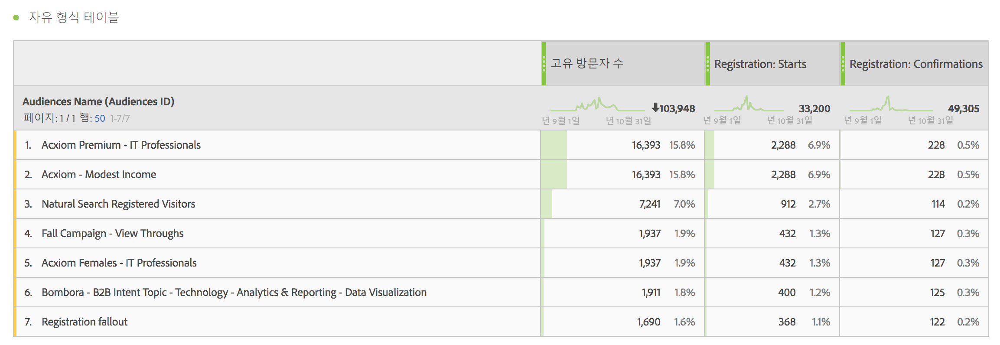
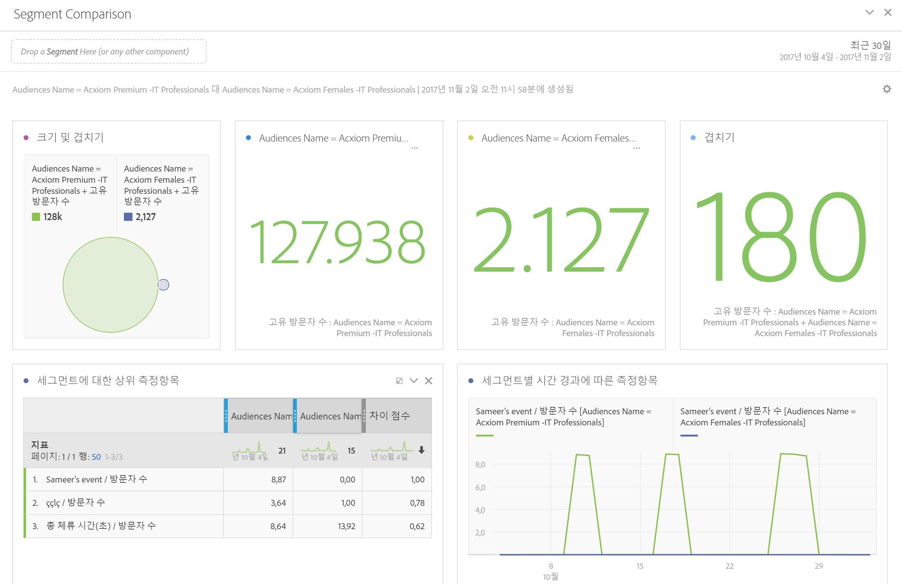
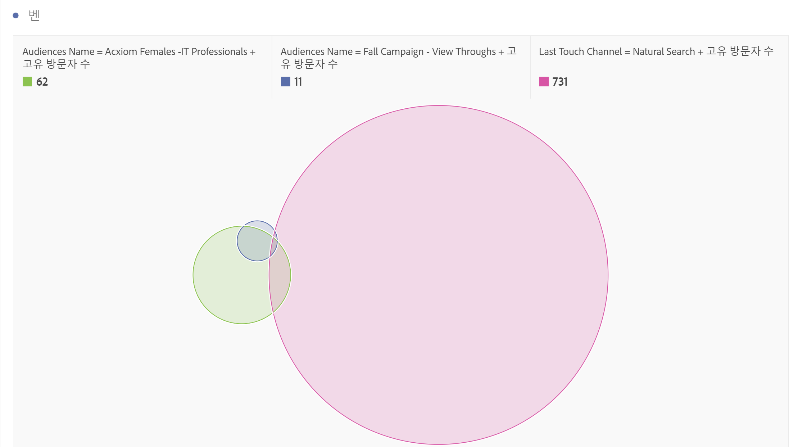
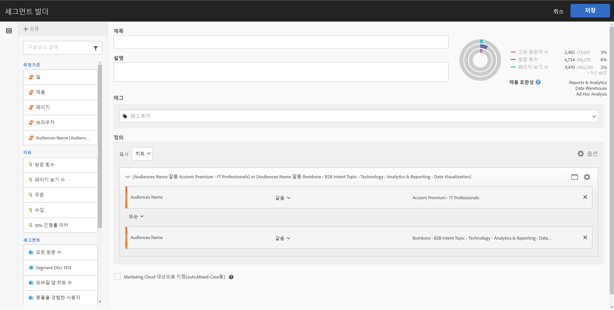
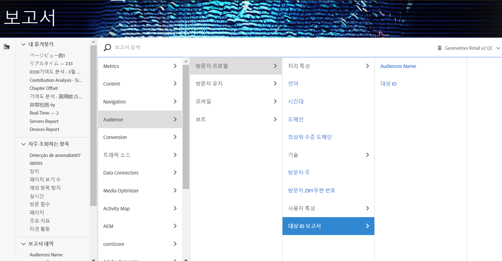

# Analytics에서 대상 데이터 사용

Analytics 전체에서 AAM 대상 차원을 사용할 수 있습니다. 통합 세그먼트는 대상 ID 및 대상 이름이라는 새로운 Analytics 차원이며, Analytics에서 수집하는 다른 차원과 마찬가지로 사용할 수 있습니다. 데이터 피드에서 대상 ID는 "mc_audiences" 열에 저장됩니다. 이러한 차원은 현재 Data Workbench 또는 Livestream에서 사용할 수 없습니다. 대상 차원을 활용하는 방법의 몇 가지 예는 다음과 같습니다.

## Analysis Workspace {#section_C70837499BEA4DED885B3486C9E02C68}

Analysis Workspace에서 AAM 세그먼트는 두 가지 차원으로 나타납니다.

1. **[!UICONTROL 작업 공간으로 이동합니다]**.
1. **[!UICONTROL 차원]** 목록에서 **[!UICONTROL 대상 ID]** 또는 **대상 이름[!UICONTROL 을 선택합니다]**. 이름은 친숙한 ID 분류입니다.

   

## 세그먼트 비교 {#section_E72B80B6470C42D4B9B19BE90E6070A2}

[세그먼트 비교](https://marketing.adobe.com/resources/help/en_US/analytics/analysis-workspace/segment-comparison.html)는 두 세그먼트 사이에서 통계적으로 중요한 차이를 검색합니다. 대상 데이터는 세그먼트 비교에서 1) 비교되는 두 세그먼트로, 2) "상위 측정기준 항목" 표에 있는 항목으로 사용됩니다.

1. **[!UICONTROL 작업 공간]**&#x200B;으로 이동하여 왼쪽 레일에서 **세그먼트 비교[!UICONTROL 패널을 선택합니다.]**

1. 구성 요소&#x200B;**메뉴에서[!UICONTROL 대상 이름]을 검색합니다.**

1. 관련 차원 항목이 표시되도록 [!UICONTROL 대상 이름]을 엽니다.
1. 비교할 대상을 세그먼트 비교 빌더로 드래그합니다.
1. (선택 사항): 다른 차원 항목이나 세그먼트를 가져올 수 있으며, 최대 2개를 비교할 수 있습니다.
1. **[!UICONTROL 작성을 클릭합니다]**.

   대상 ID 및 이름 차원은 비교 대상인 두 세그먼트에 대한 추가 프로필 데이터이므로, "상위 측정기준 항목" 표에 자동으로 표시됩니다.

   

## Analysis Workspace에서 고객 움직임(흐름) {#section_FC30E5795C9D4539838E30FE11FAEA6E}

AAM 세그먼트 데이터는 히트 기준으로 Analytics에 전달되며, 해당 시점의 방문자에 대한 대상 멤버십을 나타냅니다. 즉, 방문자는 한 세그먼트(예: "인지도")에 속할 수 있으므로 나중에 보다 적절한 세그먼트(예: "고려 사항") 대상일 수 있습니다. Analysis Workspace에서 [흐름](https://marketing.adobe.com/resources/help/en_US/analytics/analysis-workspace/flow.html)을 사용하여 방문자가 대상 사이를 이동하는 경로를 시각화할 수 있습니다.

1. **[!UICONTROL 작업 공간]**&#x200B;으로 이동하여 왼쪽 레일에서 **흐름[!UICONTROL 시각화를 선택합니다.]**

1. [!UICONTROL 대상 이름] 차원을 플로우 빌더로 드래그합니다.
1. **[!UICONTROL 작성을 클릭합니다]**.
1. (선택 사항): 다른 차원을 흐름 시각화로 드래그하여 [차원 간 흐름](https://marketing.adobe.com/resources/help/en_US/analytics/analysis-workspace/multi-dimensional-flow.html)을 만듭니다.

대상을 [폴아웃 시각화](https://marketing.adobe.com/resources/help/en_US/analytics/analysis-workspace/fallout_flow.html)에서도 사용할 수 있습니다.

## Analysis Workspace에서 벤 시각화 {#section_E78AB764FB5047148B51DC1526B0DF89}

[벤 시각화](https://marketing.adobe.com/resources/help/en_US/analytics/analysis-workspace/venn.html)는 최대 3개 세그먼트 사이의 겹침을 나타냅니다.

1. **[!UICONTROL 작업 공간]**&#x200B;으로 이동하여 왼쪽 레일에서 **벤[!UICONTROL 시각화를 선택합니다.]**

1. 구성 요소 메뉴에서 [!UICONTROL 대상 이름]을 검색합니다.
1. 관련 차원 항목이 표시되도록 [!UICONTROL 대상 이름]을 엽니다.
1. 비교할 대상을 벤 빌더로 드래그합니다.
1. (선택 사항): 다른 차원 항목이나 세그먼트를 가져올 수 있으며, 최대 3개를 비교할 수 있습니다.
1. **[!UICONTROL 작성을 클릭합니다]**.

## 세그먼트 빌더 {#section_2AA81852A1404AB894472CA8959461B6}

Analytics에서 수집한 동작 정보와 함께 Analytics [세그먼트 빌더](https://marketing.adobe.com/resources/help/en_US/analytics/segment/seg_build.html)에서 대상 차원을 통합할 수 있습니다.

1. **[!UICONTROL 구성 요소]** &gt; **[!UICONTROL 세그먼트로]** 이동합니다.
1. **[!UICONTROL 추가]를 클릭하여 새 세그먼트를 만듭니다.**
1. 세그먼트에 이름을 지정한 후 [!UICONTROL 대상 이름] 차원을 정의 패널로 드래그합니다.
1. (선택 사항): 세그먼트에 다른 기준을 추가합니다.
1. 세그먼트를 저장합니다.

   

## Reports &amp; Analytics 및 Report Builder {#section_04E8FD30F73344D7937AD3C6CD19E34A}

1. To view the Analytics report, go to  **[!UICONTROL Reports]** &gt; **[!UICONTROL Visitor Profile]** &gt; **[!UICONTROL Audience ID Reports]** .
1. 이 폴더에서 대상 ID 및 대상 이름 차원에 모두 액세스할 수 있습니다.

   

