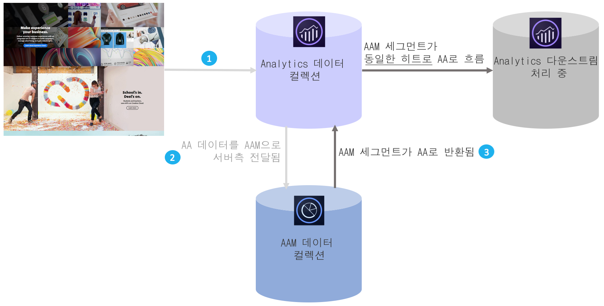

# 대상 분석 개요

AAM(Adobe Audience Manager)은 퍼스트 파티, 세컨드 파티/파트너 및 서드 파티 데이터 통합에서 고유한 대상 프로필을 구축할 수 있도록 지원하는 강력한 데이터 관리 플랫폼입니다. 광고주의 경우 이러한 대상 프로필은 디지털 채널에서 사용할 가장 중요한 세그먼트를 정의할 수 있도록 지원합니다.

Audience Analytics이 적절히 통합되면 인구 통계학 정보(예: 성별 또는 수입 수준), 사이코그래프 정보(예: 관심사 및 취미), CRM 데이터 및 광고 노출 데이터 등의 AAM 대상 데이터를 Analytics 워크플로우에 통합할 수 있습니다.

## 핵심적인 이점 {#section_94816D17283349E0BA28521BE55BB868}

Audience Analytics의 통합은 다음과 같은 주요 이점을 제공합니다.

* 이는 시장에서 DMP(데이터 관리 플랫폼)와 분석 엔진 간에 처음으로 제품화된 통합입니다.
* 실시간으로 대상 검색, 세그멘테이션 및 최적화를 알리기 위해 AAM에서 Analytics로 세그먼트가 공유됩니다.
* 모든 AAM 세그먼트는 기본적으로 공유되어 Analytics의 고객 프로필을 풍부하게 합니다.
* 솔루션 관리자는 최소한의 코드 변경만으로 사용자 인터페이스를 통해 통합할 수 있습니다.
* Audience Manager 데이터 내보내기 제어를 준수하는 세그먼트만 공유됩니다.

## 작동 방법 {#section_CECDF5A0FEC64264B206EFEF54F19EF2}

1. 방문자가 귀하의 디지털 자산에 방문할 때마다 히트 수가 수집되어 Analytics으로 전송됩니다.
1. 포함 [서버측 전달](/help/admin/admin/c-server-side-forwarding/ssf.md), Analytics에서 수신한 각 히트 수는 자동으로 실시간으로 AAM으로 전송됩니다.
1. Audience Analytics 통합을 통해 각 히트에 대해 AAM에서 방문자의 대상 멤버십을 조회하고 세그먼트 ID 목록을 실시간으로 처리하기 위해 Analytics에 반환됩니다.

AAM 세그먼트가 동일한 히트 기준에 삽입되므로 AAM에서 방문자에 대해 사용할 수 있는 데이터가 누락되지 않고 해당 히트에 대해 최신 상태인지 확인할 수 있습니다. 이 기능은 플러그인이 (현재 히트가 아닌) 다음 히트에서만 사용할 수 있는 세그먼트를 만들 수 있으므로 AppMeasurement 플러그인보다 뛰어납니다.

또한 AAM 세그먼트 ID를 사용자에게 친숙한 이름으로 자동 분류하므로 Analytics 보고서에서 영숫자 ID를 확인하지 않아도 됩니다.

## 전제 조건 {#section_A345DC31F7D44EAE9DC1AB53E824C0CC}

다음 전제 조건이 적용되었는지 확인합니다.

* Audience Manager와 Adobe Analytics의 고객입니다.
* Audience Manager 관리자입니다.
* Identity Service v 1.5 이상을 사용하고 있습니다.
* AAM 및 Adobe Analytics 보고서 세트는 ](https://marketing.adobe.com/resources/help/en_US/mcloud/report-suite-mapping.html)동일한 Experience Cloud 조직에에 매핑[됩니다.
* [서버측 전달을](/help/admin/admin/c-server-side-forwarding/ssf.md) 사용하고 [대상 관리 모듈](https://marketing.adobe.com/resources/help/en_US/aam/c_profiles_audiences.html) (DIL 코드 없음) - appmeasurement 1.5 이상을 구현했습니다.

These prerequisites are described in the [Audience Analytics Workflow](../../integrate/c-audience-analytics/c-workflow/audiences-workflow.md#concept_A5F067D14C794B759A1D92526DE27F83).
