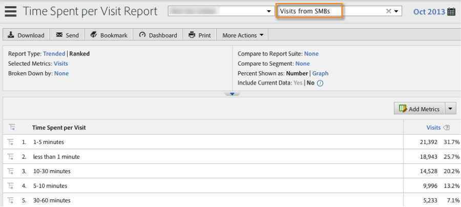

# Segmenting by Demandbase Dimensions{#segmenting-by-demandbase-dimensions}

이 통합의 주요 기능은 Demandbase 차원을 기반으로 Adobe Analytics 세그먼트를 만드는 기능입니다.

예를 들어 SMB 조직의 방문만 포함하는 세그먼트를 빌드할 수 있습니다. 이 방문은 SMBS에서 호출할 수 있습니다. 정의는 다음과 같습니다.

대상이 SMB와 같습니다.

For more information on how to build segments, consult the [Analytics Segmentation Guide](https://marketing.adobe.com/resources/help/en_US/analytics/segment/).

This segment can then be applied to practically any report - one example is the Time Spent per Visit Report seen here: 

