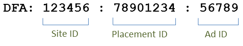

# 통합 기능{#integration-features}

활성화되면 Data Connectors DFA 통합은 Adobe Analytics 보고서에 대한 다음 지표를 제공합니다.

* 뷰스루
* DFA 클릭 수
* 노출 횟수
* (선택 사항) DFA 비용 데이터
* (선택 사항) DFA 쿼리 오류, 시간 초과

>[!NOTE]
>
>이 통합에서는 클릭 추적기 (이전에 클릭 명령) 를 지원하지 않습니다. 클릭 추적 광고는 텍스트 링크, 이메일 메시지의 링크 또는 웹 사이트에 하드코드된 다른 요소의 클릭 수를 기록하는 데 사용됩니다.

Data Connectors DFA 통합은 DFA에서 반환된 데이터의 DFA 추적 코드를 자동으로 구성합니다. 이러한 추적 코드는 연관된 게재위치 및 광고 소재와 함께 광고를 고유하게 식별하도록 구성됩니다. 다음은 통합 버전에 따른 추적 코드 구조를 요약한 것입니다. 버전 1.5 모양은 다음과 같습니다.

버전 2.0 모양은 다음과 같습니다.

이러한 ID는 Genesis와 DFA 간에 올바른 분류와 지표를 연결하는 공유 키 역할을 합니다.

| 사이트 ID | 광고가 호스팅되는 타사 사이트입니다. 사이트 이름 분류는 이 사이트 ID에 대한 수사적 이름을 제공합니다. |
|---|---|
| 광고 ID | 사용자에게 전달된 상용 메시지에 대한 ID입니다. 광고 이름 분류에 조직에서 DFA 시스템에 정의한 광고 이름이 포함됩니다. 예: `Hybrid Coup Textlink - Build`. |
| 게재위치 ID | 광고 공간을 구입한 웹 사이트의 DFA 계정, 웹 사이트의 부분 또는 웹 사이트 그룹의 표현입니다. |
| 광고 ID | 방문자에게 표시하려는 이미지, Flash SWF 또는 기타 리소스입니다. 광고 소재 이름 분류에 DFA 인터페이스에서 이 광고 소재에 제공한 이름이 포함되어 있습니다. |

다른 두 분류인 배달 도구(DoubleClick for Advertisers)와 채널(배너 광고)에 DFA 캠페인에 대해 동일한 값이 있으므로 DFA에서 가져온 데이터를 구분하는 데 도움이 됩니다.

## SearchCenter 중복 제거 {#section-f809b3bb5e5142aa8ff89bcd5f0d0e49}

DFA 통합은 이제 Adobe SearchCenter에서 확인됩니다. Data Connectors 마법사를 통해 SearchCenter 중복 제거를 활성화하면 검색 기반 방문자가 DFA의 Floodlight Server에서 데이터를 가져올 수 없고 *`s.campaign`* DFA에 의해 입력되지 않으므로 SearchCenter에서 이를 입력하도록 할 수 있습니다. 또한 이제 DFA 및 SearchCenter에서 각 제품에 대한 변수에 중복 제거 값을 입력합니다.

아래 목록은 SearchCenter 중복 제거가 활성화된 경우 활성화되는 논리를 요약한 것입니다.

**[!UICONTROL DFA]** &gt; **[!UICONTROL searchcenter 중복 제거가]** 마법사에서 선택된 경우:

* DFA 클릭스루의 경우 통합은 구성된 SCM eVar에 문자열 “DFA 클릭스루”를 입력합니다.
* DFA 뷰스루의 경우 통합은 SCM eVar에 문자열 “DFA 뷰스루”를 입력합니다.

If **[!UICONTROL SearchCenter]** &gt; **[!UICONTROL DFA deduplication]** is selected in the wizard:

* DFA 뷰스루의 경우 통합은 SCM eVar에 문자열 “DFA 뷰스루”를 입력합니다.

>[!NOTE]
>
>Searchcenter &gt; DFA 중복 제거가 활성화되고 searchcenter 쿼리 문자열 매개 변수가 설정된 경우 해당 방문은 DFA 처리를 위해 고려되지 않습니다. 즉, SearchCenter 쿼리 문자열 매개 변수는 DFA 클릭스루 매개 변수와 달라야 하며, 디스플레이 광고에서 SearchCenter 쿼리 문자열 매개 변수를 설정하지 않아야 합니다.

