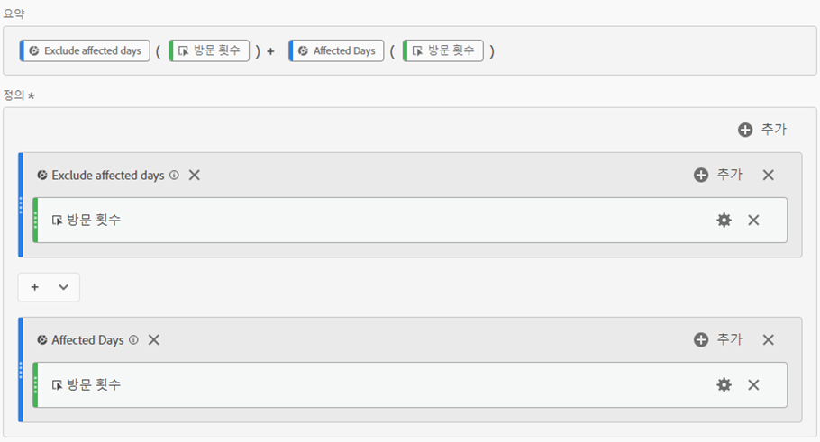
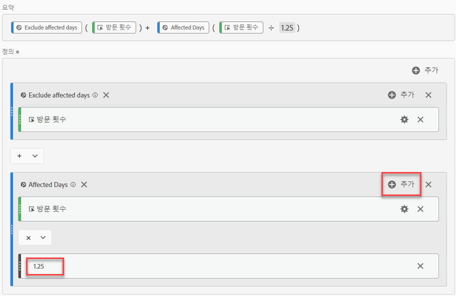
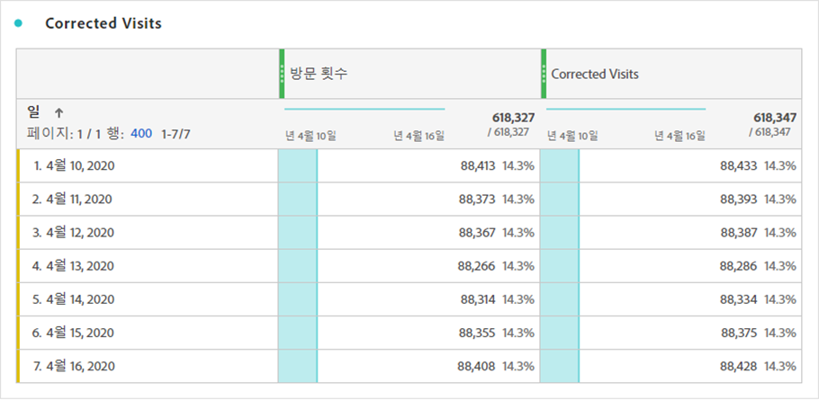
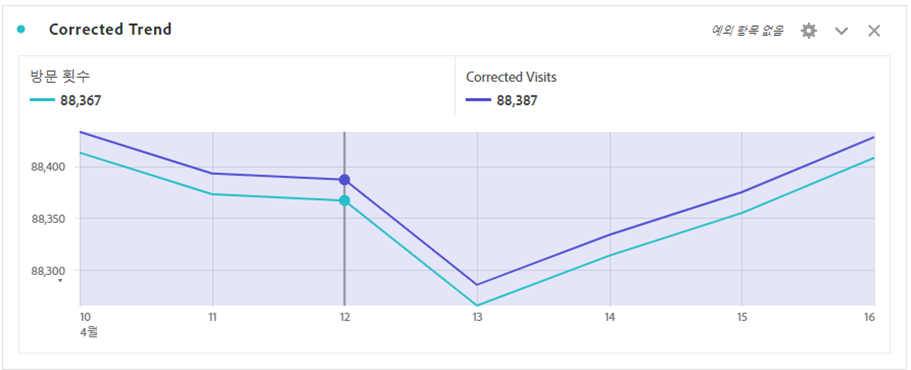

# 이벤트의 영향을 받는 데이터 가져오기

데이터가 있는 경우 [이벤트의 영향](overview.md), 계산된 지표를 사용하여 이벤트 기간에 대한 예상 값을 도출할 수 있습니다. 예를 들어, 데이터가 25% 감소한 이벤트가 있는 경우 계산된 지표에서 승수로 사용할 수 있습니다.

이러한 단계는 세분화 및 날짜 비교 관점에서 이벤트의 영향을 이해할 때 가장 잘 작동합니다. 다음 사항을 따르세요 [이벤트의 영향을 받은 날짜를 이전 범위와 비교](compare-dates.md) 및 [분석에서 특정 날짜 제외](segments.md) 이 페이지를 팔로우하기 전에

>[!NOTE]
>
>이 접근법은 입력들 및 날짜 범위들의 특정 세트에 기초한 추정이다. 모든 사용 사례나 데이터 조각에 대한 포괄적인 솔루션이 되지는 않습니다. 또한 이 접근 방법에서는 영향을 받는 날짜 범위에 계산할 히트가 하나 이상 있어야 합니다.

영향을 받는 기간에 대한 예상 계산된 지표를 만들려면 다음 작업을 수행하십시오.

1. 아래에 설명된 대로 &#39;영향을 받는 일 수&#39; 및 &#39;영향을 받는 일 수 제외&#39;에 대한 두 개의 세그먼트를 만듭니다. [분석에서 특정 날짜 제외](segments.md).
2. 다음으로 이동 **[!UICONTROL 구성 요소]** > **[!UICONTROL 계산된 지표]**.
3. **[!UICONTROL 추가]**&#x200B;를 클릭합니다.
4. 위의 두 세그먼트를 정의 캔버스로 드래그합니다. 둘 사이의 연산자를 로 변경합니다. `+` 요약하자면,
5. 두 세그먼트 내에 원하는 지표를 추가합니다. 예를 들어 &#39;방문 횟수&#39; 지표를 사용할 수 있습니다.

   

6. 클릭 **[!UICONTROL 추가]** &#39;영향을 받는 일 수&#39; 컨테이너의 오른쪽 상단에서 **[!UICONTROL 정적 수]**. 정적 수를 다음에 설명된 대로 데이터를 오프셋할 백분율로 설정합니다. [이벤트의 영향을 받은 날짜를 이전 범위와 비교](compare-dates.md). 이 예에서 오프셋은 25% 또는 1.25입니다.

   

7. 트렌드 자유 형식 테이블에서 &quot;수정된&quot; 지표를 나란히 적용합니다. 이벤트 외부의 모든 요일은 일반 지표 수를 반영하는 반면 영향을 받는 모든 요일은 승수 오프셋을 사용합니다.

   

8. 라인 시각화에서 데이터를 보고 수정된 지표의 효과를 확인합니다.

   
