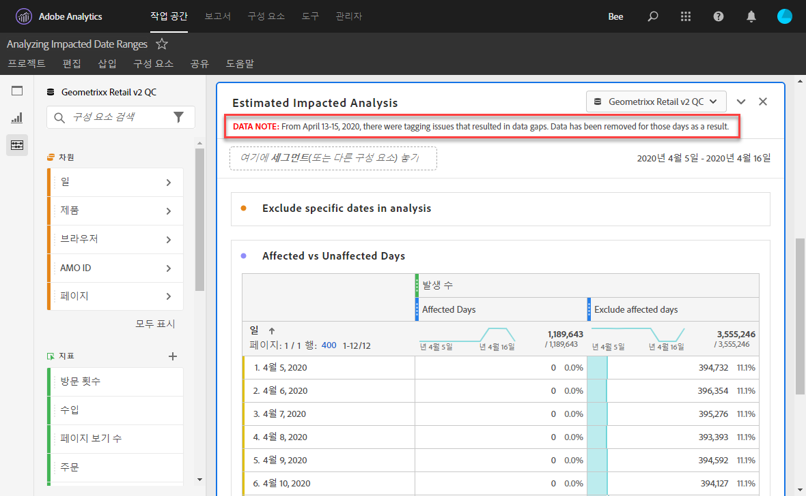
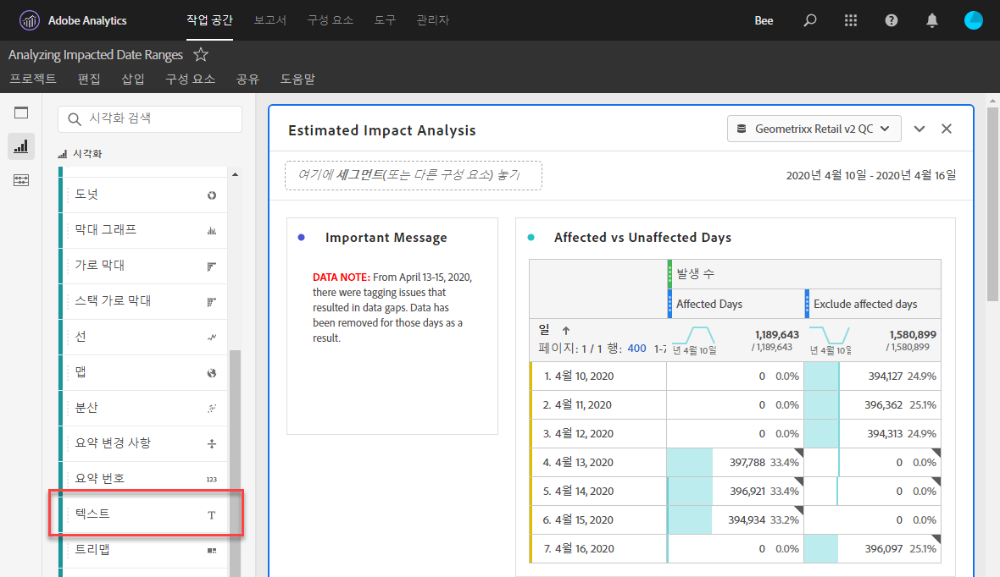
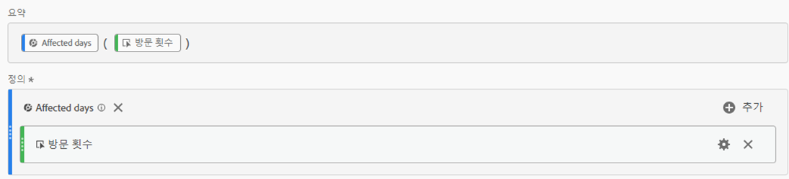
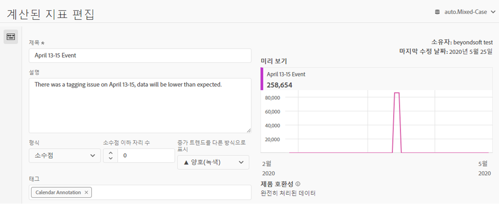
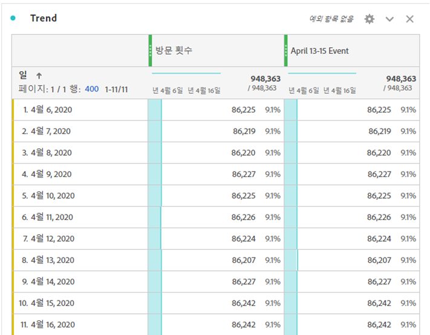
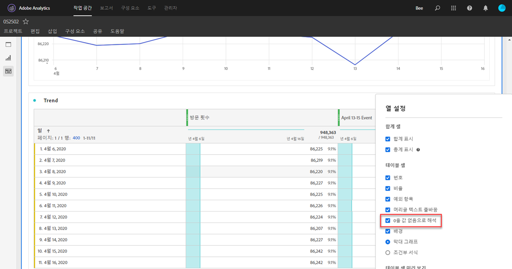
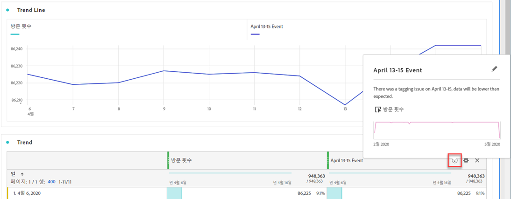
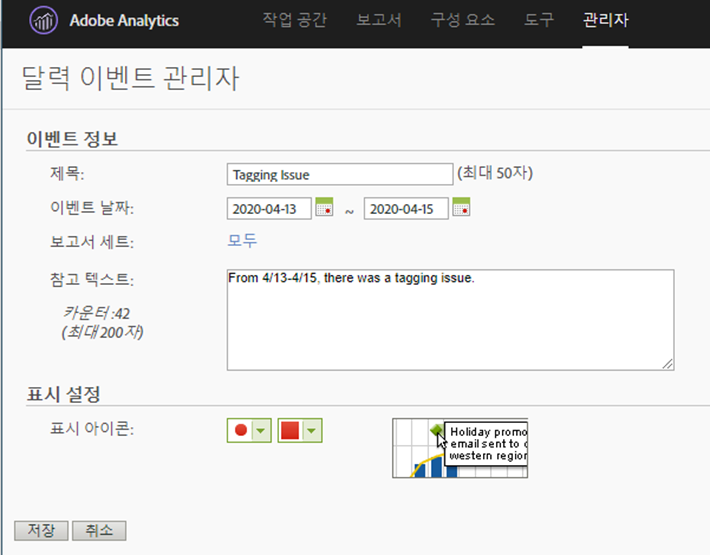

# 사용자에게 이벤트 영향 전달

이벤트의 [영향을 받는 데이터가 있는](overview.md)경우 조직의 사용자에게 해당 이벤트를 전달해야 합니다.

* 일관성 유지를 위해 커뮤니케이션에서 사용할 수 있는 일반적인 고지 사항 개발
* 이벤트 도중 및 이후 Analytics 사용자 및 주요 이해 관계자에게 지속적인 통신 제공
* 다음 달 또는 년과 같은 후속 마일스톤에 대한 일정 미리 알림을 배치합니다. 미래의 이러한 커뮤니케이션은 사용자가 보고서를 볼 때 월정액 또는 연간 보고서에 미치는 영향을 상기시키는 데 도움이 됩니다.

Adobe Analytics 내에서 다음 섹션에서는 조직의 사용자와 통신할 수 있는 다양한 방법을 보여 줍니다. Adobe Analytics 외부의 이메일 등 다른 방법을 사용하여 사용자와 통신할 수도 있습니다.

## 패널 또는 시각화 설명을 통해 커뮤니케이션

조직 내 사용자 간에 작업 공간 프로젝트를 공유하는 경우 패널 또는 시각화 설명을 통해 이벤트의 영향을 통신할 수 있습니다. 패널 또는 시각화 헤더를 마우스 오른쪽 단추로 클릭한 다음 선택합니다 **[!UICONTROL Edit description]**.

## 텍스트 시각화를 통한 커뮤니케이션

또한 전용 텍스트 시각화를 통해 이벤트의 영향을 통신할 수 있습니다. See [Text visualizations](/help/analyze/analysis-workspace/visualizations/text.md) in the Analyze user guide.

## 작업 공간의 트렌드에 사용자 지정 달력 이벤트 추가

작업 공간의 트렌드 시각화의 경우 영향을 받은 날짜 범위를 나타내는 시리즈를 추가할 수 있습니다.

1. 분석에서 특정 날짜 제외에 따라 &#39;영향 받는 일 수&#39; 세그먼트로 [계산된 지표를 만듭니다](segments.md).
1. 원하는 지표를 계산된 지표 캔버스에 추가합니다.

   

1. 사용자에게 효과를 알리는 제목 및 설명을 추가합니다. 원할 경우 이 지표를 달력 주석으로 태깅할 수도 있습니다.

   

1. 자유 형식 테이블에서 &#39;일&#39; 차원을 추가합니다. &#39;방문 횟수&#39;와 계산된 지표를 나란히 열로 추가합니다.

   

1. 계산된 지표에 대한 열 설정 톱니바퀴 아이콘을 클릭하고 활성화합니다 **[!UICONTROL Interpret zero as no value]**.

   

1. 라인 시각화 추가를 참조하십시오. 영향을 받는 요일은 다른 색상으로 표시됩니다. 사용자는 계산된 지표에 있는 &#39;정보&#39; 아이콘을 클릭하여 자세한 내용을 볼 수도 있습니다.

   

## 보고 및 분석에서 달력 이벤트 사용

보고 및 분석을 사용하는 경우 [달력 이벤트를](/help/components/t-calendar-event.md) 사용하여 모든 트렌드 보고서에서 영향을 받는 날짜를 강조 표시할 수 있습니다. 이 메서드는 분석 작업 공간에 적용되지 않습니다.

1. > **[!UICONTROL Components]** 로 **[!UICONTROL Calendar events]**&#x200B;이동합니다.
2. 원하는 제목, 날짜 범위 및 노트 텍스트를 입력합니다.
3. 클릭 **[!UICONTROL Save]**.

