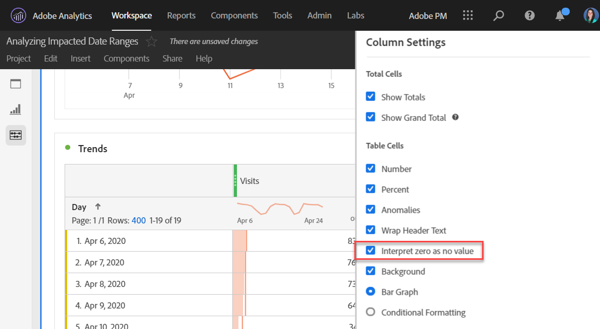

# 사용자에게 이벤트 영향 전달

데이터가 있는 경우 [이벤트의 영향](overview.md), 조직의 사용자에게 해당 이벤트를 전달하는 것이 중요합니다.

* 일관성을 위해 커뮤니케이션에 사용할 수 있는 일반적인 면책조항 개발
* 이벤트 진행 중 및 그 후에 Analytics 사용자 및 주요 관련자에게 지속적인 커뮤니케이션을 제공합니다
* 다음 달 또는 연도와 같이 후속 이정표에 대한 달력 미리 알림을 배치합니다. 향후의 이러한 커뮤니케이션은 보고서를 보는 사용자에게 월별 또는 연간 보고서를 볼 때 미치는 영향을 상기시키는 데 도움이 됩니다.

Adobe Analytics 내에서 다음 섹션에는 조직의 사용자와 통신할 수 있는 다양한 방법이 표시됩니다. Adobe Analytics 외부의 다른 방법(예: 이메일)을 사용하여 사용자와 통신할 수도 있습니다.

## 패널 또는 시각화 설명을 통해 커뮤니케이션

조직의 사용자 간에 작업 영역 프로젝트를 공유한 경우 패널 또는 시각화 설명을 통해 이벤트의 영향을 전달할 수 있습니다. 패널 또는 시각화 헤더를 마우스 오른쪽 버튼으로 클릭한 다음 를 선택합니다. **[!UICONTROL 설명 편집]**.

## 텍스트 시각화를 통한 커뮤니케이션

전용 텍스트 시각화를 통해 이벤트의 영향을 전달할 수도 있습니다. 다음을 참조하십시오 [텍스트 시각화](/help/analyze/analysis-workspace/visualizations/text.md) ( 분석 사용 안내서)를 참조하십시오.

## 작업 영역의 트렌드에 사용자 정의 달력 이벤트 추가

Workspace의 트렌드 시각화의 경우 영향을 받는 날짜 범위를 나타내는 시리즈를 추가할 수 있습니다.

1. 다음을 수행하여 &#39;영향을 받는 일 수&#39; 세그먼트로 계산된 지표 만들기 [분석에서 특정 날짜 제외](segments.md).
1. 계산된 지표 캔버스에 원하는 지표를 추가합니다.

   

1. 사용자에게 영향을 알리는 제목과 설명을 추가합니다. 원하는 경우 이 지표에 달력 주석으로 태그를 지정할 수도 있습니다.

   

1. 자유 형식 테이블에서 &#39;일&#39; 차원을 추가합니다. &#39;방문 횟수&#39;와 계산된 지표를 나란히 열로 추가합니다.

   

1. 계산된 지표에 대한 열 설정 톱니바퀴 아이콘을 클릭하고 을 활성화합니다 **[!UICONTROL 0을 값 없음으로 해석]**.

   

1. 선 시각화를 추가합니다. 영향을 받는 일은 다른 색상으로 표시됩니다. 사용자는 계산된 지표에서 &#39;정보&#39; 아이콘을 클릭하여 자세한 내용을 확인할 수도 있습니다.

   

## Reports &amp; Analytics에서 달력 이벤트 사용

Reports &amp; Analytics를 사용하는 경우 [달력 이벤트](/help/components/t-calendar-event.md) 트렌드 보고서에서 영향을 받는 일을 강조 표시합니다. 이 방법은 Analysis Workspace에는 적용되지 않습니다.

1. 다음으로 이동 **[!UICONTROL 구성 요소]** > **[!UICONTROL 모든 구성 요소]** > **[!UICONTROL 달력 이벤트]**.
2. 원하는 제목, 날짜 범위 및 참고 텍스트를 입력합니다.
3. **[!UICONTROL 저장]**&#x200B;을 클릭합니다.

