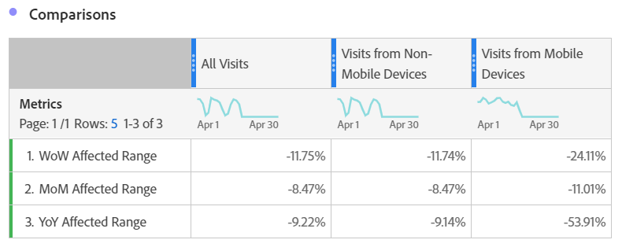

# 이벤트의 영향을 받은 날짜와 이전 범위 비교

이벤트의 [영향을 받은 데이터가 있는](overview.md)경우 내역 트렌드를 확인하여 영향을 평가할 수 있습니다. 이러한 비교는 이벤트가 데이터에 미치는 영향을 파악하는 데 유용합니다. 따라서 데이터를 제외할지, 보고서에 메모를 추가할지 또는 무시할지를 결정할 수 있습니다.

## 이벤트를 포함하는 날짜 범위 만들기

해당 이벤트의 영향을 탐색하기 시작할 이벤트를 포함하는 날짜 범위를 만듭니다.

1. > **[!UICONTROL Components]** 로 **[!UICONTROL Date ranges]**&#x200B;이동합니다.
2. 클릭 **[!UICONTROL Add]**.
3. 이벤트가 발생한 날짜 범위를 선택합니다. 클릭 **[!UICONTROL Save]**.

   

## 이벤트 날짜 및 유사한 이전 범위 나란히 보기

자유 형식 테이블 시각화를 사용하여 이벤트의 날짜 범위와 비슷한 이전 날짜 범위 간의 지표를 비교할 수 있습니다.

1. 작업 공간 프로젝트를 열고 자유 형식 테이블에 &#39;일&#39; 차원을 추가합니다. &#39;발생&#39;과 같은 지표에 스택된 최근 만든 날짜 범위를 적용합니다.

   

2. 날짜 범위를 마우스 오른쪽 단추로 클릭한 다음 **[!UICONTROL Add time period column]** > 를 클릭합니다 **[!UICONTROL Custom date range to this date range]**.
   * 일주일 간 비교를 위해 이벤트 범위를 빼기 7일을 선택합니다. 이벤트와 이 날짜 범위 사이의 요일이 정렬되었는지 확인하십시오.
   * 월정액 비교를 위해 지난 달 이벤트 범위를 선택합니다. 요일을 정렬하려는 경우 이벤트 범위를 빼기 28일을 선택할 수도 있습니다.
   * 1년 이상 비교의 경우 작년 이벤트 범위를 선택합니다.
3. 원하는 날짜 범위를 선택하면 자유 형식 테이블에 추가됩니다. 을 마우스 오른쪽 단추로 클릭하고 비교할 날짜 범위를 추가할 수 있습니다.

   

## 이벤트와 유사한 이전 범위 간의 백분율 차이 계산

자유 형식 테이블 시각화를 사용하여 이벤트의 날짜 범위와 비슷한 이전 날짜 범위 간의 차원 값을 비교합니다. 다음 단계는 다음을 수행할 수 있는 주 단위 예를 보여 줍니다.

1. 작업 공간 프로젝트를 열고 자유 형식 테이블에 **비시간 차원을** 추가합니다. 예를 들어 &#39;모바일 장치 유형&#39; 차원을 사용할 수 있습니다. &#39;발생 횟수&#39;와 같이 지표에 스택된 최근 만든 날짜 범위를 적용합니다.

   

2. 날짜 범위를 마우스 오른쪽 단추로 클릭한 다음 **[!UICONTROL Compare time periods]** > 를 클릭합니다 **[!UICONTROL Custom date range to this date range]**. 이벤트의 범위를 7일 이내로 선택합니다. 이벤트와 이 날짜 범위 사이의 요일이 정렬되었는지 확인하십시오.

   

3. 결과 &quot;변경 퍼센트&quot; 지표의 이름을 &quot;영향을 받는 범위&quot;와 같이 좀 더 구체적인 것으로 바꿉니다. 정보 아이콘을 클릭한 다음 연필 편집을 클릭하여 지표 이름을 편집합니다.

   

4. 월정액 및 연간 비교를 위해 3단계와 4단계를 반복합니다. 동일한 테이블에서 이 작업을 수행하거나 테이블을 분리할 수 있습니다.

## 비교 날짜 범위를 행으로 나란히 분석

위의 퍼센트 변경 사항을 더 자세히 분석하려면 행을 변환할 수 있습니다.

1. 자유 형식 테이블 시각화를 추가하고 테이블 빌더를 활성화합니다. 이 작업을 사용하면 백분율 변경 지표를 원하는 순서로 배치할 수 있습니다.
2. 3% 변경 지표 `Ctrl` (Windows) 또는 `Cmd` (Mac)를 한 번에 하나씩 표의 행으로 드래그합니다.

   

3. 테이블의 열 및 기타 원하는 세그먼트에 &#39;모든 방문&#39; 세그먼트를 추가합니다.

   

4. 클릭 **[!UICONTROL Build]**. 결과 테이블에서 원하는 모든 세그먼트에서 영향을 받는 범위와 이전 주, 월 및 연도를 볼 수 있습니다.

   
